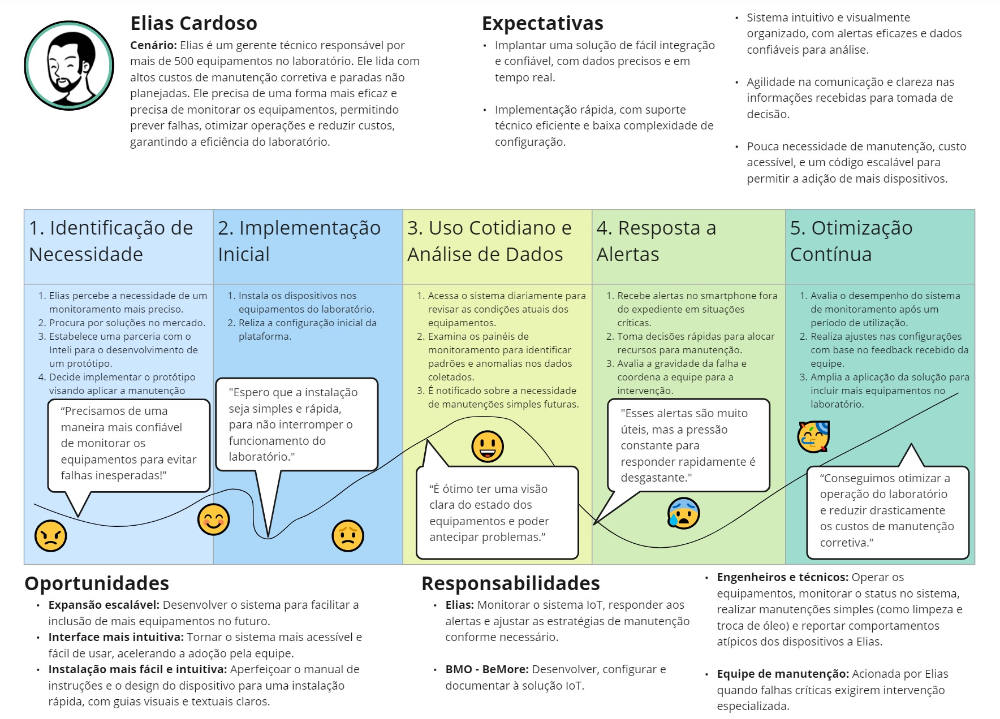
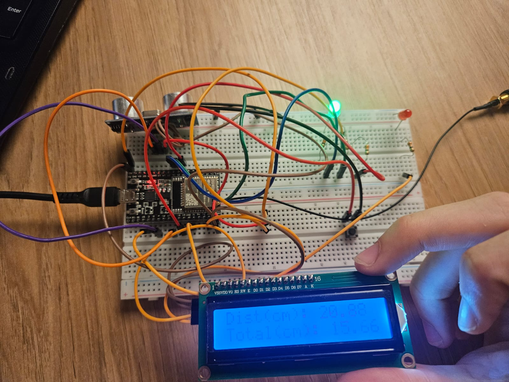

# Documentação IoTDoc - Módulo 4 - Inteli

## BMO - BeMore

#### Nomes dos integrantes do grupo:

- Andre Lobo
- Moyses Anijar
- Laura Rodrigues
- Lucas Guerra
- Thiago Volcati
- Leonardo Martins
- Luiza Petenazzi

## Sumário

[1. Introdução](#c1)

[2. Metodologia](#c2)

[3. Desenvolvimento e Resultados](#c3)

[4. Conclusões e Recomendações](#c4)

[5. Referências](#c5)

# 1. Introdução

&nbsp;&nbsp;&nbsp;&nbsp;O Instituto de Pesquisas Tecnológicas (IPT), localizado na cidade de São Paulo, é um dos maiores institutos de pesquisa do Brasil[63](#6-referências), com infraestrutura laboratorial de ponta e equipes multidisciplinares altamente capacitadas. Atua em quatro grandes áreas: pesquisa, desenvolvimento e inovação; serviços tecnológicos; serviços metrológicos; e educação em tecnologia. O IPT desenvolve e aplica soluções tecnológicas para setores fundamentais da economia, governos e sociedade, abrangendo atividades como ensaios, análises, calibrações, certificações, monitoramento, inspeção e consultoria, além do desenvolvimento de produtos e processos[64](#6-referências). No entanto, o instituto enfrenta um desafio crítico no laboratório de processos metalúrgicos, onde mais de 500 equipamentos operam sem monitoramento contínuo. Atualmente, os equipamentos são utilizados até que falhas críticas ocorram, e as manutenções são predominantemente corretivas. O monitoramento é baseado no feeling dos funcionários, ou seja, as intervenções ocorrem quando eles acreditam ser necessário, tomando decisões sem suporte de dados objetivos. Isso resulta em custos elevados com manutenção corretiva, paralisações inesperadas e redução da vida útil das máquinas, impactando negativamente a produtividade e a eficiência operacional.

## 1.1 Objetivos

### Objetivo Geral
&nbsp;&nbsp;&nbsp;&nbsp;O objetivo geral do Instituto de Pesquisas Tecnológicas (IPT) é aprimorar o monitoramento e a gestão de seus equipamentos laboratoriais, especialmente no Laboratório de Processos Metalúrgicos, visando otimizar a eficiência operacional. A meta é garantir maior controle sobre o uso e a manutenção de mais de 500 equipamentos, que operam sob demanda. Com isso, o IPT busca prolongar a vida útil dos ativos, reduzir os custos de manutenção e aumentar a disponibilidade dos equipamentos, assegurando um desempenho mais confiável e econômico no longo prazo.

### Objetivos Específicos

1 - **Redução de Custos Operacionais**: Minimizar os gastos com manutenção corretiva, reduzindo o tempo de parada dos equipamentos por meio de monitoramento contínuo e preditivo.

2 - **Aumento da Vida Útil dos Equipamentos**: Prolongar o ciclo de vida dos equipamentos metalúrgicos através de manutenção preventiva baseada em dados coletados, garantindo que as intervenções ocorram no momento ideal.

3 - **Maior Disponibilidade dos Equipamentos**: Assegurar que os equipamentos estejam disponíveis sempre que necessário para pesquisas e projetos, reduzindo a ociosidade e maximizando a eficiência operacional.

4 - **Melhoria nos Processos de Manutenção**: Implementar um fluxo de manutenção mais eficaz e automatizado, com alertas precisos sobre necessidades de intervenção, evitando falhas inesperadas e contribuindo para a continuidade dos projetos.

5 - **Sustentabilidade**: Promover uma operação mais sustentável, diminuindo o desperdício de recursos e maximizando o uso eficiente dos equipamentos laboratoriais.

&nbsp;&nbsp;&nbsp;&nbsp;Em conclusão, o IPT busca otimizar a eficiência operacional de seus laboratórios, com foco especial no Laboratório de Processos Metalúrgicos, por meio de uma gestão estratégica dos equipamentos. Dessa forma, pretende reduzir custos, prolongar a vida útil dos ativos e aumentar a disponibilidade para pesquisas e projetos.

## 1.2 Proposta da solução

&nbsp;&nbsp;&nbsp;&nbsp;A solução proposta envolve a implementação de um sistema de monitoramento contínuo dos equipamentos do laboratório metalúrgico utilizando dispositivos IoT. Esses dispositivos, conectados a sensores, serão capazes de coletar dados em tempo real sobre as condições dos equipamentos, tempo de utilização e tempo para troca de óleo. Para se adequar ao ambiente industrial do laboratório, os dispositivos terão proteção contra água e poeira, garantindo durabilidade e confiabilidade na coleta de dados.

&nbsp;&nbsp;&nbsp;&nbsp;Os dados serão transmitidos via uma rede WiFi dedicada, utilizando o protocolo MQTT, para uma plataforma de dashboard acessível online. A plataforma permitirá que os usuários visualizem gráficos em tempo real, recebam alertas de falhas ou anomalias e tenham acesso a relatórios detalhados sobre o status e manutenção dos equipamentos.

&nbsp;&nbsp;&nbsp;&nbsp;Essa solução visa reduzir o tempo de inatividade dos equipamentos, otimizar os processos de manutenção por meio da manutenção preditiva e aumentar a vida útil das máquinas, resultando em menores custos operacionais e maior eficiência para o IPT.

## 1.3 Justificativa

&nbsp;&nbsp;&nbsp;&nbsp;A solução proposta apresenta diversos benefícios estratégicos para o IPT. Ao utilizar dispositivos IoT para monitoramento contínuo, o laboratório poderá otimizar seus processos de manutenção, resultando em uma significativa redução de custos e no aumento da vida útil dos equipamentos. A manutenção preditiva, baseada nos dados coletados, permitirá antecipar problemas e corrigir falhas antes que ocorram, minimizando o tempo de inatividade dos equipamentos.

&nbsp;&nbsp;&nbsp;&nbsp;Além disso, o projeto se destaca por seu baixo custo, uma vez que a solução será implementada utilizando tecnologias acessíveis e facilmente integráveis à infraestrutura existente. Isso torna o sistema escalável, permitindo que ele seja expandido futuramente para monitorar outros equipamentos.

&nbsp;&nbsp;&nbsp;&nbsp;O uso de uma rede dedicada a IoT dentro do laboratório é um diferencial importante, pois garante maior segurança e confiabilidade no tráfego de dados. Os dispositivos serão projetados para resistir às condições adversas do ambiente industrial, contando com proteção contra água e poeira, o que assegura seu funcionamento contínuo e confiável, mesmo em meio a altos níveis de ruído e agentes externos. Essa robustez torna a solução mais adequada às condições do laboratório metalúrgico, diferenciando-a de outras alternativas que podem ser mais caras ou menos adaptáveis.

&nbsp;&nbsp;&nbsp;&nbsp;Em conclusão, a implementação dessa solução promoverá um aumento na eficiência operacional do laboratório, assegurando maior confiabilidade nos equipamentos e reduzindo interrupções inesperadas nos projetos. As características da solução foram desenvolvidas para se adequarem ao ambiente industrial do laboratório e atenderem aos principais requisitos de operação, garantindo, assim, um desempenho consistente, sustentável e alinhado às necessidades específicas do IPT no longo prazo.

# 2. Metodologia

&nbsp;&nbsp;&nbsp;&nbsp;No desenvolvimento de sistemas IoT, a metodologia RM-ODP (Reference Model for Open Distributed Processing) é amplamente utilizada para estruturar de forma organizada os principais aspectos do projeto. Essa metodologia oferece uma abordagem clara para guiar o desenvolvimento, desde a análise de negócios até a implementação tecnológica, garantindo que cada fase contribua para um sistema funcional e eficaz [66](#6-referências).

 
Figura 1 - Metodologia RM-ODP 

Fonte: Material produzido pelos autores (2024) 

&nbsp;&nbsp;&nbsp;&nbsp;Adoatando ao método, a Visão de Negócios estabelece o contexto organizacional e define o propósito fundamental do sistema, conectando os objetivos do projeto às necessidades e demandas da organização. Essa visão permite identificar as principais questões e objetivos a serem resolvidos pelo sistema, orientando seu desenvolvimento para agregar valor real à organização e assegurar a relevância do sistema dentro de um contexto específico.
A partir dessa visão inicial, o RM-ODP direciona a definição dos Requisitos Funcionais, que representam as funcionalidades essenciais que o sistema deve realizar para atender ao problema identificado na fase de negócios. Estes requisitos descrevem de maneira clara as capacidades que o sistema deve ter, possibilitando que as funcionalidades sejam planejadas para responder diretamente às necessidades e demandas identificadas anteriormente.

&nbsp;&nbsp;&nbsp;&nbsp;Além dos requisitos funcionais, a metodologia RM-ODP contempla uma análise detalhada dos Requisitos Não Funcionais, que são critérios de qualidade importantes para garantir o funcionamento seguro e eficiente do sistema. A norma ISO 25010 frequentemente serve de base para a definição desses requisitos, que englobam aspectos como confiabilidade, segurança e usabilidade. Essa visão assegura que o sistema seja robusto, seguro e eficiente, promovendo sua operação de maneira estável e confiável, mesmo em contextos desafiadores.

 
Figura 2 - Norma ISO 25010 
 
Fonte: Material produzido pelos autores (2024) 

&nbsp;&nbsp;&nbsp;&nbsp;Com os requisitos estabelecidos, o RM-ODP orienta a criação de uma Arquitetura de Solução agnóstica à tecnologia, que estrutura o sistema de forma modular e abstrata. A visão arquitetural foca na organização lógica dos componentes e módulos que interagem para cumprir as funcionalidades estabelecidas. Essa abordagem permite flexibilidade no desenvolvimento e facilita adaptações futuras, pois a estruturação modular possibilita a substituição ou atualização de componentes específicos sem a necessidade de redesenhar todo o sistema.

&nbsp;&nbsp;&nbsp;&nbsp;Finalmente, o modelo culmina na Visão Tecnológica, que especifica as tecnologias, ferramentas e protocolos que serão utilizados para implementar o sistema. Essa visão considera as opções tecnológicas que melhor atendem às características e requisitos do projeto, como dispositivos de hardware, protocolos de comunicação e interfaces de visualização. A seleção das tecnologias utilizadas assegura que o sistema funcione de acordo com as especificações e demandas operacionais, garantindo a escalabilidade do projeto [67](#6-referências).

&nbsp;&nbsp;&nbsp;&nbsp;De maneira geral, a aplicação da metodologia RM-ODP traz diversas vantagens para o desenvolvimento de sistemas complexos. Primeiramente, a divisão em visões distintas facilita a organização e a compreensão dos diferentes aspectos do projeto, promovendo clareza e alinhamento entre os membros da equipe e os stakeholders. Ao alinhar o desenvolvimento com os objetivos de negócios, evita-se a inclusão de funcionalidades desnecessárias, concentrando os esforços em entregar valor diretamente à organização. Além disso, a arquitetura modular e agnóstica permite flexibilidade para adaptações futuras e amplia a vida útil do sistema. Por fim, os requisitos não funcionais, definidos de maneira robusta, garantem que o sistema seja confiável, seguro e acessível, características essenciais em contextos onde estabilidade e segurança são cruciais.

# 3. Desenvolvimento e Resultados 

## 3.1. Domínio de Fundamentos de Negócio

### 3.1.1. Contexto da Indústria

&nbsp;&nbsp;&nbsp;&nbsp;Nesta seção, vamos apresentar a indústria na qual o Instituto de Pesquisas Tecnológicas (IPT) está inserido, que é a de pesquisa e desenvolvimento tecnológico (P&D). Apresentaremos as principais oportunidades e desafios desse setor, tanto no Brasil quanto ao redor do mundo, com destaque para como o P&D impulsiona áreas estratégicas como energia, infraestrutura, automação industrial e tecnologias digitais. Além disso, analisaremos as parcerias, regulamentações e iniciativas que têm contribuído para a evolução da indústria de P&D, ressaltando a importância da inovação e da sustentabilidade para o crescimento desse setor.

&nbsp;&nbsp;&nbsp;&nbsp;O Instituto de Pesquisas Tecnológicas (IPT) está inserido na indústria de pesquisa e desenvolvimento tecnológico (P&D), que desempenha um papel de grande importância na inovação de setores fundamentais como energia, infraestrutura, automação industrial e tecnologias digitais. Essa indústria é responsável por desenvolver soluções que impulsionam a eficiência operacional e a sustentabilidade, tanto para empresas privadas quanto para o setor público. A indústria de P&D no Brasil tem apresentado um crescimento expressivo nos últimos anos. De acordo com o *Global Innovation Index* 2023, o Brasil subiu cinco posições no ranking global de inovação, avançando da 54ª posição em 2022 para a 49ª em 2023, sendo o país mais bem colocado da América Latina [1](#6-referências). Apesar desse avanço, a posição do Brasil ainda é considerada abaixo do seu potencial, considerando o tamanho da economia do país, que já chegou à 47ª posição em 2011. Esse crescimento recente foi impulsionado principalmente pela intensificação de programas como o PROINFA (Programa de Incentivo às Fontes Alternativas de Energia) [2](#6-referências) e o Rota 2030 [3](#6-referências), além do apoio a novos parques tecnológicos voltados para a biotecnologia, como o Biopark de Toledo [4](#6-referências) e o Supera Parque de Ribeirão Preto [5](#6-referências).

&nbsp;&nbsp;&nbsp;&nbsp;Em relação à participação da indústria de P&D no PIB brasileiro, o investimento em Pesquisa e Desenvolvimento no Brasil representou, em 2022, cerca de 1% do PIB, de acordo com o Ministério da Ciência, Tecnologia e Inovações (MCTI) [6](#6-referências). Cerca de metade desses investimentos vem da iniciativa privada. Esse percentual foi considerado baixo por especialistas e provocou uma reunião no Senado para discutir sobre o assunto. Muitos empresários têm receio sobre investir em pesquisa, ciência e tecnologia, devido aos seus riscos, custos e à possibilidade de não performarem tão bem quanto investimentos mais conservadores e de curto prazo. No entanto, há um esforço para ampliar essa participação, com planos que visam elevar os investimentos em P&D para 2% do PIB nos próximos anos, alinhando o país às metas globais de inovação e desenvolvimento sustentável [6](#6-referências).

#### Principais Fornecedores e Parceiros

&nbsp;&nbsp;&nbsp;&nbsp;A indústria de P&D no Brasil depende de uma rede de fornecedores de tecnologias de ponta e de parceiros institucionais. Entre os principais fornecedores, temos empresas como a IBM [7](#6-referências) e a Siemens [8](#6-referências), que fornecem tecnologias de inteligência artificial, computação em nuvem e automação industrial. Um exemplo dessa relação é a intenção da IBM de intensificar a sua atuação como parceira de empresas públicas e privadas [7](#6-referências), enquanto a Siemens fortalece sua atuação ao firmar um acordo com o Instituto de Pesquisas Tecnológicas (IPT) para o desenvolvimento de soluções tecnológicas avançadas [8](#6-referências). As parcerias institucionais também são realizadas com universidades renomadas como a Universidade de São Paulo (USP), Universidade Estadual de Campinas (UNICAMP) e instituições de pesquisa como o próprio IPT e o Instituto Tecnológico de Aeronáutica (ITA), que atuam no desenvolvimento conjunto de projetos de inovação e na capacitação de mão de obra qualificada [5](#6-referências)[9](#6-referências).

&nbsp;&nbsp;&nbsp;&nbsp;No âmbito internacional, instituições como a *Fraunhofer-Gesellschaft* da Alemanha [9](#6-referências) e centros de inovação como o *Massachusetts Institute of Technology* (MIT) têm sido parceiros frequentes em projetos de pesquisa colaborativa no Brasil. A *Fraunhofer-Gesellschaft* mantém parcerias estratégicas no Brasil para o desenvolvimento de tecnologias inovadoras em conjunto com o setor industrial e acadêmico, transferindo conhecimento para projetos locais [9](#6-referências). O MIT, por sua vez, tem colaborado com o SENAI [10](#6-referências) e o Instituto Tecnológico de Aeronáutica (ITA) [11](#6-referências) em iniciativas que visam o avanço da pesquisa e inovação industrial no Brasil, além de firmar uma parceria com o Gov/Lab para estudar novos modelos de trabalho no serviço público, promovendo inovação na gestão pública brasileira [12](#6-referências). Essas iniciativas ajudam a trazer conhecimento especializado e a fomentar a transferência de tecnologia para o Brasil, fortalecendo a indústria nacional de P&D e posicionando o país de forma mais competitiva no cenário global.

#### Principais Tendências Nacionais e Internacionais

&nbsp;&nbsp;&nbsp;&nbsp;Globalmente, a indústria de P&D está focada em sustentabilidade, digitalização e tecnologias verdes. Instituições como o *Fraunhofer Institute* na Alemanha e o SINTEF na Noruega lideram projetos importantes nesse contexto. O *Fraunhofer Institute* está desenvolvendo o *Energiewende 2030*, que faz parte dos esforços da Europa para a neutralidade de carbono, com foco na ampliação das energias renováveis e na eficiência energética, visando a descarbonização das economias europeias [13](#6-referências). Já o SINTEF, através do PyroCO2, trabalha na captura e reutilização de dióxido de carbono para reduzir as emissões industriais, contribuindo para a descarbonização da indústria pesada [14](#6-referências). Essas iniciativas reforçam o compromisso dos países desenvolvidos com a redução de emissões de carbono e a inovação sustentável.

&nbsp;&nbsp;&nbsp;&nbsp;Os Objetivos de Desenvolvimento Sustentável (ODS) da ONU, estabelecidos na Agenda 2030, têm liderado tendências globais de P&D [15](#6-referências). A Agenda 2030 é um plano de ação global para o desenvolvimento sustentável, do qual os ODS fazem parte. Entre os objetivos, se destacam energia limpa e acessível (ODS 7), inovação e infraestrutura (ODS 9), e consumo e produção responsáveis (ODS 12). O Brasil está comprometido com essa agenda, tendo criado em 2016 a Comissão Nacional para os Objetivos do Desenvolvimento Sustentável (CNODS) [16](#6-referências), que visa difundir e dar transparência ao processo de implementação da Agenda 2030 no país [16](#6-referências). Exemplos desses esforços incluem o Plano Nacional de Energia 2050 [17](#6-referências) e a Política Nacional sobre Mudança do Clima [18](#6-referências), que estão diretamente ligados ao cumprimento de metas como ODS 7 e ODS 13, promovendo a transição para fontes renováveis e a redução de emissões de gases de efeito estufa. A indústria de P&D é a principal responsável pelo desenvolvimento de tecnologias que viabilizam essa transição, como soluções em energia renovável, eficiência energética e economia circular, todas fundamentais para o cumprimento dos ODS [15](#6-referências).

&nbsp;&nbsp;&nbsp;&nbsp;No cenário brasileiro, a busca por eficiência energética, redução de emissões de carbono e modernização da infraestrutura são tendências-chave. O Brasil se comprometeu, no âmbito do Acordo de Paris, a reduzir suas emissões de gases de efeito estufa em 37% até 2025 e em 50% até 2030, em comparação aos níveis de 2005 [19](#6-referências). Esse compromisso inclui esforços para ampliar a participação de fontes renováveis na matriz energética e promover práticas sustentáveis em setores como geração de energia e transporte. Além disso, o Programa Rota 2030, coordenado pelo IPT em parceria com o ITA (Instituto Tecnológico de Aeronáutica), visa integrar a indústria automotiva brasileira às cadeias globais de valor, promovendo inovação e sustentabilidade [3](#6-referências).

#### Regulamentação e Parcerias Tecnológicas

&nbsp;&nbsp;&nbsp;&nbsp;No cenário internacional, regulamentações voltadas para tecnologias de captura e armazenamento de carbono (CCS), como a Diretiva de Armazenamento de Carbono da União Europeia [20](#6-referências), têm assumido papel de grande importância para indústrias que precisam reduzir suas emissões de forma direta. Na Noruega, o Projeto *Longship*, apoiado pelo governo norueguês e em parceria com empresas como Equinor e TotalEnergies, está trabalhando com tecnologias avançadas de captura de carbono em indústrias pesadas [21](#6-referências). Essas regulamentações fazem parte das metas do país para reduzir as emissões de gases de efeito estufa e alcançar a neutralidade de carbono, conforme proposto pela Política Climática da Noruega [22](#6-referências).

&nbsp;&nbsp;&nbsp;&nbsp;No Brasil, a Política Nacional sobre Mudança do Clima (PNMC) apresenta metas para a redução das emissões de gases de efeito estufa, guiando as empresas na adoção de soluções tecnológicas inovadoras para se manterem competitivas [23](#6-referências). A regulamentação ambiental no Brasil ainda está em processo de evolução, e projetos como o PL 528/2021, que propõe a criação de um mercado regulado de carbono, estão em tramitação para fortalecer o compromisso do país com as metas globais de sustentabilidade [24](#6-referências). Além disso, como mencionado anteriormente, o Brasil está comprometido com a Agenda 2030 e os ODS, o que reforça sua postura de buscar uma transição energética alinhada às metas globais de descarbonização [15](#6-referências).

#### Oportunidades e Desafios do Mercado

&nbsp;&nbsp;&nbsp;&nbsp;O mercado de P&D no Brasil apresenta grandes oportunidades, especialmente nos setores de energia, infraestrutura e tecnologias digitais. O crescimento da demanda por sustentabilidade e eficiência energética cria um ambiente favorável para o desenvolvimento de soluções inovadoras. Apesar disso, os investimentos em pesquisa e desenvolvimento têm enfrentado desafios nos últimos anos. Segundo a USP, embora os investimentos tenham caído, a produção científica brasileira continua a crescer, destacando a resiliência do sistema de ciência e tecnologia do país [25](#6-referências). Contudo, essa resiliência tem limites, e há um consenso entre especialistas de que o Brasil precisa de investimentos maiores para aproveitar seu potencial científico [26](#6-referências). Um estudo da Revista Galileu aponta que, apesar de o Brasil ter um grande sistema de pós-graduação, com capacidade que supera a de muitos países emergentes, a maior parte das empresas brasileiras ainda se concentra no mercado interno, onde a pressão por inovação é menor. Em contrapartida, setores mais orientados ao mercado internacional, como o agronegócio, são mais inovadores devido à necessidade de competir globalmente [26](#6-referências).

&nbsp;&nbsp;&nbsp;&nbsp;Um relatório da Revista Ferramental estima que o mercado global de Indústria 4.0 deve atingir US$219,8 bilhões até 2026, com o Brasil se destacando como um polo estratégico para digitalização e automação [27](#6-referências). Esse destaque se deve à sua base industrial diversificada, à crescente digitalização de processos operacionais e à formação de profissionais qualificados em programas de pós-graduação. Entretanto, o alto custo de desenvolvimento de tecnologias de ponta continua sendo um desafio para as empresas locais, que muitas vezes precisam estabelecer parcerias com instituições de P&D, como o IPT, para superar essas barreiras. Além disso, a adaptação às regulamentações em evolução, tanto no Brasil quanto no exterior, exige uma inovação constante, especialmente em um cenário onde países concorrentes continuam avançando em pesquisa e desenvolvimento. A falta de investimentos suficientes e contínuos pode comprometer a competitividade do Brasil no cenário internacional. Como uma resposta a esse cenário, o governo brasileiro lançou o programa Mais Inovação, que prevê um investimento de R$ 66 bilhões em projetos de inovação até 2026 [28](#6-referências). Iniciativas como essa nos mostram que o Brasil tem interesse em continuar investindo na área.

#### Principais *Players* da Indústria de P&D

&nbsp;&nbsp;&nbsp;&nbsp;O Brasil é o país da América Latina com o maior número de universidades mundialmente reconhecidas [29](#6-referências). Entre elas, a Universidade de São Paulo (USP), a Universidade Estadual de Campinas (UNICAMP), a Universidade Federal de Minas Gerais (UFMG), a Universidade Federal do Rio de Janeiro (UFRJ) e a Universidade Estadual Paulista (UNESP) estão frequentemente listadas entre as melhores da América Latina e do mundo em rankings de pesquisa e inovação, além de serem também as mais produtivas em termos de pesquisa e desenvolvimento [30](#6-referências). Essas instituições têm um papel fundamental no desenvolvimento científico e tecnológico do país, formando pesquisadores e estabelecendo parcerias com empresas para acelerar a transferência de conhecimento e inovação para o mercado. Esse posicionamento as coloca como essenciais no avanço das áreas estratégicas do Brasil, que dependem diretamente da inovação para se manterem competitivas globalmente.

&nbsp;&nbsp;&nbsp;&nbsp;Entre as empresas brasileiras, algumas têm se sobressaído em inovação e pesquisa. Segundo o relatório de 2023 da Strategy& PwC, a Embraer, a WEG, a Totvs, a Natura e o Grupo Boticário são exemplos de empresas que lideram o setor de P&D no Brasil [31](#6-referências). A Embraer é amplamente reconhecida por suas inovações no setor aeroespacial, enquanto a WEG se destaca no desenvolvimento de soluções em automação industrial e energias renováveis [32](#6-referências). A Totvs é uma das principais desenvolvedoras de softwares de gestão empresarial no Brasil, e empresas de bens de consumo, como a Natura e o Grupo Boticário, têm investido fortemente em pesquisa de novos produtos e tecnologias sustentáveis [33](#6-referências). De acordo com um estudo da Gazeta do Povo, embora os investimentos brasileiros em P&D sejam limitados em comparação com países desenvolvidos, essas empresas, líderes em seus setores, têm a necessidade de competir globalmente. Isso as força a investir mais em P&D, para se manterem competitivas no cenário internacional, mesmo com os riscos e custos associados a esses investimentos [34](#6-referências).

&nbsp;&nbsp;&nbsp;&nbsp;As multinacionais também desempenham um papel importante no ecossistema de inovação do Brasil. Empresas como a Pfizer, Bayer, Siemens e General Electric (GE) têm uma presença importante no país e investem em P&D, desenvolvendo tecnologias que atendem tanto ao mercado brasileiro quanto internacional. Essas empresas se destacam em rankings de inovação e muitas foram reconhecidas pela *Strategy& PwC* como as mais inovadoras no Brasil em 2022 e 2023 [31](#6-referências). A Pfizer e a Bayer, por exemplo, investem principalmente na pesquisa farmacêutica e biotecnológica, enquanto a Siemens e a GE lideram no desenvolvimento de soluções para automação industrial e energias renováveis [35](#6-referências).

&nbsp;&nbsp;&nbsp;&nbsp;Os principais institutos de pesquisa no Brasil, como o Instituto de Pesquisas Tecnológicas (IPT), o Instituto Tecnológico de Aeronáutica (ITA), o Instituto Butantan, e o Instituto de Tecnologia de Alimentos (Ital), são líderes no desenvolvimento de soluções inovadoras e no apoio à indústria nacional. Esses institutos foram fundamentais durante a pandemia de COVID-19, contribuindo para o desenvolvimento de vacinas, tecnologias de diagnóstico e outras soluções emergenciais para o setor de saúde [36](#6-referências). O Instituto Butantan, por exemplo, foi um dos protagonistas no desenvolvimento da vacina CoronaVac, em parceria com a Sinovac. Já o IPT e o ITA concentraram esforços em pesquisas voltadas para a aplicação de tecnologias emergentes e soluções inovadoras que ajudaram tanto na área da saúde quanto em outros setores críticos. Esses institutos também desempenham um papel central na promoção da integração entre ciência e indústria, além de fornecer apoio técnico para o desenvolvimento de novos produtos e tecnologias [37](#6-referências). Organizações como o SENAI e o SEBRAE oferecem suporte para pequenas e médias empresas, as auxiliando a adotar novas tecnologias e a se manterem competitivas no mercado [38](#6-referências).

#### Clientes Atuais e Futuros

&nbsp;&nbsp;&nbsp;&nbsp;Os principais clientes do setor de P&D no Brasil atualmente incluem grandes empresas dos setores de energia, saneamento e mineração, como Petrobras, Sabesp e Vale, que demandam soluções inovadoras para otimizar seus processos, melhorar a eficiência energética e garantir a conformidade com as regulamentações [39](#6-referências).

&nbsp;&nbsp;&nbsp;&nbsp;Por outro lado, startups e pequenas empresas de base tecnológica estão emergindo como novos atores no setor de P&D, mas ainda enfrentam desafios. Devido ao alto custo e risco associados às operações de P&D, essas empresas muitas vezes optam por não prosseguir o desenvolvimento tecnológico. Para mitigar esses desafios, iniciativas como programas de aceleração de startups e centros de inovação aberta, como o OpenTech [40](#6-referências) e o DeepLab [41](#6-referências), vêm desempenhando o papel de auxiliar essas startups nesse contexto [42](#6-referências). Esses programas oferecem acesso a mentoria, infraestrutura de pesquisa e laboratórios avançados, permitindo que startups desenvolvam e validem suas soluções tecnológicas de forma mais acessível e com menor risco financeiro. Isso contribui para o desenvolvimento de um ecossistema de inovação mais diversificado e promissor, onde empresas emergentes podem complementar a capacidade de inovação dos grandes players, impulsionando o crescimento do setor de P&D no Brasil.

&nbsp;&nbsp;&nbsp;&nbsp;A indústria de P&D no Brasil atua como guia no avanço de setores fundamentais como energia, infraestrutura e tecnologias digitais, mas ainda enfrenta desafios, como a baixa participação no PIB, resistência de muitas empresas em investir em inovação devido aos custos e riscos envolvidos. No entanto, a resiliência do sistema de ciência e tecnologia, aliada a programas de aceleração e esforços governamentais, como o Mais Inovação, mostra o potencial do país para se destacar no cenário global. Para que o Brasil alcance um papel de liderança, é fundamental alinhar o setor público, privado e acadêmico, transformando sua base científica em inovação aplicada e sustentável.

&nbsp;&nbsp;&nbsp;&nbsp;Para aprofundar a análise do contexto da indústria de pesquisa e desenvolvimento tecnológico (P&D), aplicamos o modelo das 5 Forças de Porter. Esse modelo, desenvolvido por Michael Porter, é amplamente utilizado para avaliar a competitividade de uma indústria e identificar os fatores que influenciam a rentabilidade e o desempenho das empresas [43](#6-referências). As cinco forças analisam a rivalidade entre concorrentes, o poder de barganha de fornecedores e compradores, a ameaça de novos entrantes e a ameaça de produtos substitutos. Juntas, essas forças fornecem uma visão abrangente sobre os desafios e oportunidades enfrentados pela indústria de P&D, considerando os fatores internos e externos que afetam o mercado.

Figura 3 - Infográfico das 5 forças de porter

Fonte: Material produzido pelos autores (2024)

	
&nbsp;&nbsp;&nbsp;&nbsp;Na imagem, apresentamos um infográfico que ilustra as 5 Forças de Porter na indústria de P&D. Cada força é representada por uma cor diferente e está posicionada para facilitar a visualização:

- Poder de Barganha dos Fornecedores (laranja, à esquerda no topo)

- Ameaça de Novos Entrantes (vermelho, à direita no topo)

- Ameaça de Produtos Substitutos (verde escuro, à esquerda embaixo)

- Poder de Barganha dos Compradores (verde claro, à direita embaixo)

- Rivalidade entre Concorrentes (azul, no centro)

#### 1. Ameaça de novos entrantes

&nbsp;&nbsp;&nbsp;&nbsp;A barreira de entrada no setor de P&D no Brasil é alta, em função dos grandes investimentos necessários em infraestrutura e tecnologia, além dos riscos envolvendo o desenvolvimento de novas tecnologias, que podem ou não gerar inovações bem-sucedidas. Instituições como o Instituto de Pesquisas Tecnológicas (IPT) e empresas como Embraer e WEG já possuem uma base tecnológica consolidada e fortes parcerias estratégicas, como a recente colaboração entre a Embraer e a BAE Systems [44](#6-referências), fortalecendo ainda mais suas posições no mercado. O Instituto Tecnológico de Aeronáutica (ITA) também atua como parceiro estratégico do IPT em projetos voltados para o desenvolvimento de materiais avançados, reforçando a importância dessas alianças na competitividade do setor [45](#6-referências).

&nbsp;&nbsp;&nbsp;&nbsp;Outro fator que limita a entrada de novos competidores no mercado é a necessidade de certificações técnicas especificas. A ISO/IEC 17025, por exemplo, é uma certificação que assegura a competência técnica de laboratórios para realizar ensaios e calibrações, exigindo que as operações sigam padrões de qualidade rígidos. Esse tipo de certificação é essencial para empresas que desejam operar em laboratórios de P&D e acessar mercados que requerem conformidade com normas internacionais, aumentando as barreiras para novos entrantes [46](#6-referências).

&nbsp;&nbsp;&nbsp;&nbsp;Portanto, a ameaça de novos entrantes no setor de P&D é consideravelmente alta devido às barreiras impostas pelos grandes investimentos em tecnologia, riscos associados à inovação, parcerias estratégicas consolidadas e certificações exigentes. Esses fatores limitam o número de novos competidores, favorecendo empresas e instituições já estabelecidas no mercado, que possuem a infraestrutura e os recursos necessários para se manterem competitivas.

#### 2. Poder de barganha dos fornecedores

&nbsp;&nbsp;&nbsp;&nbsp;No setor de P&D, o poder de barganha dos fornecedores é significativo devido à dependência de tecnologias exclusivas e infraestrutura de ponta, especialmente em áreas como TI, automação industrial e materiais avançados. Empresas de P&D dependem fortemente de fornecedores que oferecem tecnologias chave, como softwares especializados, equipamentos de laboratório e soluções de automação. Por exemplo, empresas como Siemens e IBM fornecem tecnologias essenciais para automação e inovação no Brasil, o que dá a essas empresas uma posição de barganha privilegiada [47](#6-referências).

&nbsp;&nbsp;&nbsp;&nbsp;Além disso, tecnologias emergentes como inteligência artificial e computação em nuvem, fornecidas por gigantes da tecnologia como a Google Cloud e Amazon Web Services (AWS), são indispensáveis para a realização de pesquisas em larga escala e com alto desempenho computacional. Isso coloca esses fornecedores em uma posição elevada, pois suas soluções são cruciais para o avanço de inovações em setores como biotecnologia, automação e energia renovável. A dependência de serviços de TI de alto desempenho e computação em nuvem para processar grandes volumes de dados em projetos de P&D é um fator crítico, tornando difícil para as empresas de P&D diversificarem seus fornecedores [48](#6-referências).

&nbsp;&nbsp;&nbsp;&nbsp;A especialização exigida em muitas dessas tecnologias também contribui para o elevado poder de barganha dos fornecedores. Equipamentos avançados de laboratório, como os necessários para análises químicas, biotecnológicas e de materiais, muitas vezes só podem ser adquiridos ou mantidos por fornecedores altamente especializados, como a Thermo Fisher Scientific. A Pfizer, por exemplo, estabeleceu uma parceria científica com a Thermo Fisher para colaborar em pesquisas que exigem soluções de alta tecnologia e equipamentos de ponta, demonstrando a importância dessas parcerias para o avanço de pesquisas biotecnológicas [49](#6-referências). Essa dependência de fornecedores específicos cria uma relação de poder desequilibrada, já que as empresas de P&D têm poucas alternativas tecnológicas viáveis.

&nbsp;&nbsp;&nbsp;&nbsp;Por fim, o custo elevado de substituição de fornecedores especializados aumenta o poder de barganha desses atores. O desenvolvimento de novas infraestruturas de TI ou a adoção de novos equipamentos de laboratório requer investimentos altos em tecnologia e treinamento, o que faz com que as empresas de P&D prefiram manter seus fornecedores tradicionais, reforçando o poder desses fornecedores no mercado. Em resumo, o poder de barganha dos fornecedores no setor de P&D é elevado devido à dependência de tecnologias exclusivas e especializadas, combinada com o alto custo de substituição e a falta de alternativas tecnológicas viáveis. Empresas de P&D precisam manter relações fortes com fornecedores especializados, o que aumenta a influência desses fornecedores sobre os termos e preços de seus serviços.

#### 3. Poder de barganha dos compradores

&nbsp;&nbsp;&nbsp;&nbsp;O poder de barganha dos compradores no setor de P&D pode variar bastante, dependendo do perfil dos clientes e das soluções oferecidas. Compradores que incluem grandes empresas dos setores de energia, infraestrutura e saúde têm um poder de barganha elevado devido ao seu tamanho e importância estratégica para o mercado. Essas empresas geralmente demandam soluções personalizadas de alta complexidade, o que lhes permite negociar preços e condições favoráveis com fornecedores de P&D. Por exemplo, gigantes como a Petrobras, Vale, e Sabesp são clientes importantes de empresas de P&D no Brasil, e seu volume de compras e a importância estratégica de seus projetos lhes conferem grande poder de barganha na negociação de contratos de pesquisa e desenvolvimento.

&nbsp;&nbsp;&nbsp;&nbsp;No entanto, o poder de barganha pode ser reduzido quando as empresas fornecedoras de P&D oferecem tecnologias exclusivas e inovadoras, ou quando há pouca concorrência no fornecimento de soluções altamente especializadas. No setor de biotecnologia e automação industrial, fornecedores como Thermo Fisher Scientific e Siemens dominam tecnologias avançadas, como inteligência artificial, automação de processos e materiais inovadores. Isso lhes permite ter mais controle sobre os termos e preços de seus serviços, limitando a capacidade de negociação dos compradores. Empresas que investem em inovação de produtos sustentáveis e novas tecnologias frequentemente precisam aceitar as condições de fornecedores especializados em P&D, uma vez que dependem fortemente dessas soluções para se manterem competitivas no mercado.

&nbsp;&nbsp;&nbsp;&nbsp;Além disso, os compradores também podem enfrentar barreiras durante a negociação quando as soluções exigem um alto grau de personalização e integração. Nesse caso, os fornecedores de P&D que estabelecem parcerias de longo prazo com seus clientes conseguem reduzir o poder de barganha dos compradores ao criar uma relação de dependência. As parcerias com instituições de pesquisa e grandes empresas de tecnologia fortalecem a relação de cooperação e inovação contínua, diminuindo o poder de barganha dos compradores em negociações de curto prazo.

&nbsp;&nbsp;&nbsp;&nbsp;Por outro lado, compradores como startups e pequenas empresas, que possuem menos recursos e influência, têm um poder de barganha limitado. Mesmo com o suporte de programas governamentais, essas empresas ainda enfrentam desafios para negociar melhores condições com fornecedores de P&D devido à falta de recursos para grandes projetos e à menor escala de suas operações.

&nbsp;&nbsp;&nbsp;&nbsp;Em resumo, o poder de barganha dos compradores no setor de P&D é influenciado por diversos fatores como o tamanho do comprador, a exclusividade das tecnologias fornecidas, e a natureza estratégica das soluções oferecidas. Grandes empresas e governos podem ter maior influência nas negociações, enquanto empresas menores ou startups enfrentam desafios para negociar preços e condições favoráveis.

#### 4. Ameaça de produtos substitutos

&nbsp;&nbsp;&nbsp;&nbsp;A ameaça de produtos substitutos no setor de P&D é relativamente baixa devido à complexidade e especialização dos serviços prestados. As soluções desenvolvidas exigem infraestrutura de alta tecnologia e testes em laboratórios, que são difíceis de substituir por métodos alternativos. Embora algumas inovações tecnológicas estejam emergindo, como o uso de simulações avançadas, elas ainda não substituem completamente a necessidade de validações físicas.

&nbsp;&nbsp;&nbsp;&nbsp;De acordo com o Instituto Federal de São Paulo (IFSP), as simulações computacionais estão sendo cada vez mais usadas para substituir laboratórios tradicionais em algumas áreas de pesquisa, permitindo reduzir custos e otimizar processos. Essas simulações são especialmente vantajosas em fases iniciais de testes, quando ainda é possível explorar variáveis de forma virtual antes de realizar experimentos físicos [50](#6-referências). No entanto, muitos setores, como o de biotecnologia e o farmacêutico, ainda dependem de experimentos em laboratórios físicos para garantir a segurança e a eficácia dos produtos desenvolvidos.

&nbsp;&nbsp;&nbsp;&nbsp;Outro exemplo de uma tecnologia emergente que poderia ser considerada um substituto parcial para processos tradicionais de P&D é a edição genética por meio da técnica CRISPR. Essa técnica tem o potencial de acelerar processos de desenvolvimento biotecnológico, especialmente em áreas como medicina e agricultura. Entretanto, mesmo com seu impacto revolucionário, a CRISPR ainda enfrenta limitações que exigem testes extensivos em ambientes controlados antes de sua aplicação prática [51](#6-referências).

&nbsp;&nbsp;&nbsp;&nbsp;Portanto, embora existam alternativas tecnológicas que podem otimizar ou complementar o trabalho de pesquisa e desenvolvimento, a substituição completa de processos tradicionais de laboratório ainda é improvável. Isso mantém a ameaça de produtos substitutos relativamente baixa no setor de P&D.

#### 5. Rivalidade entre concorrentes

&nbsp;&nbsp;&nbsp;&nbsp;A rivalidade entre concorrentes no setor de P&D é elevada, devido à competição por contratos de pesquisa, parcerias estratégicas e financiamento público e privado. Empresas e instituições que atuam nesse setor competem para se posicionar como líderes em inovação tecnológica, o que lhes confere a preferência em projetos de alto impacto. A necessidade de se destacar em áreas como biotecnologia, inteligência artificial e energias renováveis intensifica essa rivalidade.

&nbsp;&nbsp;&nbsp;&nbsp;A especialização exigida para o desenvolvimento de novas tecnologias e a capacidade de oferecer soluções personalizadas também ampliam a rivalidade. Empresas que conseguem dominar essas áreas se tornam altamente competitivas, o que força outras a intensificarem seus investimentos em P&D para não ficarem para trás.

&nbsp;&nbsp;&nbsp;&nbsp;Além disso, o financiamento público destinado a pesquisas é limitado, aumentando a pressão entre concorrentes para garantir acesso a esses recursos. Programas que buscam fomentar o desenvolvimento de novas tecnologias são muito disputados por empresas e instituições de P&D. A competição por esses fundos estimula o crescimento da rivalidade no setor, já que eles podem determinar quais projetos terão mais chances de sucesso no mercado [52](#6-referências).

&nbsp;&nbsp;&nbsp;&nbsp;A rivalidade também é acirrada entre empresas globais e startups emergentes. Embora grandes empresas tenham uma vantagem competitiva devido à sua infraestrutura e acesso a recursos, startups inovadoras têm ganhado espaço no desenvolvimento de soluções tecnológicas disruptivas que atraem investimentos e parcerias estratégicas. Mesmo assim, a rivalidade continua sendo uma barreira relevante, já que as startups ainda enfrentam desafios relacionados à escalabilidade e financiamento.

&nbsp;&nbsp;&nbsp;&nbsp;Portanto, a rivalidade entre concorrentes no setor de P&D é forte, impulsionada pela busca por inovação, recursos financeiros e parcerias estratégicas. Essa pressão competitiva força as empresas a inovarem continuamente para se manterem relevantes no mercado.

&nbsp;&nbsp;&nbsp;&nbsp;A análise das cinco forças de Porter no setor de P&D revela que, embora o setor apresente barreiras relevantes para novos entrantes, devido a investimentos elevados, certificações especificas e dependência de tecnologias exclusivas, as empresas já estabelecidas mantêm uma posição privilegiada. O poder de barganha dos fornecedores é elevado, e o dos compradores varia conforme o tamanho e a influência das empresas. A ameaça de produtos substitutos é relativamente baixa, e a rivalidade entre concorrentes é intensa, com todos competindo por liderança tecnológica e recursos financeiros. No entanto, iniciativas governamentais podem reduzir algumas dessas barreiras ao longo do tempo, incentivando startups e pequenas empresas a ingressarem no setor.

### 3.1.2. Análise SWOT

&nbsp;&nbsp;&nbsp;&nbsp;A Análise SWOT é uma ferramenta estratégica amplamente utilizada para identificar os pontos fortes, fracos, as oportunidades e ameaças de uma organização. Ao realizar essa análise, é possível entender melhor o cenário em que o negócio está inserido, facilitando a tomada de decisões e o planejamento de ações para alavancar os resultados. Essa técnica ajuda a explorar as vantagens competitivas e a mitigar riscos potenciais, oferecendo uma visão clara tanto das áreas de melhoria quanto das oportunidades de crescimento e expansão [1](#Referências). No caso do IPT, a análise SWOT nos revela seu desempenho atual e as perspectivas de desenvolvimento em um ambiente de constante transformação tecnológica e econômica.

    Figura 4 - Análise SWOT
     
    
     
    Fonte: Material produzido pelos autores (2024)

<li>Strengths</li> 
 O IPT dispõe de uma vasta infraestrutura de máquinas e laboratórios de última geração, com total capacidade de desenvolver uma grande diversidade de projetos e inovações. A instituição consegue atuar em diversas áreas, o que a torna versátil e preparada para lidar com diferentes demandas tecnológicas e industriais. Essa diversidade permite que o IPT seja um parceiro estratégico em setores variados, desde a construção civil até a energia. Além disso, os profissionais altamente qualificados são uma de suas principais forças, garantindo a excelência nos resultados desde seus muitos anos de mercado.

<li>Opportunities</li>

Com o crescimento da demanda por soluções sustentáveis, o IPT tem uma grande oportunidade de expandir sua atuação na área de tecnologias verdes. Investidores e empresas estão cada vez mais interessados em soluções que promovam um futuro ambientalmente responsável, e o IPT pode se destacar desenvolvendo novas tecnologias que contribuam para esse mercado em crescimento. A busca por inovações que mitiguem o impacto ambiental, como energias renováveis e processos industriais mais eficientes, representa uma chance importante para ampliar a atuação do instituto e atrair novos parceiros. Além disso, com o aumento da transformação digital e da Indústria 4.0, o IPT tem uma excelente oportunidade de se consolidar no desenvolvimento de soluções tecnológicas avançadas, especialmente com foco na IoT.

<li>Weakness</li>

O IPT, por ser uma instituição tradicional e com processos estabelecidos, pode ter dificuldades em se adaptar rapidamente às inovações e mudanças tecnológicas do mercado, especialmente em setores emergentes. A burocracia envolvida em muitos processos institucionais pode representar um obstáculo para implementar soluções ágeis e inovadoras. Além disso, embora o IPT tenha uma base sólida de conhecimento técnico, sua falta de experiência em projetos comerciais de IoT em larga escala pode ser uma fraqueza inicial, exigindo uma curva de aprendizado significativa para competir com empresas mais ágeis nesse setor.

<li>Threats</li>

Pesquisadores e técnicos qualificados podem ser atraídos por ofertas mais competitivas no setor privado, o que representa uma grande ameaça ao IPT. No setor privado, a remuneração e as oportunidades de crescimento tendem a ser mais atrativas, resultando na perda de talentos. Além disso, a concorrência de startups e outras empresas de tecnologia mais ágeis pode pressionar o IPT, especialmente no que diz respeito à implementação de soluções rápidas e escaláveis na área de IoT. Outra ameaça significativa é a possibilidade de alterações nas políticas públicas de incentivo à pesquisa e desenvolvimento, que podem impactar diretamente o financiamento do IPT. Caso haja redução nos investimentos governamentais, o instituto pode enfrentar dificuldades em manter sua infraestrutura de ponta e a capacidade de desenvolver projetos inovadores com a mesma excelência.

&nbsp;&nbsp;&nbsp;&nbsp;A Análise SWOT do IPT evidencia como a instituição está posicionada para aproveitar suas forças e oportunidades, ao mesmo tempo em que reconhece suas fraquezas e as ameaças do mercado. A identificação desses elementos é crucial para o planejamento estratégico e para garantir a adaptação contínua do IPT às demandas do setor de tecnologia e inovação, especialmente nas áreas de IoT e Indústria 4.0. Dessa forma, ao maximizar suas potencialidades e reduzir as limitações, o IPT pode fortalecer ainda mais sua posição no mercado e continuar sendo um parceiro estratégico em projetos tecnológicos e industriais de grande relevância.

### 3.1.3. Descrição da Solução a ser Desenvolvida

#### 3.1.3.1 Qual é o problema a ser resolvido

&nbsp;&nbsp;&nbsp;&nbsp;O Instituto de Pesquisas Tecnológicas (IPT) enfrenta grandes desafios na gestão e monitoramento de seus mais de 500 equipamentos laboratoriais, especialmente no Laboratório de Processos Metalúrgicos. A falta de um sistema eficaz para monitoramento contínuo resulta em altos custos operacionais devido à manutenção corretiva frequente, baixa disponibilidade dos equipamentos e dificuldade em prever intervenções necessárias. Tal situação compromete a eficiência operacional e a vida útil dos ativos, além de impactar negativamente os projetos de pesquisa. 

#### 3.1.3.2 Qual é a solução proposta (visão de negócios)

&nbsp;&nbsp;&nbsp;&nbsp;Para  mitigar o problema, a solução proposta é o desenvolvimento de um dispositivo IoT, construido com base no microcontrolador ESP32   , que permitirá o monitoramento contínuo dos aparelhos laboratoriais. Este dispositivo será de baixo custo e contará com um dashboard intuitivo para visualização em tempo real dos dados coletados, como tempo de operação e data da última revisão. O sistema enviará alertas automáticos para a equipe técnica sempre que forem detectadas condições que possam exigir manutenção preventiva, evitando assim a necessidade de intervenções emergenciais. 

#### 3.1.3.3 Como a solução proposta deverá ser utilizada

&nbsp;&nbsp;&nbsp;&nbsp;O dispositivo IoT será instalado nos equipamentos selecionados do laboratório, como a Maquina Univeresal de Ensaios EMIC - DL 10000. A equipe técnica utilizará o dashboard para monitorar as condições operacionais e receber notificações sobre a necessidade de manutenção. Assim, os dados coletados poderão, também, ser analisados para identificar padrões de uso e desgaste dos equipamentos.

#### 3.1.3.4 Quais os benefícios trazidos pela solução proposta

&nbsp;&nbsp;&nbsp;&nbsp;A implementação da nossa solução propõe alguns benefícios para o IPT e, dentre eles, temos a redução substancial nos custos operacionais, minimizando gastos com manutenção corretiva e diminuindo o tempo de inatividade dos equipamentos. Além disso, a solução aumentará a vida útil dos equipamentos laboratoriais, pois as intervenções preventivas  garantirão que os aparelhos sejam mantidos em condições ideais. Com alertas sobre a necessidade de manutenção, os equipamentos estarão mais disponíveis para uso, maximizando a eficiência operacional. A automação dos processos de manutenção proporcionará respostas mais rápidas às necessidades operacionais, evitando falhas inesperadas e promovendo um uso otimizado dos equipamentos. 

#### 3.1.3.5 Qual será o critério de sucesso e qual medida será utilizada para o avaliar

&nbsp;&nbsp;&nbsp;&nbsp;Para considerarmos uma solução de sucesso vamos avaliar a redução significativa dos custos operacionais relacionados à manutenção e o aumento da disponibilidade dos equipamentos. Assim como também iremos analisar a frequência das manutenções e o funcionamento dos sensores utilizados para coletar os dados. Esses indicadores possibilitam que sejam quantificados os benefícios trazidos pela solução proposta e garantir que os objetivos do IPT sejam alcançados.

&nbsp;&nbsp;&nbsp;&nbsp;A proposta de desenvolver um dispositivo IoT para o IPT representa uma abordagem eficaz para enfrentar os desafios da empresa. A solução não apenas promete reduzir significativamente os custos operacionais e minimizar o tempo de inatividade, mas também aumentará a vida útil dos equipamentos. Com um dashboard intuitivo e alertas automáticos, a equipe técnica poderá monitorar as condições operacionais em tempo real, garantindo respostas rápidas às necessidades de manutenção. Com a aplicação do IoT, podemos promover uma operação mais eficiente e sustentável para o IPT.

	
### 3.1.4. *Value Proposition Canvas*

&nbsp;&nbsp;&nbsp;&nbsp;O Canva de Proposta de Valor é uma ferramenta visual e estratégica utilizada para o desenvolvimento de produtos, soluções e projetos. Ele ajuda a mapear e entender as necessidades dos clientes, alinhando a proposta de valor às tarefas que eles precisam realizar, aos problemas que enfrentam e aos resultados que desejam alcançar. Por meio dessa abordagem, é possível ajustar os produtos e serviços para aliviar dores e criar ganhos relevantes, aumentando as chances de sucesso da solução no mercado [1](#6-Referênias). Essa metodologia é essencial para visualizar, testar e melhorar a forma como a empresa cria valor, garantindo que as inovações realmente atendam às expectativas dos consumidores.

Figura 5 - Proposta de Valor

Fonte: Material produzido pelos autores (2024)

**Na seção "Proposta de Valor", há três componentes principais destacados na figura, que buscam trazer o papel da corporação no modelo de negócios proposto.**

&nbsp;&nbsp;&nbsp;&nbsp; *1. Produtos e Serviços:*  
- Dispositivo de baixo custo que coleta e armazena como horas de funcionamento e funcionamento fora do esperado.  
- Armazenamento de dados em banco de dados não relacional para supervisão e análise.

&nbsp;&nbsp;&nbsp;&nbsp;A proposta inclui o desenvolvimento de um sistema de *IoT* para monitoramento contínuo de equipamentos no laboratório. Esse sistema envolve dispositivos de baixo custo capazes de coletar e armazenar dados críticos para o funcionamento dos aparelhos. Além disso, os dados serão armazenados em um banco de dados não relacional para permitir a supervisão e análise das condições de operação dos equipamentos.

&nbsp;&nbsp;&nbsp;&nbsp; *2. Criadores de Ganho:*  

- Aumenta a vida útil dos equipamentos de laboratório.  
- Proporciona maior controle e planejamento das manutenções preventivas.  

&nbsp;&nbsp;&nbsp;&nbsp;Com essa solução, espera-se aumentar a vida útil dos equipamentos de laboratório, proporcionando maior controle e planejamento das manutenções preventivas. O monitoramento contínuo também ajudará a reduzir os custos operacionais, evitando falhas inesperadas que interrompem o uso dos equipamentos.

&nbsp;&nbsp;&nbsp;&nbsp; *3. Aliviadores de Dor:*  

- Elimina a falta de monitoramento e manutenção preventiva, reduzindo quebras repentinas.  
- Coleta contínua de dados sobre condições de operação, permitindo decisões baseadas em fatos.  
- Integração com a infraestrutura existente (*Wi-Fi*), reduzindo a complexidade e os custos de implementação.

&nbsp;&nbsp;&nbsp;&nbsp;Essa solução visa resolver a falta de monitoramento contínuo e de manutenção preventiva. O sistema coleta dados de funcionamento e permite decisões informadas, além de se integrar facilmente com a infraestrutura existente, minimizando a complexidade e os custos de implementação.

**Na seção "Segmentos de Clientes", também existem três componentes principais destacados na figura, que buscam trazer o papel do cliente no modelo de negócios atual.**

&nbsp;&nbsp;&nbsp;&nbsp; *1. Trabalhos do Cliente:*  

- Garantir o funcionamento eficiente e contínuo dos equipamentos de laboratório.  
- Minimizar o tempo de inatividade dos aparelhos e os custos de manutenção.
- Utilizar máquinas sem um registro de informação do quão propícia ela está à falhar

&nbsp;&nbsp;&nbsp;&nbsp;Os clientes principais, que incluem as equipes de operação e manutenção, têm a tarefa de garantir o funcionamento contínuo e eficiente dos equipamentos de laboratório, minimizando falhas inesperadas e reduzindo os custos de manutenção. A proposta de solução *IoT* vai ajudar essas equipes a monitorar as condições dos equipamentos em tempo real, facilitando a tomada de decisões mais informadas.

&nbsp;&nbsp;&nbsp;&nbsp; *2. Dores:*  

- Falta de manutenção preventiva, o que resulta em quebras inesperadas.  
- Alto custo com reparos e reposição de peças devido à ausência de monitoramento.  
- Dificuldade em planejar intervenções nos equipamentos sem dados precisos sobre suas condições.
- Equipamentos que ja possuem sistema de monitoramento interno, mas que não comunicam com um sistema

&nbsp;&nbsp;&nbsp;&nbsp;Atualmente, a ausência de manutenção preventiva resulta em quebras inesperadas e altos custos de reparo. A falta de monitoramento contínuo dificulta o planejamento das intervenções e torna o processo mais reativo do que preventivo. Isso gera ineficiências operacionais e maior desgaste dos equipamentos.

&nbsp;&nbsp;&nbsp;&nbsp; *3. Ganhos:*  

- Prolongar a vida útil dos equipamentos com intervenções preventivas.  
- Reduzir os custos de manutenção e aumentar a eficiência operacional.  
- Maior previsibilidade e controle sobre a condição dos aparelhos, melhorando a alocação de recursos.

&nbsp;&nbsp;&nbsp;&nbsp;Com a implementação do sistema *IoT*, os clientes poderão prolongar a vida útil dos equipamentos, reduzir os custos de manutenção e aumentar a eficiência operacional. O monitoramento contínuo proporcionará uma maior previsibilidade sobre o estado dos equipamentos, permitindo uma melhor alocação de recursos e evitando paradas inesperadas.

&nbsp;&nbsp;&nbsp;&nbsp;A partir dessa análise, conclui-se que a solução proposta de *IoT* para o IPT pretende melhorar a manutenção e operação dos equipamentos de laboratório, permitindo um monitoramento contínuo e preventivo. Ao fornecer um sistema de baixo custo que coleta dados essenciais, a solução visa não apenas reduzir as falhas inesperadas, mas também prolongar a vida útil dos equipamentos. Dessa forma, o IPT poderá aumentar sua eficiência operacional, reduzir custos de manutenção e garantir maior disponibilidade dos equipamentos para seus projetos, resultando em um impacto positivo nas atividades laboratoriais.

### 3.1.5. Matriz de Riscos

&nbsp;&nbsp;&nbsp;&nbsp;A matriz de risco é uma ferramenta visual essencial no gerenciamento de projetos, projetada para identificar, avaliar e priorizar os riscos com base em sua probabilidade de ocorrência e impacto no resultado final. Ela permite uma visão estratégica, auxiliando no entendendimento sobre quais riscos representam maior ameaça e requerem uma resposta rápida, e quais podem ser monitorados com menor urgência [1](#6-Referências). Ao ser aplicada no nosso projeto, a matriz será fundamental para antecipar possíveis problemas, como falhas nos componentes de hardware, limitações de conectividade, dificuldades no desenvolvimento de software ou questões relacionadas à integração da equipe. Essa abordagem permite a adoção de medidas preventivas, otimizando a alocação de recursos e assegurando que o desenvolvimento ocorra de forma mais segura, eficiente e previsível, evitando retrabalho e possíveis atrasos no cronograma.

Figura 6 - Matriz de riscos

Fonte: Material produzido pelos autores (2024)

#### 1. Desenvolvimento de Código em C/C++
   
&nbsp;&nbsp;&nbsp;&nbsp;As linguagens C e C++ são de baixo nível e apresentam uma curva de aprendizado mais acentuada, especialmente para membros da equipe que possuem experiência apenas com linguagens de alto nível, como Python e JavaScript. A orientação a objetos nessas linguagens também representa um desafio adicional, visto que é um paradigma mais complexo. Essa dificuldade pode resultar em atrasos na entrega do protótipo e falhas na implementação, o que comprometeria a qualidade do projeto.
   
- Plano de Ação: Manter uma rotina de autoestudo focada em conteúdos das linguagens, promovendo sessões de codificação em grupo para que todos possam aprender e se familiarizar com o código. Adotar práticas de revisão de código para identificar e corrigir falhas antecipadamente.
   
- Responsável: André Lobo

#### 2. Integração e Organização do Grupo
   
&nbsp;&nbsp;&nbsp;&nbsp;O grupo foi formado recentemente, e alguns membros nunca trabalharam juntos, o que pode gerar dificuldades de comunicação, entrosamento e execução das tarefas. Além disso, este é o último módulo do ano e exige a realização de tarefas complexas em um ritmo mais acelerado, integrando diversas áreas em uma única sprint. A falta de integração pode impactar o desempenho coletivo e a qualidade das entregas.
   
- Plano de Ação: Aplicar a metodologia ágil (*Scrum*) para organizar as tarefas e facilitar a colaboração. Promover uma comunicação aberta e respeitosa entre os membros. Adotar o GitFlow para gerenciamento de código e versionamento de forma clara e organizada.
   
- Responsável: O(s) Scrum(s) vigentes

#### 3. Montagem Física do Protótipo
   
&nbsp;&nbsp;&nbsp;&nbsp;A montagem física do protótipo envolve o manuseio de componentes eletrônicos, o que representa um desafio para os membros da equipe que estão tendo o primeiro contato com esse tipo de atividade. A falta de experiência pode resultar em atrasos, falhas na montagem e possíveis danos ao protótipo, afetando o cronograma de entrega e a qualidade do produto final.
   
- Plano de Ação: Manter uma rotina de autoestudo contínua, complementada por práticas de montagem em grupo para aprimorar as habilidades da equipe e garantir que todos estejam aptos a executar a montagem.
   
- Responsável: Luiza Petenazzi

#### 4. Proteção Contra o Ambiente Industrial
   
&nbsp;&nbsp;&nbsp;&nbsp;O ambiente industrial é agressivo, com alta presença de poeira, água, ruído e vibrações. Mesmo um protótipo funcional pode se deteriorar rapidamente sem a proteção adequada, comprometendo a durabilidade e a confiabilidade do equipamento.
   
- Plano de Ação: Investir em modelagem 3D para projetar uma proteção eficaz, capaz de abrigar o hardware e garantir seu funcionamento seguro. Realizar testes para verificar a eficácia das proteções em condições adversas.
   
- Responsável: Leonardo Martins

#### 5. Dificuldade na Compreensão do Problema
   
&nbsp;&nbsp;&nbsp;&nbsp;A complexidade do problema, somada à necessidade de integrar partes de duas sprints em uma única, pode resultar em uma proposta inadequada ou desalinhada com as necessidades reais do parceiro.
   
- Plano de Ação: Realizar reuniões de validação constantes com o parceiro (no mínimo uma a cada sprint) para garantir o entendimento correto do problema e o alinhamento da solução proposta.
   
- Responsável: Lucas Guerra

#### 6. Dificuldade para Realização de Testes
   
&nbsp;&nbsp;&nbsp;&nbsp;A realização de testes nos equipamentos depende de autorização e disponibilidade do parceiro, o que pode resultar em atrasos e limitações no cronograma de testes, impactando a validação do protótipo.
   
- Plano de Ação: Agendar sessões de teste com antecedência, garantindo a comunicação prévia e frequente com o parceiro para alinhar a necessidade de acesso aos equipamentos e minimizar possíveis atrasos.
   
- Responsável: André Lobo

#### 7. Custo Elevado para Monitoramento de Equipamentos Críticos
   
&nbsp;&nbsp;&nbsp;&nbsp;Embora o projeto tenha foco em baixo custo, alguns equipamentos críticos requerem monitoramento especializado, o que aumenta o custo do dispositivo IoT. Se esses custos forem replicados para todos os equipamentos, a solução pode se tornar inviável financeiramente.
   
- Plano de Ação: Priorizar o monitoramento dos equipamentos mais críticos e propor um modelo modular para o dispositivo, permitindo a remoção de sensores quando não forem necessários.
   
- Responsável: Thiago Volcati

#### 8. Conectividade WiFi Comprometida
   
&nbsp;&nbsp;&nbsp;&nbsp;Parte dos equipamentos está alocada em salas fechadas, o que pode limitar a conectividade com a rede WiFi e comprometer a transmissão de dados do sistema IoT. Isso pode afetar a coleta contínua de dados e a confiabilidade do protótipo, prejudicando o monitoramento dos equipamentos.
   
- Plano de Ação: Estudar alternativas para melhorar a conectividade, além de consultar professores para obter orientações sobre soluções específicas para o problema.
   
- Responsável: Lucas Guerra

#### 9. Limitação de Recursos de Hardware
   
&nbsp;&nbsp;&nbsp;&nbsp;Os componentes de hardware são fornecidos pela instituição de ensino e dependem de disponibilidade no estoque. Caso componentes sejam danificados ou haja necessidade de reposição, o processo pode ser prejudicado por restrições orçamentárias, limitando o andamento do projeto.
   
- Plano de Ação: Adotar práticas de simulação antes dos testes práticos para evitar danos aos componentes. Planejar a solicitação de materiais de forma antecipada, comunicando a instituição sobre a demanda de recursos para evitar imprevistos.
   
- Responsável: Laura Rodrigues

&nbsp;&nbsp;&nbsp;&nbsp;A utilização da matriz de riscos no nosso projeto não apenas proporciona uma visão abrangente dos possíveis problemas, mas também facilita a tomada de decisões estratégicas ao longo do desenvolvimento. Com uma avaliação criteriosa dos riscos mais críticos, a equipe pode focar seus esforços nas áreas que mais demandam atenção, promovendo soluções mais ágeis e efetivas. Essa metodologia não apenas contribui para a eficiência do projeto, mas também reforça a segurança e a confiabilidade do protótipo, permitindo uma implementação mais consistente e alinhada às necessidades do parceiro. Em conclusão, a matriz de risco garante que o projeto seja conduzido de maneira planejada e controlada, minimizando os impactos negativos e aumentando as chances de sucesso.

### 3.1.6. Política de Privacidade de acordo com a LGPD
**Política de Privacidade da BeMore - Inteli**

&nbsp;&nbsp;&nbsp;&nbsp;A política de privacidade possui o objetivo de esclarecer aos usuários as medidas e práticas adotadas para o tratamento e a segurança de seus dados, detalhando como as informações são coletadas, armazenadas, processadas e protegidas. Além de promover transparência sobre quais dados são coletados e para quais finalidades, a política informa os usuários sobre seus direitos em relação às informações pessoais, incluindo o acesso, a correção e a exclusão dos dados, bem como a revogação de consentimentos. Também define nossas responsabilidades como empresa, assegurando conformidade com a legislação vigente.

#### 3.1.6.1 Informações gerais sobre a empresa

&nbsp;&nbsp;&nbsp;&nbsp;A Política de Privacidade da BeMore, um grupo de estudantes do Instituto de Tecnologia e Liderança, tem como objetivo garantir a proteção e a preservação dos dados sobre os equipamentos laboratoriais do IPT (Instituto de Pesquisas Tecnológicas), além de explicar os direitos dos titulares desses dados. A BeMore assegura que os usuários possam acessar, corrigir e eliminar suas informações conforme necessário, em conformidade com a Lei Geral de Proteção de Dados (LGPD). A empresa é dedicada ao desenvolvimento de dispositivos IoT para o monitoramento das condições de equipamentos de laboratório, adotando práticas confiáveis de segurança e privacidade. Dessa forma, a política não só protege os direitos dos usuários, mas também estabelece um ambiente confiável para o tratamento das informações coletadas.

#### 3.1.6.2 Informações sobre o tratamento de dados

&nbsp;&nbsp;&nbsp;&nbsp;Esta seção tem como objetivo esclarecer o manuseio e a manipulação dos dados, que serão tratados com medidas de segurança para garantir a confidencialidade e evitar qualquer divulgação indevida. É importante ressaltar que os dados coletados não incluem informações sensíveis, o que elimina a necessidade de tratamentos complexos. Esses dados serão utilizados exclusivamente para o desenvolvimento da solução IoT.

#### 3.1.6.3 Quais são os dados coletados

&nbsp;&nbsp;&nbsp;&nbsp;O desenvolvimento de um modelo IoT visa otimizar a gestão e a manutenção dos ativos laboratoriais do IPT. Para isso, a coleta de dados é fundamental, e alguns dos principais dados necessários incluem:
- **Tipo de Equipamento**: Identificar cada tipo de equipamento presente no laboratório é essencial para entender suas especificidades e requisitos operacionais.
- **Quantidade de Equipamentos**: Saber quantos equipamentos estão disponíveis permite uma análise mais precisa do uso e da demanda.
- **Frequência de Uso**: Esse tipo de dado ajuda a identificar padrões de operação e a prever necessidades futuras de manutenção.
- **Histórico de Manutenção**: Manter um registro detalhado das manutenções realizadas em cada equipamento pode fornecer insights valiosos sobre sua durabilidade e necessidade de intervenções futuras.

&nbsp;&nbsp;&nbsp;&nbsp;Com as informações obtidas, será possível identificar tendências, prever falhas e otimizar as intervenções, resultando em economia significativa nos custos operacionais e aumentando a disponibilidade dos equipamentos.

#### 3.1.6.4 Onde os dados são coletados 

&nbsp;&nbsp;&nbsp;&nbsp;Os dados são coletados diretamente por meio das análises dos equipamentos realizadas no laboratório do IPT, fonte oficial e regulamentada de informações garantindo que os dados obtidos sejam precisos e relevantes. Com essa abordagem, conseguimos manter um monitoramento contínuo e detalhado das condições operacionais, assegurando que as decisões tomadas sejam fundamentadas em dados concretos.

#### 3.1.6.5 Para quais finalidades os dados serão utilizadas

&nbsp;&nbsp;&nbsp;&nbsp;Os dados coletados são utilizados no desenvolvimento do modelo IoT considerando que, com eles, podemos realizar uma análise para prever falhas e programar manutenções preventivas, assegurando que os ativos estejam sempre em condições ideais de funcionamento, e assim também gerar dados como, por exemplo, a data da ultima manutenção e tempo de funcionamento da maquina. Com esses insights, é possível ajustar as práticas de manutenção, minimizando o tempo de inatividade e maximizando a disponibilidade dos equipamentos. Assim, os dados fundamentam decisões estratégicas para a construção de nosso dispositivo. 

#### 3.1.6.6 Onde os dados ficam armazenados 

&nbsp;&nbsp;&nbsp;&nbsp; Para fins de desenvolvimento do MVP os dados serão guardados num banco de dados relacional em PostgreSQL hosteado pela empresa Render. Além disso, será feito um armazenamento temporário de dados num banco de dados não relacional vinculado ao broker MQTT do HiveMQ. Tudo isso com políticas de controle de acesso baseadas em autorização mínima para a segurança do ambiente. A base do projeto é isolada de potenciais ameaças.

#### 3.1.6.7 Qual o período de armazenamento dos dados (retenção)

&nbsp;&nbsp;&nbsp;&nbsp;Os dados são armazenados por um período de 10 semanas, correspondente ao período de atividade do projeto. Ao final, todas as informações são eliminadas das bases de dados utilizadas.

#### 3.1.6.8 Uso de cookies e/ou tecnologias semelhantes

&nbsp;&nbsp;&nbsp;&nbsp;A BeMore não utiliza cookies ou outras tecnologias no contexto deste projeto.

#### 3.1.6.9 Com quem esses dados são compartilhados (parceiros, fornecedores, subcontratados)

&nbsp;&nbsp;&nbsp;&nbsp;O acesso aos dados é limitado exclusivamente aos alunos que estão diretamente envolvidos no desenvolvimento do projeto, ao corpo docente do Instituto de Tecnologia e Liderança (Inteli) e ao IPT. O controle de acesso é realizado por meio de mecanismos de autenticação robustos, e a transmissão das informações ocorre por meio de canais criptografados como, por exemplo, slack e github, onde somente emails com o domínio do inteli possuem permissão para verificação das informações, assegurando a proteção dos dados durante o processo de compartilhamento.

#### 3.1.6.10 Informações sobre medidas de segurança adotadas pela empresa

&nbsp;&nbsp;&nbsp;&nbsp;Com o intuito de assegurar a proteção dos dados e os direitos dos usuários em relação às informações coletadas, o grupo BeMore aplica práticas de segurança para garantir a integridade das informações. Isso inclui, por exemplo, controle de acesso com autorização mínima, criptografia dos dados, monitoramento constante do ambiente de armazenamento e acesso, além de revisões periódicas das políticas e procedimentos de segurança. Essas medidas são fundamentais para prevenir acessos não autorizados e garantir que os dados permaneçam protegidos durante todo o ciclo de vida do projeto.

#### 3.1.6.11 Orientações sobre como a empresa/organização atende aos direitos dos usuários

&nbsp;&nbsp;&nbsp;&nbsp;Para garantir os direitos dos usuários em relação aos dados, os titulares têm a possibilidade de solicitar alterações nas informações coletadas. Essas modificações incluem, entre outras, a correção de dados que estejam incorretos ou desatualizados e a portabilidade das informações conforme a legislação pertinente. No entanto, é importante destacar que, de acordo com a Lei nº 13.709/2018 (LGPD), o direito do titular à exclusão dos dados pessoais tratados com base no consentimento está sujeito a exceções específicas. As mudanças nas práticas de tratamento dos dados serão implementadas em conformidade com as diretrizes do IPT e outras normas aplicáveis.

#### 3.1.6.12 Informações sobre como o titular de dados pode solicitar e exercer os seus direitos

&nbsp;&nbsp;&nbsp;&nbsp;Os titulares de dados têm o direito de solicitar e exercer suas prerrogativas em relação às informações coletadas. Para isso, é fundamental que eles estejam cientes dos procedimentos disponíveis. Os interessados podem entrar em contato com a equipe da BeMore ou com o DPO da organização por meio de canais específicos, como e-mail, onde poderão fazer solicitações relacionadas à correção, atualização ou exclusão de suas informações. É importante ressaltar que todas as solicitações serão analisadas e atendidas em conformidade com a Lei Geral de Proteção de Dados (LGPD). A BeMore se compromete a responder a essas solicitações de maneira ágil e transparente, garantindo que os direitos dos usuários sejam respeitados e protegidos.

#### 3.1.6.13 Informações de contato do Data Protection Officer (DPO) ou encarregado de proteção de dados da organização

&nbsp;&nbsp;&nbsp;&nbsp;O responsável pela proteção de dados (Data Protection Officer - DPO) do Inteli pode ser contatado pelo e-mail: inteli@inteli.edu.br. O DPO é encarregado de assegurar que as normas de proteção de dados sejam seguidas e de atender às demandas dos titulares no que diz respeito aos seus direitos.

&nbsp;&nbsp;&nbsp;&nbsp;A política de privacidade apresentada está alinhada com a legislação atual e demonstra o comprometimento do grupo em garantir os direitos e a privacidade das informações de todos. Esta política será revisada e atualizada regularmente para assegurar que esteja em conformidade com as leis de proteção de dados aplicáveis e as melhores práticas do setor. Além disso, o grupo BeMore se compromete a manter a transparência em todo o processo de tratamento dos dados, comunicando as atualizações realizadas e respondendo a quaisquer perguntas ou solicitações.

### 3.1.7. Bill of Material (BOM)

&nbsp;&nbsp;&nbsp;&nbsp;O Bill of Material (BoM), ou Lista de Materiais, é um documento essencial para o desenvolvimento do nosso projeto, pois detalha todos os componentes, peças, e equipamentos necessários para a execução da solução proposta. Essa lista é uma referência que garante o planejamento adequado dos recursos, facilitando a aquisição dos materiais e evitando atrasos durante a implementação. Para compor o BoM deste projeto, realizamos uma pesquisa de preços através do Google Shopping, o que nos permitiu estimar os custos de cada item de forma mais precisa. O BoM não apenas ajuda na organização e controle do processo de montagem, mas também é fundamental para o gerenciamento financeiro, permitindo ajustes no orçamento e identificando possíveis alternativas de fornecedores, mantendo a viabilidade e eficiência do projeto.

Quadro 1 - BOM 
	
| **Nome**                                           | **Quantidade** | **Código do Fabricante** | **Valores** |
|----------------------------------------------------|----------------|--------------------------|-------------|
| mpu6050 6-Axis Accel & Gyro Sensor                 | 1              | MPU-6050                 | R$18        |
| Cabo jumper macho-macho                            | 10             |                          | R$2,5       |
| Resistor                                           | 10             |                          | R$0,1       |
| Botão momentâneo 4 pinos                           | 4              |                          | R$0,7       |
| Módulo Sensor de Distância Ultrassônico            | 1              | HC-SR04                  | R$8         |
| Módulo Relé 1 Canal 5V                             | 1              | HW-307                   | R$6         |
| Buzzer 12mm 5V Ativo Contínuo                      | 1              | TBM12A05                 | R$2         |
| Display LCD 16X2 - BackLight Azul - I2C            | 1              | 1602 LCD I2C             | R$20        |
| Led RGB 5mm                                        | 1              |                          | R$0,9       |
| Multimetro Digital                                 | 1              | DT830B                   | R$10        |

&nbsp;&nbsp;&nbsp;&nbsp;A *Bill of Material* apresentada reúne todos os componentes necessários para o sucesso do projeto, especificando de maneira detalhada as características de cada item, o que garante uma aquisição e integração precisas. A escolha cuidadosa de componentes como sensores, resistores, capacitores e placas de controle assegura a confiabilidade e a precisão do sistema, aspectos essenciais para o bom desempenho do projeto.

&nbsp;&nbsp;&nbsp;&nbsp;Além disso, a inclusão de informações especificas como códigos de fabricante, quantidades e notas adicionais simplifica tanto o processo de compra quanto a montagem, reduzindo o risco de erros durante a implementação. Com uma BoM bem estruturada, o projeto tem maiores chances de ser executado de forma ágil e eficiente, aproveitando melhor os recursos disponíveis. O custo total dos materiais para o desenvolvimento de um equipamento completo, considerando todos os componentes listados foi estimado em R$356,40, garantindo que o orçamento seja respeitado e que a solução permaneça economicamente viável.

## 3.2. Domínio de Fundamentos de Experiência de Usuário 

### 3.2.1. Personas

&nbsp;&nbsp;&nbsp;&nbsp;Nesta seção, apresentamos as personas elaboradas no contexto do nosso projeto. De acordo com o Nielsen Norman Group, personas são representações fictícias de usuários típicos, baseadas em dados reais e projetadas para refletir comportamentos, necessidades e motivações de diferentes segmentos de um público-alvo [1](#6-referências). Elas ajudam o time de desenvolvimento a compreender melhor quem são os usuários, o que esperam e como interagem com o sistema, facilitando a criação de soluções mais direcionadas e eficazes [2](#6-referências).

&nbsp;&nbsp;&nbsp;&nbsp;As personas foram desenvolvidas de maneira qualitativa, com base em pesquisas feitas pelo grupo no Linkedin e pressoalmente com os parceiros. Esse método ajuda a construir um perfil mais detalhado dos usuários, levando em consideração suas dores, desejos e expectativas, o que é de grande importância para alinhar o desenvolvimento do projeto às necessidades do público que irá utiliza-lo [3](#6-referências). Além disso, alguns *bullet points* específicos, como os das dores, necessidades e desejos das personas, estão hierarquizados, começando pelos aspectos mais críticos e seguindo por itens de menor prioridade para a persona.

Abaixo, apresentamos uma imagem que resume a primeira persona, Elias Cardoso:

#### Persona 01: Elias cardoso - O Gerente

Figura 7 - Persona 01: Elias cardoso

Fonte: Material produzido pelos autores (2024)

&nbsp;&nbsp;&nbsp;&nbsp;Elias é um gerente técnico de laboratório com mais de 10 anos de experiência, especializado em engenharia química e gestão de operações. Desde jovem, sempre teve interesse em gestão e química, o que o levou à sua posição atual. Ele busca eficiência sustentável no laboratório. No tempo livre, joga futebol e xadrez. Casado com o marido, valoriza o equilíbrio entre vida profissional e pessoal.

##### Hábitos Relacionados ao Protótipo
&nbsp;&nbsp;&nbsp;&nbsp;Elias utiliza o Excel de maneira específica para registrar o estado dos equipamentos no laboratório, incluindo informações como “equipamento Y”, “funcionado com ressalvas”, “tem feito barulhos estranho” e “contato do fornecedor”. A planilha é atualizada sem integração direta com sistemas automatizados, se baseando em relatos informais de membros da equipe ou em falhas observadas por ele durante a operação. Isso torna o registro menos preciso e mais reativo, dificultando o planejamento de manutenções preventivas e impactando a eficiência das intervenções.

&nbsp;&nbsp;&nbsp;&nbsp;Elias também utiliza o WhatsApp diariamente para receber alertas sobre falhas e outros problemas no laboratório. Os membros da equipe notificam quando um equipamento apresenta falhas, permitindo que ele responda de maneira rápida. No entanto, a comunicação via WhatsApp é muitas vezes desordenada, com mensagens acumuladas de maneira caótica, especialmente em situações de alta demanda. A ferramenta não possui recursos de notificação para priorização de falhas críticas, o que pode prejudicar a agilidade das respostas e dificultar o foco nas intervenções mais urgentes.

#### Dores

##### Altos custos associados à manutenção corretiva.
&nbsp;&nbsp;&nbsp;&nbsp;A manutenção corretiva é um dos maiores desafios de Elias, pois é cara e imprevisível. Custos inesperados surgem sem qualquer planejamento, exigindo intervenções imediatas que desestabilizam o orçamento do laboratório. Essas manutenções corrigem falhas que poderiam ser evitadas, mas ainda assim são necessárias para manter o funcionamento dos equipamentos.

##### Falta de monitoramento adequado dos equipamentos
&nbsp;&nbsp;&nbsp;&nbsp;A falta de monitoramento é um problema crítico para Elias, pois as falhas nos equipamentos só são percebidas após os efeitos negativos se manifestarem. Quando um equipamento apresenta problemas, outros que dependem dele também acabam parando, impactando toda a operação. A maior parte do orçamento de manutenção é consumido por reparos corretivos, que poderiam ser evitados com monitoramento adequado e manutenção preditiva.

&nbsp;&nbsp;&nbsp;&nbsp;Por exemplo, um equipamento caro sofre falhas após permanecer ligado por mais tempo do que o manual permite, exigindo um grande investimento de tempo e recursos para consertá-lo. Com um monitoramento adequado e preciso, essas variações seriam detectadas mais cedo, permitindo uma intervenção preditiva mais rápida e barata, com menor impacto na operação. Além disso, Elias não sabe exatamente quantos equipamentos estão em uso ou parados, já que não há registro centralizado, nem mesmo das últimas manutenções, como troca de óleo ou limpeza, complicando o planejamento e aumentando a incerteza operacional.

##### Dificuldade de prever falhas nos equipamentos
&nbsp;&nbsp;&nbsp;&nbsp;A imprevisibilidade das falhas é uma preocupação constante, já que Elias nunca sabe quando um equipamento vai apresentar problemas. Isso dificulta o planejamento financeiro e operacional do laboratório e afeta a equipe de manutenção, que precisa atuar de forma reativa e, muitas vezes, sem informações suficientes. A falta de registros das últimas manutenções, como trocas de óleo e revisões, torna mais difícil identificar padrões e prever falhas iminentes.

#### Ausência de registro centralizado de manutenção.
&nbsp;&nbsp;&nbsp;&nbsp;A ausência de um registro centralizado de manutenção é um grande desafio para Elias, pois impede um planejamento adequado das intervenções nos equipamentos. Sem um histórico consolidado, ele não consegue identificar padrões de falhas, prever a necessidade de manutenção ou mesmo saber quando foi realizada a última troca de componentes, como óleo ou filtros. Isso gera incerteza operacional e força a equipe a agir de maneira reativa, o que aumenta o risco de falhas imprevistas e a necessidade de reparos mais dispendiosos.

##### Soluções já existentes são caras e difíceis de aplicar
&nbsp;&nbsp;&nbsp;&nbsp;Embora existam soluções de monitoramento no mercado, elas são caras e complexas para integrar ao ambiente industrial do laboratório, caracterizado por água, poeira e ruído excessivo. A infraestrutura atual não é totalmente compatível com essas tecnologias, exigindo adaptações dispendiosas e demoradas.

#### Necessidades

##### Reduzir os custos de manutenção e evitar falhas imprevistas
&nbsp;&nbsp;&nbsp;&nbsp;Os altos custos de manutenção corretiva drenam o orçamento do laboratório, impedindo a alocação de recursos para novos equipamentos ou melhorias na infraestrutura. Elias precisa reduzir esses custos para permitir mais investimentos em outras áreas de interesse.

##### Monitorar o estado dos equipamentos de forma confiável
&nbsp;&nbsp;&nbsp;&nbsp;Elias precisa monitorar o estado dos equipamentos do laboratório para planejar melhor a distribuição dos equipamentos, identificar aqueles que necessitam de manutenção e identificar rapidamente quando um equipamento para de funcionar ou apresenta sinais de falhas. Isso é essencial para otimizar o uso dos recursos e evitar paradas inesperadas, garantindo que o laboratório opere de forma mais eficiente.

##### Aumentar a eficiência do laboratório
&nbsp;&nbsp;&nbsp;&nbsp;A eficiência operacional do laboratório é muitas vezes comprometida por falhas súbitas em equipamentos críticos. Elias precisa melhorar esse cenário e garantir que os equipamentos estejam sempre operacionais além de evitar paradas inesperadas que impactam os resultados do laboratório.

#### Desejos

##### Ter uma visão clara e organizada das condições de cada equipamento
&nbsp;&nbsp;&nbsp;&nbsp;Elias deseja ter maior controle e visibilidade sobre o estado dos equipamentos. Isso permitiria acionar a equipe de manutenção com mais precisão, reduzir os gastos com reparos corretivos e antecipar falhas. Com uma visão mais organizada, ele também conseguiria alocar melhor os equipamentos, otimizando sua utilização e aumentando a vida útil deles.

##### Implementar estratégias de manutenção preditiva com base em dados
&nbsp;&nbsp;&nbsp;&nbsp;Elias deseja implementar estratégias de manutenção preditiva, pois elas são mais econômicas e aumentam a eficiência operacional. Ao não ser surpreendido por falhas repentinas, ele consegue programar as intervenções de manutenção, resultando em menos tempo de inatividade e menores gastos. A manutenção preditiva prolonga a vida útil dos equipamentos, sendo essencial para o funcionamento sustentável do laboratório.

#### Cenários de Interação
&nbsp;&nbsp;&nbsp;&nbsp;Elias utiliza o sistema de monitoramento tanto no desktop durante o expediente quanto no smartphone fora do horário de trabalho, garantindo decisões rápidas e a continuidade das operações.

#### Nível de Letramento Digital: Avançado
&nbsp;&nbsp;&nbsp;&nbsp;Elias possui um nível de letramento digital avançado, sendo habilidoso com sistemas de gestão e análise de dados. Ele aprende rapidamente novas tecnologias, priorizando soluções intuitivas para facilitar a adaptação da equipe.

&nbsp;&nbsp;&nbsp;&nbsp;Em resumo, Elias é um gerente técnico focado em melhorar a eficiência do laboratório por meio de um monitoramento mais confiável e estratégias de manutenção preditiva. Suas principais dores são os altos custos de manutenção corretiva, a falta de monitoramento adequado e a ausência de um registro centralizado de manutenção. Seus desejos e necessidades incluem reduzir custos, ter maior controle sobre o estado dos equipamentos e implementar soluções preditivas para evitar falhas inesperadas. Elias busca otimizar os recursos disponíveis e garantir operações mais estáveis e sustentáveis no laboratório.

#### Persona 02: Palmira Cravo - A Engenheira

Figura 8 - Persona 02: Palmira Cravo

Fonte: Material produzido pelos autores (2024)

&nbsp;&nbsp;&nbsp;&nbsp;Palmira é uma engenheira de minas que atua na operação de equipamentos em um laboratório industrial. Sua principal responsabilidade é manter o funcionamento contínuo dos dispositivos e coordenar diferentes cadeias de produção de forma eficiente. Ela alcançou essa posição após receber uma bolsa de estudos em uma faculdade renomada, optando por engenharia de minas, assim como seu pai, que foi sua inspiração. No tempo livre, gosta de cozinhar pratos variados, ler livros de ficção e aproveitar momentos de qualidade com seu filho de 17 anos.

#### Hábitos Relacionados ao Prototipo

&nbsp;&nbsp;&nbsp;&nbsp;Palmira utiliza o Excel de forma pontual para registrar o estado dos equipamentos no laboratório, anotando informações como “equipamento X”, “funcionando” ou “apresentou falha há 3 meses”, além de incluir dados como o contato do fornecedor. Essa planilha é atualizada sem um monitoramento automatizado, se baseando em relatos informais dos membros do laboratório ou em falhas que ela mesma observa durante a operação. Como resultado, as informações registradas podem não ser suficientemente precisas para um planejamento de manutenções preventivas, o que limita a eficácia das intervenções.

&nbsp;&nbsp;&nbsp;&nbsp;Além disso, Palmira depende do WhatsApp para ser alertada sobre falhas ou eventos que exigem sua atenção no laboratório. Os membros da equipe usam esse canal para comunicar problemas de maneira rápida, permitindo que Palmira tome decisões rápidas. Entretanto, o uso do WhatsApp para comunicação sobre falhas pode gerar desorganização, já que as mensagens podem se acumular de forma desordenada e não há funcionalidades para alertas prioritários ou detalhados, o que dificulta a identificação imediata de falhas críticas e a priorização das ações.

#### Dores

##### Falhas repentinas em equipamentos críticos
&nbsp;&nbsp;&nbsp;&nbsp;Palmira enfrenta desafios com falhas inesperadas em equipamentos críticos, que muitas vezes são responsáveis por manter toda uma cadeia de produção em funcionamento. Quando uma falha ocorre, o impacto é imediato, levando à interrupção de todo o fluxo operacional. Isso não apenas afeta a produtividade, mas também exige replanejamento rápido para contornar a situação, o que pode ser desgastante e gerar custos elevados. Sem um monitoramento confiável, Palmira só percebe as falhas quando já estão causando prejuízos, o que torna mais difícil agir preventivamente.

##### Dificuldade em identificar falhas rapidamente
&nbsp;&nbsp;&nbsp;&nbsp;Apesar de sua experiência, Palmira encontra dificuldade em identificar falhas de forma rápida e precisa, especialmente quando os sinais são sutis, como data desde a ultima troca de óleo. Sem monitoramento adequado, é difícil distinguir entre um funcionamento normal e o início de uma falha. Isso gera incerteza durante a operação e pode resultar em decisões reativas, em vez de preditivas, aumentando os riscos de interrupções maiores no futuro.

##### Falta de disponibilidade de equipamentos por conta das falhas
&nbsp;&nbsp;&nbsp;&nbsp;Muitas vezes, Palmira se prepara para operar um equipamento específico, mas ao chegar, descobre que ele está fora de funcionamento devido a uma falha inesperada. Essa situação é frustrante e afeta tanto sua produtividade quanto o andamento da operação, exigindo ajustes de última hora no planejamento. A falta de disponibilidade dos equipamentos aumenta o tempo de inatividade e reduz a eficiência geral do laboratório.

##### Falta de registro de manutenção
&nbsp;&nbsp;&nbsp;&nbsp;A ausência de um registro centralizado de manutenções é uma grande barreira para o planejamento eficaz das intervenções nos equipamentos. Palmira precisa tomar decisões com base em sua experiência, sem informações detalhadas sobre quando foi feita a última manutenção, troca de óleo ou limpeza. Isso dificulta a previsão de problemas e o agendamento de manutenções preventivas, aumentando a incerteza operacional e o risco de falhas imprevistas, que poderiam ser evitadas com dados mais completos.

#### Necessidades

##### Ter acesso às informações sobre o estado dos equipamentos
&nbsp;&nbsp;&nbsp;&nbsp;Palmira precisa de dados precisos e em tempo real sobre as condições dos equipamentos para otimizar sua alocação e uso. Com acesso a informações detalhadas, ela pode tomar decisões mais informadas, planejar manutenções de maneira eficaz e garantir que os recursos do laboratório sejam usados de forma eficiente e segura.

##### Ter equipamentos disponíveis para uso
&nbsp;&nbsp;&nbsp;&nbsp;Para manter o laboratório produtivo, Palmira precisa garantir que os equipamentos estejam operacionais e prontos para uso sem surpresas. Isso significa que ela precisa de um identificar de forma clara e antecipada o estado de cada equipamento, ajudando a evitar interrupções inesperadas no fluxo de trabalho.

##### Ser alertada rapidamente em casos críticos
&nbsp;&nbsp;&nbsp;&nbsp;Palmira ser alertada imediatamente sobre qualquer falha crítica nos equipamentos. Isso permite que ela tome decisões rápidas para minimizar os danos e evitar a paralisação total da operação. A rapidez na resposta é fundamental para garantir que as falhas sejam corrigidas antes de causarem impactos significativos na produção.

#### Desejos

##### Identificar o estado dos equipamentos críticos e da cadeia
&nbsp;&nbsp;&nbsp;&nbsp;Palmira quer ter uma visão clara e completa do estado dos equipamentos, incluindo aqueles que são críticos para a operação. Isso a ajudaria a antecipar problemas, alocar recursos de maneira mais eficaz e escalar a equipe de manutenção de acordo com as necessidades reais, aumentando a vida útil dos equipamentos e reduzindo custos.

##### Menos falhas repentinas
&nbsp;&nbsp;&nbsp;&nbsp;Para Palmira, a redução de falhas inesperadas é um grande desejo. Ela vê a implementação de manutenção preditiva como uma solução essencial para um ambiente de trabalho mais seguro e previsível. Com menos falhas repentinas, ela pode garantir maior estabilidade no laboratório, melhorando a produtividade e reduzindo o tempo de inatividade.

#### Reduzir o tempo de resposta para falhas
&nbsp;&nbsp;&nbsp;&nbsp;Palmira busca reduzir o tempo de resposta às falhas, garantindo uma intervenção rápida para evitar interrupções prolongadas e melhorar a eficiência do fluxo de trabalho. Isso ajuda a manter a operação mais estável e produtiva.

##### Aumentar a eficiência da operação
&nbsp;&nbsp;&nbsp;&nbsp;Palmira deseja melhorar a eficiência geral do laboratório, reduzindo o tempo de resposta às falhas e garantindo uma operação mais estável. Ela acredita que intervenções mais rápidas e eficazes são fundamentais para manter a produtividade e evitar prejuízos maiores.

#### Cenários de interação
&nbsp;&nbsp;&nbsp;&nbsp;Palmira acessa o sistema de monitoramento via desktop durante o expediente para acompanhar o status dos equipamentos e recebe alertas em tempo real no smartphone, mesmo fora do horário de trabalho, para agir rapidamente em casos de falhas críticas ou necessidades de manutenção preditiva.

#### Nível de Letramento Digital: Avançado
&nbsp;&nbsp;&nbsp;&nbsp;Palmira possui um nível avançado de letramento digital, sendo capaz de usar ferramentas complexas de forma eficiente e se adaptar rapidamente a novas tecnologias. Ela prefere interfaces claras e intuitivas para facilitar o uso e a compreensão dos sistemas.

&nbsp;&nbsp;&nbsp;&nbsp;Palmira é uma engenheira de minas focada em manter a operação contínua e eficiente do laboratório. Suas principais dores estão relacionadas a falhas críticas, falta de monitoramento adequado e ausência de registros de manutenção. Ela busca reduzir o tempo de resposta às falhas, implementar soluções preditivas e garantir maior disponibilidade dos equipamentos, visando operações mais estáveis e produtivas.

&nbsp;&nbsp;&nbsp;&nbsp;Em conclusão, as personas apresentadas foram desenvolvidas com base em dados reais consultados pelo grupo. Esse processo permitiu construir representações precisas dos usuários, levando em conta suas principais dores, necessidades e desejos, organizados de forma hierárquica para refletir suas prioridades. Essas personas irão facilitar a tomada de decisões centradas no usuário, assegurando que as solução desenvolvida esteja alinhada às expectativas e comportamentos do público-alvo, aumentando a eficácia e a relevância da solução.

### 3.2.2. Jornada do Usuário e Storyboard

&nbsp;&nbsp;&nbsp;&nbsp;O Mapa de Jornada do Usuário ou *User Journey Map* é uma ferramenta visual que ilustra a sequência de interações de um usuário com um produto ou serviço. Ele descreve o que o usuário faz, pensa e sente em cada etapa do processo, destacando pontos de dor, satisfação e oportunidades de melhoria. Esse mapa permite uma visão ampla da experiência do usuário, facilitando o desenvolvimento de soluções mais personalizadas e eficazes [1](#6-referências).

&nbsp;&nbsp;&nbsp;&nbsp;No nosso contexto, o mapa detalha as interações de Elias, nossa primeira persona, com a solução proposta. No mapa, balões brancos representam as falas de Elias em cada etapa, enquanto os emojis refletem suas emoções, que variam de positivas a negativas ao longo da jornada. A linha contínua de picos e vales ilustra suas flutuações emocionais: picos, que são altos e pontuais, indicam pontos de satisfação, enquanto vales, que são mais baixos ou regulares e constantes, representam momentos de frustração.

Abaixo, apresentamos a imagem da jornada do usuário de Elias e de Palmira, as personas do nosso projeto.

Figura 9 - Mapa de Jornada do Usuário - Elias

Fonte: Material produzido pelos autores (2024)

#### Cenário

&nbsp;&nbsp;&nbsp;&nbsp;Elias é um gerente técnico que precisa gerenciar mais de 500 equipamentos em um laboratório metalúrgico, enfrentando altos custos de manutenção corretiva e falhas inesperadas. Atualmente, ele usa planilhas de Excel para monitoramento, dependendo de relatos informais da equipe e alertas no WhatsApp, o que resulta em dados imprecisos e reativos. Com um nível avançado de letramento digital, ele busca uma solução que permita monitorar os equipamentos de forma contínua e confiável, reduzindo custos e otimizando a operação. Ele espera que a solução forneça dados precisos e em tempo real para tomada de decisões rápidas, garantindo uma eficiência sustentável no laboratório. A expectativa é que o solução facilite o planejamento de manutenções preditivas, minimizando a dependência de manutenções corretivas imprevisíveis e dispendiosas.

#### Expectativas

&nbsp;&nbsp;&nbsp;&nbsp;Elias tem uma série de expectativas em relação à solução, ele visa uma experiência prática, eficiente e integrada à rotina do laboratório. Em primeiro lugar, ele espera uma fácil integração e confiabilidade. Para ele, o sistema precisa se adaptar rapidamente à infraestrutura do laboratório, fornecendo dados precisos e confiáveis. A precisão das informações é fundamental, pois permite um monitoramento contínuo e eficaz dos equipamentos, ajudando a minimizar intervenções corretivas inesperadas. Elias entende que a eficácia da solução depende diretamente da qualidade dos dados transmitidos, por isso valoriza uma tecnologia que ofereça informações em tempo real.

&nbsp;&nbsp;&nbsp;&nbsp;Além disso, Elias tem uma forte expectativa de uma implementação ágil, com suporte técnico eficiente durante o processo de instalação. Ele busca um sistema que seja rápido de implementar, sem interromper o funcionamento normal do laboratório. Elias sabe que uma instalação complexa poderia afetar a produtividade do time e causar frustrações desnecessárias. Por isso, ele deseja que a solução inclua um manual de instruções claro, permitindo que ele e sua equipe possam configurar e começar a usar o sistema sem grandes dificuldades ou atrasos.

&nbsp;&nbsp;&nbsp;&nbsp;Embora Elias tenha um nível avançado de letramento digital, ele ainda preza por uma interface intuitiva e organizada. Ele acredita que uma interface fácil de usar não só o ajudará a operar o sistema de maneira eficiente, mas também facilitará a adaptação de toda a equipe do laboratório, incluindo os engenheiros responsáveis pelo uso diário dos equipamentos. Elias quer que a equipe compreenda rapidamente o funcionamento do sistema e consiga acessar as informações mais importantes de forma direta e clara, sem a necessidade de um treinamento extenso ou de um tempo prolongado de adaptação.

&nbsp;&nbsp;&nbsp;&nbsp;Elias também valoriza muito a agilidade na comunicação e a clareza das informações recebidas para a tomada de decisão. Para ele, é essencial que os alertas sejam enviados em tempo real, com informações claras e detalhadas que permitam uma resposta rápida às situações críticas. Isso inclui notificações claras que especificam o tipo de falha, o equipamento afetado e a urgência da intervenção necessária. Uma comunicação assertiva é crucial para Elias, pois possibilita uma priorização eficaz das ações de manutenção e reduz o risco de falhas maiores e mais custosas.

&nbsp;&nbsp;&nbsp;&nbsp;Por fim, Elias espera que a solução tenha pouca necessidade de manutenção e seja economicamente viável. Elias espera que os dispositivos IoT operem de forma consistente e estável, sem a necessidade de manutenções frequentes, o que garantiria uma operação sustentável a longo prazo. Ele também quer que a solução tenha um custo acessível, permitindo uma expansão para monitorar mais equipamentos sem grandes gastos adicionais. A expansão escalável é vista por Elias como uma característica importante, já que ele pretende aplicar a tecnologia em todos os equipamentos do laboratório no futuro.

#### Fase 1: Identificação de Necessidade

&nbsp;&nbsp;&nbsp;&nbsp;Elias inicia esta fase com um sentimento predominante de frustração e irritação. Ele está ciente de que o método atual de monitoramento é inadequado, baseado em planilhas de Excel e relatos informais da equipe. Esses métodos não apenas são imprecisos, mas também contribuem para uma gestão reativa das falhas, com altos custos de manutenção corretiva e paradas inesperadas que afetam o desempenho do laboratório. A falta de um registro centralizado e de dados em tempo real dificulta o planejamento preventivo, o que agrava a frustração de Elias. No início desta fase, a linha de picos e vales é representada por um vale acentuado, refletindo a insatisfação e o estado emocional baixo de Elias diante dessa situação.

&nbsp;&nbsp;&nbsp;&nbsp;Ao perceber a necessidade urgente de um sistema mais eficaz, Elias começa a explorar alternativas no mercado. No entanto, essa busca inicial é marcada por mais frustração, pois ele descobre que muitas das soluções existentes são caras, complexas e difíceis de integrar ao ambiente do laboratório. Os dispositivos geralmente não são adequados para as condições adversas do local, que incluem água, poeira e ruído excessivo. Isso reforça o sentimento de impotência de Elias, que enfrenta um desafio adicional: encontrar uma solução que seja financeiramente viável e que possa ser implementada sem grandes adaptações.

&nbsp;&nbsp;&nbsp;&nbsp;No entanto, à medida que a fase avança, Elias encontra uma possibilidade promissora ao estabelecer uma parceria com o Inteli. A colaboração para o desenvolvimento de um protótipo de sistema IoT personalizado traz um sentimento de alívio e esperança. A perspectiva de trabalhar em uma solução adaptada especificamente às necessidades do laboratório marca uma transição no estado emocional de Elias. Ele sente que está finalmente no caminho certo para lidar com o problema de forma mais proativa e sustentável, o que é refletido na linha de picos e vales como um pico ascendente, mostrando um aumento na satisfação. O sentimento de otimismo e alívio no final desta fase é resultado direto de uma abordagem mais estratégica, o que alimenta a expectativa de sucesso nos próximos passos da jornada.

#### Fase 2: Implementação Inicial

&nbsp;&nbsp;&nbsp;&nbsp;Elias inicia o processo de instalação e configuração do sistema IoT com uma mistura de ansiedade e apreensão. Ele entende que o sucesso da implementação depende de uma adaptação rápida ao novo sistema, sem comprometer as operações diárias do laboratório. Além disso, ele está consciente de que toda a equipe precisará se familiarizar com a solução, e a configuração inicial pode determinar o quão eficaz e confiável o sistema será a longo prazo. 

&nbsp;&nbsp;&nbsp;&nbsp;Elias e sua equipe começam a instalação seguindo o manual de instruções, que fornece orientações simples e claras para posicionar corretamente os dispositivos e conectá-los aos equipamentos. Durante esse processo, ele se vê focado na configuração de parâmetros críticos, como a identificação dos equipamentos mais sensíveis e prioritários, que precisam de monitoramento constante. Além disso, ele define os limites para variáveis importantes como limite de distancia para prensas e tempo de operação, garantindo que o sistema emita alertas sempre que esses valores ultrapassarem os níveis seguros. Essas configurações iniciais são de grande importância para Elias, pois cada equipamento no laboratório tem suas próprias características e condições operacionais, e ele quer evitar falsos alarmes ou, pior ainda, falhas não detectadas.

&nbsp;&nbsp;&nbsp;&nbsp;Conforme o processo avança, a equipe de Elias encontra alguns desafios, como garantir que todos os dispositivos estejam corretamente posicionados e calibrados. A preocupação inicial com a complexidade da instalação diminui gradualmente à medida que ele e a equipe se adaptam e entendem as funcionalidades da solução. Embora ainda sinta alguma cautela, Elias começa a experimentar um sentimento de alívio à medida que percebe que a instalação é menos problemática do que ele esperava. Esse progresso é refletido na linha de picos e vales como uma ascensão gradual, indicando uma melhoria em seu estado emocional.

&nbsp;&nbsp;&nbsp;&nbsp;Ao final da fase, Elias se sente mais confiante, ainda que permaneça um pouco cauteloso, sabendo que o verdadeiro teste da solução virá quando o monitoramento for integrado totalmente à rotina do laboratório. Ele finaliza a fase com uma expectativa positiva, satisfeito por ter superado a implementação inicial e por ver que a equipe está se adaptando bem. A linha de picos e vales termina com um leve aumento, refletindo o sentimento de alívio cauteloso e a expectativa para os próximos desafios de utilização e análise de dados.

#### Fase 3: Uso Cotidiano e Análise de Dados

&nbsp;&nbsp;&nbsp;&nbsp;Elias e sua equipe começam a incorporar o sistema IoT na rotina diária do laboratório. No início dessa fase, Elias sente um alívio crescente e satisfação ao ver o sistema funcionando conforme esperado. Agora, ele pode acessar dados em tempo real sobre o status dos equipamentos. Essa transição da coleta de informações reativa para um monitoramento contínuo e automatizado permite a Elias ter um controle mais preciso dos equipamentos, além de facilitar o planejamento das manutenções preditivas. No gráfico de picos e vales, essa fase começa com uma leve elevação, indicando o aumento da satisfação de Elias com a solução.

&nbsp;&nbsp;&nbsp;&nbsp;À medida que se familiariza com o sistema, Elias começa a realizar análises mais detalhadas nos painéis de monitoramento, onde ele pode observar padrões e identificar anomalias nos dados coletados. Ele explora variáveis-chave para verificar o comportamento de cada equipamento, ajustando os parâmetros de alerta quando necessário. Isso lhe permite detectar com antecedência variações que possam indicar futuras falhas, garantindo que os equipamentos críticos permaneçam operacionais e que as manutenções sejam agendadas com base em dados concretos, reduzindo a necessidade de manutenções corretivas.

&nbsp;&nbsp;&nbsp;&nbsp;A satisfação de Elias aumenta à medida que ele observa a clareza dos dados e a rapidez com que consegue acessar as informações necessárias para tomar decisões. O sistema envia notificações sobre possíveis manutenções simples, como trocas de óleo e limpezas periódicas, o que permite à equipe antecipar intervenções de rotina. A clareza das notificações e a facilidade de visualização dos dados ajudam Elias a entender rapidamente o status dos equipamentos e a organizar os recursos de forma mais eficiente, o que representa um pico de satisfação nessa fase da jornada.

&nbsp;&nbsp;&nbsp;&nbsp;Contudo, apesar dessa satisfação geral, Elias ainda identifica áreas de melhoria. Ele percebe que a interface poderia ser mais intuitiva, facilitando a compreensão dos dados para todos os membros da equipe, inclusive aqueles com menos familiaridade com sistemas de monitoramento. Essa necessidade de aprimorar a usabilidade da interface é um ponto de atenção para o futuro, embora não reduza sua satisfação atual com o sistema. A fase termina com Elias se sentindo confiante e satisfeito com o impacto positivo do sistema na eficiência do laboratório, refletido por um alto ponto na linha de picos e vales, simbolizando a satisfação e confiança crescentes que ele sente com o uso da solução em sua rotina diária.

#### Fase 4: Resposta a Alertas

&nbsp;&nbsp;&nbsp;&nbsp;Elias começa a experienciar os benefícios de um monitoramento em tempo real que permite detectar falhas antes que se tornem problemas maiores. Os alertas críticos são enviados diretamente ao seu celular por *e-mail* e SMS, inclusive fora do horário de expediente, o que inicialmente gera um sentimento de urgência e estresse moderado. A possibilidade de responder prontamente a problemas críticos é fundamental para manter a operação do laboratório, mas essa agilidade vem acompanhada de uma grande pressão, já que ele precisa tomar decisões rápidas sobre quais intervenções realizar e como priorizar recursos de manutenção.

&nbsp;&nbsp;&nbsp;&nbsp;Durante essa fase, Elias se vê em situações nas quais precisa avaliar a gravidade das falhas detectadas e decidir a melhor forma de agir. Ele analisa os dados enviados pelo sistema para entender o contexto de cada alerta, verificando variáveis-chave como tempo de operação e data da ultima tróca de óleo, e assim determinar a prioridade e a complexidade da intervenção necessária. A clareza dos dados permite que ele tome decisões de forma ágil, o que reduz a chance de paralisações inesperadas e melhora a continuidade das operações do laboratório. O sentimento de satisfação e segurança aumenta quando Elias percebe que, com a ajuda do sistema, pode evitar falhas maiores e custos mais altos. Esse momento representa um pico na linha de picos e vales, simbolizando a sensação de controle e eficiência que Elias experimenta ao responder aos alertas de maneira assertiva.

&nbsp;&nbsp;&nbsp;&nbsp;Contudo, o processo de resposta aos alertas em tempo real também exige que Elias esteja constantemente atento, mesmo fora do horário de trabalho, o que pode gerar uma certa tensão. Embora o sistema ofereça a vantagem de detecção rápida, ele precisa responder prontamente e, em alguns casos, acionar a equipe de manutenção. Esse nível de comprometimento gera uma sensação de pressão contínua, refletida por uma leve oscilação na linha de picos e vales. Ao final dessa fase, Elias se sente aliviado por ter uma ferramenta que permite uma reação imediata a falhas, mas ele ainda percebe a necessidade de ajustes na priorização dos alertas para equilibrar a resposta rápida com uma gestão mais focada.

&nbsp;&nbsp;&nbsp;&nbsp;No geral, a Fase 4 termina em um ponto relativamente alto na linha de picos e vales, com Elias experimentando uma satisfação predominante pelo impacto positivo da solução na prevenção de problemas e redução de custos. Ele reconhece que a agilidade proporcionada pelo sistema fortalece a eficiência operacional, e o sentimento de segurança começa a superar a tensão inicial, dando a ele confiança para lidar com os alertas e gerenciar o laboratório de forma mais proativa.

#### Fase 5: Otimização Contínua

&nbsp;&nbsp;&nbsp;&nbsp;Elias atinge o ponto de maior satisfação em sua jornada com a solução IoT, à medida que observa os impactos positivos do sistema no longo prazo. Ele começa essa fase com um sentimento de orgulho e realização, pois o sistema já está integrado à rotina do laboratório, trazendo resultados consistentes na redução de custos e na prevenção de falhas. Com o tempo, Elias percebe que a solução permite melhorias contínuas na operação, o que o incentiva a realizar ajustes nas configurações de monitoramento e a expandir o uso do sistema para incluir mais equipamentos.

&nbsp;&nbsp;&nbsp;&nbsp;Neste estágio, Elias passa a focar na personalização do sistema com base no feedback da equipe e nos dados coletados ao longo do tempo. Ele ajusta os limites de alertas para tornar as notificações ainda mais precisas e priorizadas, garantindo que os alertas críticos realmente exijam intervenções rápidas e que notificações de menor importância possam ser monitoradas sem pressa. Esses ajustes nas configurações oferecem a Elias uma sensação de controle e domínio sobre o sistema, já que ele pode moldar a solução para atender às necessidades específicas do laboratório. A linha de picos e vales nos mostra um pico ascendente, simbolizando a satisfação sustentada de Elias e a sensação de que o sistema está contribuindo ativamente para a eficiência do laboratório.

&nbsp;&nbsp;&nbsp;&nbsp;Ao longo dessa fase, Elias também observa que a solução está permitindo uma gestão mais estratégica dos recursos do laboratório. Com o uso de dados históricos e em tempo real, ele consegue tomar decisões mais informadas sobre a manutenção preditiva e alocação dos equipamentos, prolongando a vida útil dos maquinários e aumentando a produtividade geral. Além disso, a expansão do sistema para monitorar mais equipamentos reforça o impacto positivo da solução, a consolidando como um recurso fundamental para as operações.

&nbsp;&nbsp;&nbsp;&nbsp;A fase 5 representa o ponto mais alto de satisfação na linha de picos e vales, marcada por um sentimento contínuo de realização e confiança. Elias se sente no controle da situação e percebe que o sistema IoT não apenas atendeu, mas superou suas expectativas iniciais, trazendo eficiência e estabilidade ao laboratório. Essa fase é marcada por um pico duradouro de satisfação, refletindo o sucesso e a consistência da solução em sua operação cotidiana.

#### Oportunidades a partir da Jornada de Elias

&nbsp;&nbsp;&nbsp;&nbsp;A partir da jornada de Elias, identificamos algumas oportunidades de aprimoramento para tornar a solução IoT ainda mais eficaz e alinhada às necessidades do laboratório. Esses pontos foram destacados com base nas interações e insights que surgiram ao longo do uso do sistema.

&nbsp;&nbsp;&nbsp;&nbsp;Uma das oportunidades mais claras é a expansão escalável do sistema. A possibilidade de monitorar mais equipamentos com facilidade é crucial para garantir que todos os dispositivos do laboratório possam ser incluídos na solução. Essa flexibilidade permitiria que o sistema se adaptasse ao crescimento e à demanda operacional do laboratório, consolidando o monitoramento preditivo como um recurso essencial para a gestão de recursos e equipamentos.

&nbsp;&nbsp;&nbsp;&nbsp;Outra oportunidade relevante é a interface mais intuitiva e acessível. Ao longo de sua experiência, Elias percebeu que ajustes na interface poderiam facilitar ainda mais o uso do sistema para todos os membros da equipe, promovendo uma interpretação rápida e clara dos dados. Uma interface simplificada e mais amigável permitiria que qualquer colaborador, independente de sua familiaridade com tecnologia, acompanhasse o status dos equipamentos e entendesse os alertas de forma eficiente, melhorando a experiência de uso e promovendo uma adoção mais colaborativa.

&nbsp;&nbsp;&nbsp;&nbsp;Por fim, identificamos a facilidade de instalação como uma oportunidade de melhoria. Embora a implementação inicial tenha sido bem-sucedida, ajustes no manual de instruções e no design dos dispositivos poderiam simplificar ainda mais o processo. Isso seria útil tanto para novas instalações quanto para manutenções e configurações futuras, reduzindo o tempo necessário para adaptação e garantindo que novos usuários possam implementar a solução com mais autonomia e praticidade.

#### Responsabilidades
&nbsp;&nbsp;&nbsp;&nbsp;Durante a jornada com a solução IoT, diversas responsabilidades são desempenhadas para garantir que o sistema funcione de maneira correta e contribua para a eficiência do laboratório. Elias, como gerente técnico, tem a responsabilidade de monitorar diariamente o sistema, respondendo a alertas e ajustando as estratégias de manutenção conforme necessário para prevenir falhas e otimizar a operação. Ele é o principal usuário da solução e toma decisões fundamentadas nos dados coletados, garantindo que as intervenções sejam realizadas de maneira precisa e eficiente.

&nbsp;&nbsp;&nbsp;&nbsp;As equipes de engenheiros e técnicos desempenham um papel importante, operando os equipamentos e utilizando o dashboard para acompanhar o status em tempo real. Além disso, eles são responsáveis por realizar manutenções simples, como limpeza e troca de óleo, e por reportar qualquer comportamento atípico a Elias. A comunicação contínua entre a equipe e Elias é essencial para que o sistema opere com eficiência e para que ajustes possam ser feitos quando necessário.

&nbsp;&nbsp;&nbsp;&nbsp;Por fim, a equipe de manutenção terceirizada é acionada por Elias quando alertas críticos indicam a necessidade de intervenções mais complexas. Essa equipe realiza reparos que exigem conhecimentos especializados ou equipamentos específicos, complementando as ações da equipe interna do laboratório. Essa divisão de responsabilidades permite que o sistema funcione de maneira sustentável, com cada grupo atuando conforme sua especialidade para manter a operação do laboratório em alta performance.

#### *Feedbacks* e *Insights*
&nbsp;&nbsp;&nbsp;&nbsp;A jornada de Elias evidencia que a solução deve ser amigável e acessível a todos os tipos de usuários, facilitando a interação e a configuração dos parâmetros necessários. Uma interface intuitiva é essencial para garantir a adoção ampla entre os membros da equipe, independentemente de seu nível de familiaridade com tecnologia. Além disso, a solução deve ser escalável para acompanhar o crescimento do laboratório e integrar novas tecnologias, assegurando a eficiência a longo prazo.

&nbsp;&nbsp;&nbsp;&nbsp;Outro *insight* importante é a necessidade de uma documentação clara, incluindo manual de instruções para facilitar a instalação e minimizar interrupções. Aprendemos também que Elias valoriza a captação de dados em tempo real e a rapidez dos alertas, sejam eles críticos ou não-críticos, pois entende que a agilidade na resposta é crucial para manter a eficiência do laboratório, mesmo que isso o coloque sob pressão.

&nbsp;&nbsp;&nbsp;&nbsp;Em conclusão, a jornada de Elias com a solução ilustra uma transição bem-sucedida de uma abordagem reativa e desorganizada de monitoramento para um processo proativo e automatizado. No final dessa jornada, Elias atinge um alto nível de satisfação, pois observa melhorias significativas na operação do laboratório: a eficiência é otimizada, os custos de manutenção corretiva são reduzidos, e a previsão de falhas é aprimorada. A solução, ao longo do tempo, se integra de forma eficaz à rotina do laboratório, permitindo que Elias e sua equipe respondam rapidamente a problemas e realizem ajustes que aumentam a produtividade geral.

&nbsp;&nbsp;&nbsp;&nbsp;O impacto da implementação da solução vai além da manutenção preditiva; ela possibilita uma gestão estratégica dos recursos e a expansão do uso para mais equipamentos. Com isso, Elias se sente mais confiante e no controle da situação, uma evidência de que a solução superou suas expectativas iniciais. A jornada termina em um ponto de realização e otimismo, com Elias convencido de que a eficiência e a estabilidade do laboratório foram asseguradas.
  
#### *Storyboard* da jornada de Elias

&nbsp;&nbsp;&nbsp;&nbsp;Um *storyboard* é uma ferramenta visual usada para mapear e ilustrar uma sequência de eventos, permitindo que equipes compreendam e analisem a experiência e jornada de um usuário de forma intuitiva. Ele serve para mostrar, de maneira gráfica, como um usuário interage com um produto ou serviço, ajudando na identificação de pontos de dor, oportunidades de melhoria e comportamentos críticos [1](#6-Referências). Nesse contexto, o *storyboard* é uma forma eficaz de visualizar a jornada de Elias e suas interações com a solução.

Figura 10 - Storyboard do Usuário - Elias

  
Fonte: Material produzido pelos autores (2024)

&nbsp;&nbsp;&nbsp;&nbsp;Através do *storyboard* da jornada de Elias, conseguimos compreender sua experiência e extrair *insights*. Podemos observar suas reações em cada fase da jornada, assim como os contextos e ambientes em que ele interage com a solução. Esse *storyboard* facilita a identificação de pontos críticos e oportunidades de melhoria, permitindo uma visão clara de como a solução pode impactar seu trabalho. Dessa forma, ele demonstra como essa implementação pode transformar desafios em oportunidades de melhoria e eficiência.

#### Jornada do usuário e Storyboard 2

Figura 11 - Mapa de Jornada do Usuário - Palmira

Fonte: Material produzido pelos autores (2024)

#### Cenário:

&nbsp;&nbsp;&nbsp;&nbsp;Palmira Cravo trabalha em um laboratório metalúrgico onde enfrenta problemas constantes com a falha de equipamentos e altos custos de manutenção. Ela percebe que o método atual de monitoramento é reativo e pouco eficiente, resultando em paradas inesperadas e manutenção corretiva recorrente. Sua expectativa é encontrar uma solução acessível e confiável para monitorar continuamente os equipamentos, permitindo prever problemas e reduzir custos de manutenção.

#### Expectativas:

&nbsp;&nbsp;&nbsp;&nbsp;Palmira está em busca de uma solução que permita monitorar os equipamentos de seu laboratório metalúrgico de forma contínua e confiável. Ela espera que o sistema seja acessível e prático, capaz de fornecer dados precisos e em tempo real sobre o estado dos equipamentos, possibilitando uma manutenção preditiva e ajudando a evitar falhas inesperadas. Para Palmira, é essencial que a solução se integre facilmente ao ambiente industrial do laboratório, sem a necessidade de modificações complexas.

#### Fase 1: Identificação de necessidades
&nbsp;&nbsp;&nbsp;&nbsp;Palmira nota que uma das prensas do laboratório parou de funcionar sem aviso, o que leva a uma parada inesperada e a custos elevados de manutenção. Essa situação ocorre frequentemente e exige que ela tome medidas corretivas em vez de preventivas. Cansada das constantes interrupções e da imprevisibilidade, Palmira decide que precisa de uma solução que a alerte sobre problemas de funcionamento dos equipamentos com antecedência.

#### Fase 2: Implementação do sistema IOT
&nbsp;&nbsp;&nbsp;&nbsp;Após identificar a necessidade, Palmira recebe a instalação de um sistema de monitoramento IoT que coleta dados como distancia maxima percorrida e tempo de uso dos equipamentos. Ela realiza os primeiros testes para garantir que os dispositivos estão funcionando corretamente e são adequados ao ambiente industrial do laboratório.

#### Fase 3: Uso diário do sistema
&nbsp;&nbsp;&nbsp;&nbsp;Palmira agora usa o sistema diariamente, monitorando os alertas em seu tablet. Ela confere o status dos equipamentos e, ao identificar alguns alertas falsos, faz ajustes para evitar esses alarmes incorretos. O sistema facilita sua rotina, permitindo que ela acompanhe o desempenho dos equipamentos de forma prática e acessível.

#### Fase 4: Manutenção preventiva
&nbsp;&nbsp;&nbsp;&nbsp;Com o sistema totalmente integrado à rotina do laboratório, Palmira começa a receber notificações automáticas sobre necessidades de manutenção preventiva, como limpezas periódicas e trocas de peças antes que se tornem críticas. Ela verifica os relatórios gerados pelo sistema para planejar as ações de manutenção e percebe uma redução significativa nas falhas e nos custos de manutenção.

#### Fase 5: Avaliação dos resultados
&nbsp;&nbsp;&nbsp;&nbsp;Após um período de uso do sistema, Palmira avalia os resultados obtidos. Ela analisa os dados de desempenho dos equipamentos e calcula a economia gerada pelo sistema de monitoramento, apresentando esses resultados à equipe de gestão. A solução IoT se mostra eficaz, reduzindo os custos de manutenção e aumentando a eficiência do laboratório.

&nbsp;&nbsp;&nbsp;&nbsp;Abaixo temos também o storyboard de Palmira, um storyboard é uma ferramenta visual que organiza uma sequência de quadros, ilustrando passo a passo o desenvolvimento de uma história ou processo. Cada quadro contém uma imagem ou ilustração que representa um momento específico, acompanhada de descrições breves para contextualizar a ação ou os sentimentos dos personagens. Essa abordagem ajuda a visualizar o fluxo de uma experiência do usuário.

Figura 12 - Storyboard do usuário - Palmira

Fonte: Material produzido pelos autores (2024)

&nbsp;&nbsp;&nbsp;&nbsp;A elaboração dos Mapas de Jornada do Usuário para Elias e Palmira destaca os desafios específicos e as expectativas de cada persona em suas interações com a solução proposta. Esses mapas permitem uma visão clara dos pontos de dor e momentos de satisfação, auxiliando na criação de uma solução personalizada, eficaz e que atenda às necessidades reais dos usuários. Assim, ao compreender melhor suas jornadas, podemos desenvolver um sistema que não só resolva problemas, mas também otimize a experiência e agregue valor de forma prática e confiável.

## 3.3. Solução Técnica

### 3.3.1. Requisitos Funcionais 

&nbsp;&nbsp;&nbsp;&nbsp;Os requisitos funcionais especificam as funcionalidades e serviços essenciais que o sistema deve oferecer para atender às necessidades dos usuários e stakeholders. Eles descrevem os comportamentos ou ações que o sistema deve executar em resposta a entradas, eventos ou condições, garantindo a entrega de uma solução confiável, eficiente e alinhada aos objetivos do projeto[1](#6-Referências). A seguir, apresenta-se uma lista revisada e detalhada dos requisitos funcionais e suas respectivas regras de negócio para atender as especificações do MVP voltado para supervisionamento da Prensa Industrial presente no IPT:

Quadro 2 - Requisitos Funcionais 

| **RF#** | **Descrição** | **Regra de Negócio** | 
|----------|----------|----------|
| RF01 | **Medição de Distância Percorrida e Tempo de Funcionamento**| O dispositivo deve medir continuamente a distancia que a parte de compressão da prensa se encontra do aparelho Iot, por meio do sensor Ultrassônico. A medição deve ocorrer a cada segundo enquanto o equipamento estiver ligado. Além disso, a partir disso, enquanto a maquina estiver em movimentação sera capturado o tempo de funcionamento.|
| RF02 | **Alerta de Distancia Crítica e Tempo Máximo**| O dispositivo deve acionar um alerta sonoro e visual sempre que a a Distancia ultrapassar o maximo permitido. O alerta deve permanecer ativo até que a a maquina volte a obedecer os limites de distancia impostos volte ao nível seguro. O mesmo deve acontecer caso o tempo limite de uso que o manual propõe seja passado. Será enviado um alerta via dashboard, e então o usuário deve solicitar uma manutenção|
| RF03 | **Controle de LED para Indicação de Estado**| O LED verde deve permanecer aceso enquanto a a prensa estiver em bom funcionamento e ligada. Caso ultrapasse os limites críticos, o LED vermelho será acionado.|
| RF04 | **Coleta de Dados dos Sensores**| O sistema deve coletar dados dos sensores instalados nos equipamentos, nesse caso, os dados oriundos do esp32 e do sensor ultrassônico.|
| RF05 | **Envio de Dados via Protocolo MQTT**| O dispositivo deve formatar e enviar os dados coletados em intervalos de 5 segundos para a plataforma de monitoramento via protocolo MQTT. Este intervalo deve ser configurável para atender a diferentes requisitos operacionais. Os dados devem estar em formato JSON, contendo timestamp e identificação do dispositivo. |
| RF06 | **Conexão e Sincronização com WiFi**| O dispositivo deve conectar-se automaticamente à rede WiFi definida e sincronizar os dados com a plataforma. Apenas usuários autenticados terão permissão para acessar os dados coletados.|
| RF07 | **Registro de Dados em Memória Local**| O dispositivo deve armazenar localmente os dados coletados a cada 10 segundos e transmiti-los ao servidor quando a conexão WiFi estiver disponível. Em caso de falha na conexão, os dados devem ser enviados posteriormente.|
| RF08 | **Notificações de Falha ou Anomalia**| O sistema deve notificar os usuários em caso de falha, anomalia ou parâmetros fora do normal, por meio de e-mail, SMS e notificação na plataforma.|
| RF09 | **Monitoramento da Vida Útil do Sensor**| O sistema deve monitorar o status de funcionamento dos sensores. Em caso de falha ou desconexão de qualquer sensor, o dispositivo deve emitir um alerta para o operador.|
| RF10 | **Configuração de Limites Críticos e Histórico**| O sistema deve permitir que técnicos autorizados configurem datas, limites críticos de variáveis monitoradas e incluam históricos de funcionamento e manutenção para cada dispositivo.|
| RF11 | **Exibição de Dados no Display LCD**| O dispositivo deve exibir distancia que se encontra atual do equipamento em um display LCD, com atualizações a cada segundo. O display deve ser acessível ao pressionar um botão físico no dispositivo.|
| RF12 | **Suspensão Automática do Dispositivo**| O dispositivo deve entrar em modo de repouso automaticamente para economizar energia quando o equipamento monitorado estiver desligado.|
| RF13 | **Controle de Ciclo de Funcionamento do Equipamento**| O dispositivo deve registrar a quantidade de ciclos completos (ligado-desligado) do equipamento e enviar esses dados semanalmente à plataforma para análise de uso e desgaste.|
| RF14 | **Visualização Gráfica dos Dados**| O sistema deve representar graficamente os dados monitorados no dashboard, incluindo gráficos de linha, barras e outros elementos visuais.|
| RF15 | **Gerenciamento de Dispositivos**| Somente administradores, autenticados através de credenciais únicas e válidas, terão permissão para adicionar ou remover sensores e dispositivos na plataforma.|

&nbsp;&nbsp;&nbsp;&nbsp;Portanto, os requisitos funcionais desempenham um papel fundamental no desenvolvimento da solução proposta para o IPT, assegurando que todas as funcionalidades essenciais para o monitoramento contínuo dos equipamentos no laboratório de processos metalúrgicos sejam atendidas. Eles garantem que o sistema seja capaz de oferecer serviços precisos e confiáveis, permitindo um acompanhamento eficiente e em tempo real, conforme as necessidades específicas do projeto. Dessa forma, a solução estará alinhada com os objetivos de performance e segurança, atendendo de maneira plena às expectativas de todos os stakeholders envolvidos.

### 3.3.2. Requisitos Não Funcionais

A tabela de requisitos não funcionais é essencial para definir e avaliar características de qualidade em sistemas, softwares e hardwares, abordando aspectos além das funcionalidades diretas. Esses requisitos complementam os funcionais, assegurando que o sistema ofereça uma experiência eficiente, segura e satisfatória aos usuários finais.

Com base na norma ISO/IEC 25010, a tabela estrutura os requisitos em oito aspectos de qualidade principais, abrangendo desde a adequação funcional até a portabilidade. Esses aspectos incluem critérios como desempenho, usabilidade, segurança e manutenção, fundamentais para garantir que o sistema atenda aos padrões esperados de qualidade e confiabilidade.

Quadro 3 - Requisitos Não Funcionais 

| **RNF#** | **Descrição** | **Aspecto de Qualidade** |
|----------|---------------|--------------------------|
| **RNF01 - Proteção contra poeira e água** | A estrutura do hardware deve proteger o sistema contra poeira, água, detritos e outros elementos comuns em ambientes industriais. | Manutenibilidade |
| **RNF02 - Estrutura modular para manutenção** | O hardware deve possuir uma estrutura modular, com tampas removíveis e áreas de fácil acesso que permitam manutenção e substituição dos sensores de forma ágil. Todos os sensores devem ser modulares para facilitar ajustes conforme necessário. | Manutenibilidade |
| **RNF03 - Capacidade de Escalabilidade** | O sistema deve ser escalável, suportando a adição de novos dispositivos sem perda significativa de performance. | Manutenibilidade |
| **RNF04 - LEDs indicadores de status** | O hardware deve incluir LEDs que indicam o status dos sensores e do sistema: vermelho para falhas críticas, amarelo para manutenção preventiva, verde para operação normal e azul para modo de repouso. | Manutenibilidade |
| **RNF05 - Limite Máximo de Utilização de Recursos do Sistema** | O sistema deve manter a utilização de CPU e memória abaixo de 90% em condições normais de operação para garantir estabilidade e evitar sobrecarga. | Eficiência de performance |
| **RNF06 - Tempo Máximo de Resposta do Dashboard** | A dashboard deve ter um tempo de resposta máximo de 3 segundos para atualização de dados e carregamento de páginas. | Eficiência de performance |
| **RNF07 - Sensores de alta precisão** | Os sensores devem monitorar distancia com precisão de distância com ±0.5 mm. | Eficiência de performance |
| **RNF08 - Modo de repouso automático** | O sistema deve entrar em modo de repouso após 10 minutos de inatividade do equipamento monitorado, reduzindo o consumo de energia em até 80% no modo de repouso do ESP32. | Eficiência de performance |
| **RNF09 - Tempo Máximo de Reconexão WiFi** | Uma vez que a conexão seja perdida, mas a rede esteja disponível e com conexão estável, o sistema deve se reconectar automaticamente à rede WiFi em um tempo máximo de 5 segundos. | Confiabilidade |
| **RNF10 - Continuidade de monitoramento offline** | O sistema deve continuar coletando e armazenando dados localmente quando a conexão estiver offline, e enviá-los automaticamente para a plataforma assim que a conexão for restaurada. | Confiabilidade |
| **RNF11 - Reconexão automática de Wi-Fi** | Em caso de interrupção, o sistema deve tentar se reconectar automaticamente enquanto estiver em operação. | Confiabilidade |
| **RNF12 - Disponibilidade da dashboard** | A dashboard deve estar disponível para acesso pelos usuários pelo menos 99% do tempo. | Confiabilidade |
| **RNF13 - Interface intuitiva e informativa** | A plataforma deve ter uma interface intuitiva que atenda às necessidades das personas, apresentando informações, alertas e notificações de forma clara e detalhada. A usabilidade será avaliada conforme as heurísticas de Nielsen. | Usabilidade |
| **RNF14 - Bloqueio de entradas inválidas** | A plataforma deve bloquear entradas inválidas, como valores negativos e letras. | Usabilidade |
| **RNF15 - Facilidade de Configuração Inicial** | O sistema deve proporcionar uma configuração inicial simplificada, com documentação detalhada e um manual de instruções para instalação e ativação dos dispositivos e da plataforma. | Usabilidade |
| **RNF16 - Compatibilidade Multi-Dispositivo** | A plataforma de monitoramento deve ser acessível em dispositivos com diferentes sistemas operacionais (Windows, macOS, Android e iOS) e tamanhos de tela. | Portabilidade |
| **RNF17 - Compatibilidade modular com diversos equipamentos** | O hardware deve ser compatível com uma ampla gama de equipamentos industriais, em especial com a Prensa, facilitada pela modularidade para incluir ou remover sensores conforme necessário. | Portabilidade |
| **RNF18 - Precisão na exibição de dados** | A plataforma deve exibir os dados dos equipamentos com precisão de até duas casas decimais. | Adequação funcional |
| **RNF19 - Alertas em tempo real** | Notificações devem ser enviadas em até 1 segundo por e-mail, SMS e na própria plataforma quando um limite crítico for ultrapassado. | Adequação funcional |
| **RNF20 - Autenticação para funcionários** | O primeiro acesso à plataforma deve exigir autenticação por meio de e-mail e senha, com validação feita pelo envio de um código de verificação para o e-mail informado. A senha deve ter no mínimo 9 caracteres. Os demais acessos devem ser realizados com o *username* e senha escolhidos. | Segurança |
| **RNF21 - Armazenamento Seguro de Informações do Usuário** | Todas as informações do usuário, incluindo senhas e dados de acesso, devem ser armazenadas com segurança, utilizando criptografia para proteger contra acessos não autorizados. A segurança dos dados deve incluir criptografia TLS para dados em trânsito e práticas de proteção alinhadas aos padrões de segurança da informação. | Segurança |
| **RNF22 - Fonte de alimentação com pilhas AAA** | O sistema deve ser alimentado por pilhas AAA. | Eficiência de recursos |

Em conclusão, a tabela de requisitos não funcionais, em conformidade com a norma ISO/IEC 25010, assegura que o sistema atenda a padrões essenciais de qualidade, além das funcionalidades básicas. Esses requisitos proporcionam uma experiência de qualidade para os usuários, contribuindo para um sistema confiável e sustentável.

### 3.3.3. Arquitetura da Solução

&nbsp;&nbsp;&nbsp;&nbsp;A solução proposta para o projeto IoT do IPT é composta por uma arquitetura que integra hardware e software para monitorar e prevenir falhas em aparelhos metalurgicos, mas o MVP será focado na Prensa presente no IPT. O sistema é baseado em um dispositivo IoT centralizado no microcontrolador ESP32, que está conectado a diversos sensores e se comunica com uma plataforma de monitoramento via protocolo MQTT.

&nbsp;&nbsp;&nbsp;&nbsp;Para explicar o funcionamento da arquitetura, segue o vídeo desenvolvido: https://youtu.be/wkYnUFvr9sU

&nbsp;&nbsp;&nbsp;&nbsp;Dividimos nossa solução em 4 grandes blocos: IoT, Broker, Banco de dados e APP. Abaixo detalhamos o funcionamento de cada um:

Quadro 4 - IoT 

1- **IoT** 

| **Nome da tecnologia** | **Descrição** | **Função no sistema** | **Conexão** |
|------------------------|---------------|-----------------------|-------------|
| **ESP32** | O ESP32 é um microcontrolador de 32 bits com conectividade Wi-Fi e Bluetooth integrada, amplamente utilizado em aplicações de IoT. | Atua como o cérebro do dispositivo IoT, coletando dados dos sensores, processando e transmitindo para o broker MQTT (HiveMQ). | Conecta-se automaticamente à rede Wi-Fi dedicada e ao HiveMQ. |
| **HC-SR04** | O HC-SR04 é um sensor de distancia ultrassônico, que nesse projeto tem como objetivo identificar a movimentação da Prensa, assim sendo possível extrair o tempo de funcionamento da máquina.| Envia dados de distancia da maquina, assim sendo possível plotar gráficos de distancia por tempo do aparelho, além de supervisionar caso passe de uma distância crítica | Conectado ao ESP32.

Quadro 5 - Broker MQTT 

2- **Broker MQTT**

| **Nome da tecnologia** | **Descrição** | **Função no sistema** | **Conexão** |
|------------------------|---------------|-----------------------|-------------|
| **Broker MQTT (HiveMQ)** | O HiveMQ é uma plataforma de broker MQTT profissional, projetada para conectar dispositivos IoT de forma confiável e escalável. | Serve como intermediário entre os dispositivos IoT e o backend, gerenciando a comunicação MQTT e garantindo entrega confiável. | Os dispositivos se conectam ao HiveMQ via Wi-Fi e publicam os dados dos sensores em tópicos específicos. |

Quadro 6 - Banco de Dados 

3- **Banco de Dados**

| **Nome da tecnologia** | **Descrição** | **Função no sistema** | **Conexão** |
|------------------------|---------------|-----------------------|-------------|
| **PostgreSQL** | Sistema de gerenciamento de banco de dados relacional avançado e open-source, reconhecido por sua estabilidade e integridade. | Repositório central de dados, armazenando dados históricos dos sensores e informações de usuários, como autenticação e chaves. | O backend interage com o PostgreSQL usando o Prisma ORM, garantindo operações eficientes e seguras. |

Quadro 7 - App 

4- **App**

| **Nome da tecnologia** | **Descrição** | **Função no sistema** | **Conexão** |
|------------------------|---------------|-----------------------|-------------|
| **Next.js** | Framework de desenvolvimento web React que oferece renderização no lado do servidor e geração de sites estáticos. | Desenvolve o frontend da aplicação web, permitindo a visualização de dados em tempo real, gráficos, tabelas e alertas no dashboard. | Se comunica através de APIs para obter dados e enviar solicitações ao backend. |
| **Recharts** | Biblioteca de componentes gráficos para React, baseada em SVG, que permite criar visualizações interativas de dados. | Apresenta os dados dos sensores de forma gráfica, permitindo análise rápida e interatividade com os gráficos no dashboard. | Integrado ao frontend para renderização de gráficos nos componentes React. |
| **Tailwind CSS** | Framework CSS utilitário com classes pré-definidas para estilização rápida e eficiente de interfaces web. | Estiliza o frontend, garantindo design consistente e permitindo desenvolvimento rápido e personalizado. | Conectado ao Next.js e Recharts para estilizar componentes React e elementos de interface. |
| **Prisma ORM** | Ferramenta de mapeamento objeto-relacional que simplifica o acesso ao banco de dados com uma API segura e eficiente. | Facilita operações no banco de dados PostgreSQL, como execução de consultas, inserções, atualizações e exclusões. | Integrado ao servidor Next.js para acesso ao banco de dados PostgreSQL. |

&nbsp;&nbsp;&nbsp;&nbsp;A imagem abaixo ilustra a interação entre esses componentes e suas respectivas tecnologias:

Figura 13 - Arquitetura da solução

&nbsp;&nbsp;&nbsp;&nbsp;A arquitetura proposta foi cuidadosamente elaborada para atender aos requisitos funcionais (RF) e não funcionais (RNF) definidos para o projeto. Cada componente do sistema desempenha um papel específico para garantir que os objetivos sejam alcançados de maneira eficiente e eficaz.

&nbsp;&nbsp;&nbsp;&nbsp;A seguir, apresentamos como a arquitetura suporta esses requisitos:

#### Requisitos Não Funcionais

Quadro 8 - Requisitos Não Funcionais e Arquitetura 

| **Requisitos Não Funcionais**  | **Como a arquitetura suporta**  |
|---------------------------------|---------------------------------|
| **RNF01 - Proteção contra poeira e água**  | O hardware é protegido por uma caixa com classificação IP65, resistente a ambientes industriais.  |
| **RNF02 - Estrutura modular para manutenção**  | O design modular permite fácil acesso e substituição de sensores e componentes.  |
| **RNF03 - Capacidade de Escalabilidade**  | O uso do HiveMQ e do protocolo MQTT permite adicionar mais dispositivos sem perda de desempenho.  |
| **RNF04 - LEDs indicadores de status**  | LEDs conectados ao ESP32 indicam o status operacional com cores específicas.  |
| **RNF05 - Limite Máximo de Utilização de Recursos do Sistema**  | O backend em ASP.NET Core e o PostgreSQL são otimizados para uso de CPU e memória abaixo de 90%.  |
| **RNF06 - Tempo Máximo de Resposta do Dashboard**  | A aplicação web em Next.js é otimizada para tempos de resposta inferiores a 3 segundos.  |
| **RNF07 - Sensores de alta precisão**  | Os sensores BME-280 e MMA845X fornecem medições com as precisões especificadas.  |
| **RNF08 - Modo de repouso automático**  | O ESP32 entra em modo de repouso após 10 minutos de inatividade, reduzindo o consumo em até 80%.  |
| **RNF09 - Tempo Máximo de Reconexão Wi-Fi**  | O dispositivo tenta se reconectar à rede Wi-Fi em até 5 segundos após uma desconexão.  |
| **RNF10 - Continuidade do monitoramento offline**  | O ESP32 armazena dados localmente quando offline e os envia ao reconectar.  |
| **RNF11 - Reconexão automática ao Wi-Fi**  | O dispositivo realiza tentativas periódicas de reconexão sem intervenção manual.  |
| **RNF12 - Disponibilidade do dashboard**  | Infraestrutura confiável garante que o dashboard esteja disponível 99% do tempo.  |
| **RNF13 - Interface intuitiva e informativa**  | O uso do Tailwind CSS e boas práticas de UX proporciona uma interface amigável.  |
| **RNF14 - Bloqueio de entradas inválidas**  | Validações no frontend e backend impedem entradas inválidas ou maliciosas...  |
| **RNF15 - Facilidade na Configuração Inicial**  | Documentação e guias passo a passo auxiliam na instalação e ativação dos dispositivos.  |
| **RNF16 - Compatibilidade Multi-Dispositivo**  | O dashboard é responsivo e compatível com vários sistemas operacionais e dispositivos.  |
| **RNF17 - Compatibilidade modular com diversos equipamentos**  | A arquitetura permite adicionar ou remover sensores para diferentes equipamentos.  |
| **RNF18 - Precisão na exibição dos dados**  | Dados são exibidos com precisão de até duas casas decimais no dashboard.   |
| **RNF19 - Alertas em tempo real**   | O sistema envia notificações em até 1 segundo após detectar uma anomalia.   |
| **RNF20 - Autenticação para funcionários**   | A plataforma exige autenticação segura com validação de email e senha forte.   |
| **RNF21 - Armazenamento Seguro das Informações do Usuário**   | Dados dos usuários são armazenados com criptografia e protegidos por TLS durante a transmissão.   |
| **RNF22 - Fonte de alimentação com pilhas AAA**   | O dispositivo é projetado para operar com pilhas AAA, gerenciando eficientemente o consumo.|

#### Requisitos Funcionais

Quadro 9 - Requisitos Funcionais e Arquitetura 

| **Requisitos Funcionais**   | **Como a arquitetura suporta**   |
|------------------------------|----------------------------------|
| **RF01 - Coleta de dados dos sensores** | O Dispositivo IoT com ESP32 coleta dados dos sensores a cada 5 segundos. |
| **RF02 - Transmissão de dados para a plataforma** | O ESP32 transmite os dados coletados para o HiveMQ via protocolo MQTT, usando tópicos separados por sensor e IDs únicos para cada dispositivo. |
| **RF03 - Conexão com rede Wi-Fi** | O ESP32 conecta-se automaticamente à rede Wi-Fi dedicada, garantindo comunicação contínua. |
| **RF04 - Definição de chave identificadora do usuário** | Cada dispositivo e usuário tem uma chave identificadora única armazenada no PostgreSQL, gerenciada pelo backend. |
| **RF05 - Acesso ao dashboard** | A Aplicação Web em Next.js fornece um dashboard acessível via navegador, permitindo aos usuários visualizarem os dados em tempo real. |
| **RF06 - Gerenciamento de dispositivos** | Apenas administradores podem adicionar ou remover dispositivos através do dashboard, controlado pelo backend. |
| **RF07 - Visualização gráfica dos dados** | O frontend utiliza Recharts para exibir gráficos interativos dos dados coletados. |
| **RF08 - Notificações em caso de falha ou anomalia** | O backend processa os dados e envia alertas automáticos via e-mail, SMS e notificações no dashboard quando detecta anomalias. |
| **RF09 - Configuração de limites críticos e histórico** | Usuários podem configurar limites críticos e adicionar históricos através do dashboard. |
| **RF10 - Suspensão do dispositivo ao desligar o equipamento monitorado** | O ESP32 entra em modo de repouso automaticamente após detectar inatividade por 10 minutos, economizando energia. |

&nbsp;&nbsp;&nbsp;&nbsp;A solução proposta para o projeto IoT do IPT integra hardware e software para monitorar e prevenir falhas em maquinas industriais, em especial a prensa presente no IPT, utilizando o microcontrolador ESP32 e diversos sensores. A arquitetura é organizada em quatro blocos principais: IoT, Broker, Banco de Dados e Aplicativo, garantindo uma comunicação eficiente via protocolo MQTT. 

&nbsp;&nbsp;&nbsp;&nbsp;Cada componente desempenha um papel crucial na coleta, transmissão e visualização de dados, atendendo aos requisitos funcionais e não funcionais do sistema. A implementação dessa solução não apenas melhora a eficiência operacional, mas também proporciona uma interface intuitiva para os usuários, permitindo monitoramento em tempo real e alertas automáticos. Em suma, a arquitetura proposta oferece uma abordagem robusta e escalável para o gerenciamento de equipamentos industriais, contribuindo significativamente para a redução de riscos e otimização de processos.

### 3.3.4. Arquitetura do Protótipo

&nbsp;&nbsp;&nbsp;&nbsp;Para atender às necessidades do nosso projeto, foi desenvolvida uma arquitetura robusta e escalável que integra dispositivos IoT, comunicação MQTT, processamento backend e uma aplicação web interativa. Esta solução visa monitorar os equipamentos, como a prensa, utilizando sensor de distância. O fluxo de dados ocorre de forma eficiente, desde a coleta pelos sensores até a visualização em dashboards. A combinação de tecnologias garante a escalabilidade e uma experiência de usuário otimizada.

&nbsp;&nbsp;&nbsp;&nbsp;Para esclarecer melhor a nossa arquitetura e seus detalhes técnicos, produzimos um vídeo explicativo que apresenta as tecnologias utilizadas e as ligações entre os elementos da solução. No vídeo, é possível descobrir como os microcontroladores, sensores, atuadores e a aplicação web interagem para alcançar os objetivos do projeto. O vídeo está disponível no link abaixo:

[Link para o vídeo](https://www.loom.com/share/0e787ee60a2b413f9c05e5cd377fcf48)

&nbsp;&nbsp;&nbsp;&nbsp;Abaixo apresentamos o diagrama da arquitetura da solução em blocos, ilustrando os principais componentes do sistema, suas tecnologias e como eles interagem entre si para atender aos objetivos do projeto. Este diagrama fornece uma visão geral clara de todo o fluxo de dados, desde os dispositivos IoT até a aplicação web.

    Figura 14 - Diagrama da arquitetura da solução 
     
    
     
    Fonte: Material produzido pelos autores (2024)

Quadro 10 - Dispositivo na arquitetura 

#### 1. **Dispositivo**
| **Nome da tecnologia ou componete** | **Descrição** | **Função no sistema** | **Conexão** |
|-------------------------|---------------|------------------------|-------------|
| **ESP32**              | Microcontrolador de 32 bits com conectividade Wi-Fi e Bluetooth integrada, amplamente utilizado em projetos IoT. | Atua como o cérebro do dispositivo IoT, coletando dados dos sensores, os processando e transmitindo para o broker MQTT (HiveMQ). | Se conecta automaticamente à rede Wi-Fi e ao HiveMQ via MQTT. Utiliza cabos para conexão com sensores e atuadores. |
| **C/C++**              | Linguagem de programação utilizada para desenvolver o firmware do ESP32, devido ao seu alto desempenho e compatibilidade com bibliotecas de hardware. | Implementa a lógica de leitura dos sensores, acionamento dos atuadores e envio de dados via MQTT. | Executado diretamente no ESP32. |
| **HC-SR04**            | Sensor ultrassônico para medição de distância, com alta precisão em curtas distâncias. | Mede deslocamentos realizados na prensa para verificar seu tempo em funcionamento. | Conectado ao ESP32 via GPIO (pinos Trigger e Echo) utilizando cabos para comunicação. |
| **Display LCD 16x2**   | Tela de exibição com 16 colunas e 2 linhas para apresentação de informações em tempo real. | Exibe dados coletados pelos sensores para feedback local. | Conectado ao ESP32 via I2C utilizando cabos para comunicação. |
| **LED RGB**            | LED de múltiplas cores que fornece feedback visual. | Indica estados do sistema, como atividade, falhas ou alertas. | Controlado pelo ESP32 via GPIO utilizando cabos. |
| **Botão**              | Dispositivo físico para interação com o sistema. | Permite ativar/desativar sensores manualmente. | Conectado ao ESP32 via GPIO utilizando cabos. |

Quadro 11- Broker na arquitetura

#### 2. **Broker MQTT**
| **Nome da tecnologia** | **Descrição** | **Função no sistema** | **Conexão** |
|-------------------------|---------------|------------------------|-------------|
| **HiveMQ**             | Plataforma de broker MQTT profissional, confiável e escalável. | Centraliza e gerencia a comunicação entre dispositivos IoT e o backend, garantindo entrega confiável das mensagens. | Os dispositivos IoT publicam dados no HiveMQ via MQTT e o backend consome via MQTT Subscribe. |

Quadro 12 - Backend na arquitetura

#### 3. **Backend**
| **Nome da tecnologia** | **Descrição** | **Função no sistema** | **Conexão** |
|-------------------------|---------------|------------------------|-------------|
| **.NET Microserviço**  | Plataforma de desenvolvimento robusta e escalável, com suporte a múltiplas linguagens como C#. | Consome mensagens do broker MQTT, processa os dados e os armazena no banco PostgreSQL. Implementa lógica de negócio, como análise de dados e alertas. | Se comunica com o HiveMQ via MQTT Subscribe e com o PostgreSQL via Prisma ORM e SQL. |
| **C# (dentro do .NET)**| Linguagem de programação utilizada para implementar o backend. Reconhecida por sua robustez e facilidade de integração com APIs e bancos de dados. | Implementa a lógica do microserviço para processar dados recebidos do HiveMQ e os armazenar no banco. | Executado no ambiente .NET. |

Quadro 13 - Banco de Dados na arquitetura

#### 4. **Banco de Dados**
| **Nome da tecnologia** | **Descrição** | **Função no sistema** | **Conexão** |
|-------------------------|---------------|------------------------|-------------|
| **PostgreSQL**         | Banco de dados relacional avançado e open-source, conhecido por sua estabilidade e suporte a alta integridade de dados. | Repositório central de dados, armazenando leituras históricas dos sensores e informações de configuração do sistema. | O backend .NET interage com o PostgreSQL usando o Prisma ORM para consultas e atualizações. |

Quadro 14 - Aplicação web na arquitetura

#### 5. **Aplicação Web**
| **Nome da tecnologia** | **Descrição** | **Função no sistema** | **Conexão** |
|-------------------------|---------------|------------------------|-------------|
| **Next.js**            | Framework React com suporte a renderização no servidor e geração de sites estáticos. | Desenvolve o frontend da aplicação web, permitindo a visualização de dados em dashboards interativos. | Se comunica com o backend via APIs REST para obter dados e enviar comandos. |
| **Recharts**           | Biblioteca gráfica para React, baseada em SVG, que cria visualizações interativas de dados. | Apresenta dados dos sensores em gráficos interativos, permitindo uma análise rápida e visual. | Integrado ao frontend (Next.js) para renderização de gráficos. |
| **TailwindCSS**        | Framework CSS utilitário com classes pré-definidas para estilização rápida e eficiente. | Estiliza o frontend, garantindo design consistente e permitindo desenvolvimento ágil e customizável. | Conectado ao frontend, estilizando os componentes React. |
| **Prisma ORM**         | Ferramenta de mapeamento objeto-relacional para simplificar o acesso ao banco de dados. | Facilita operações no banco de dados PostgreSQL, como consultas, inserções e atualizações. | Integrado ao backend, o conectando ao banco PostgreSQL. |

&nbsp;&nbsp;&nbsp;&nbsp;Em conclusão, a arquitetura proposta integra diferentes tecnologias de forma harmônica para atender aos requisitos de monitoramento de equipamentos industriais. Desde a coleta dos dados pelos dispositivos IoT até a apresentação em dashboards web, todos os componentes foram selecionados visando robustez, escalabilidade e facilidade de uso. O uso de padrões de comunicação confiáveis (MQTT e HTTP/HTTPS) e ferramentas modernas como Next.js, Prisma ORM e TailwindCSS garantem a qualidade da solução. Essa arquitetura é capaz de atender tanto as demandas atuais quanto futuras expansões do sistema.

### 3.3.5. Arquitetura Refinada da Solução	

Para entender tecnicamente a solução da BeMore, a documentação da arquitetura refinada da solução foi feita justificando como cada componente contribui para a solução e repassando o fluxo de trabalho.

    Figura 15 - Diagrama da arquitetura da solução refinado 
     
    
     
    Fonte: Material produzido pelos autores (2024)

A seguir, apresentamos duas tabelas que detalham como a arquitetura do projeto atende aos requisitos funcionais e não funcionais, destacando as soluções empregadas para garantir o cumprimento das especificações estabelecidas.

Segue a tabela com os requisitos e a justificativa de como a arquitetura apresentada suporta cada um deles:

Quadro 15 - Arquitetura refinada da solução

| *Requisitos* | *Como a arquitetura suporta* |
|--------------|------------------------------|
| *RF01 - Coleta de dados dos sensores* | A arquitetura utiliza o ESP32 conectado aos sensores BME-280 e HC-SR04, que coletam dados dos equipamentos e enviam para o broker MQTT, garantindo a captura das informações necessárias para o sistema.                                                                                      |
| *RF02 - Transmissão de dados para a plataforma* | O ESP32 utiliza o protocolo MQTT para transmitir dados ao HiveMQ Broker, com tópicos organizados e identificados por IDs únicos, garantindo a separação e a rastreabilidade dos dados enviados por cada sensor.                                                                                          |
| *RF03 - Conexão com rede WiFi* | O módulo ESP32 é configurado para se conectar automaticamente à rede WiFi dedicada, garantindo a conectividade contínua para a transmissão dos dados coletados.                                                                                                                       |
| *RF04 - Definição de chave de identificação de usuário* | A arquitetura prevê o uso de IDs únicos para dispositivos IoT e usuários, armazenados no PostgreSQL, permitindo autenticação e autorização centralizadas para acesso e controle do sistema.                                                                                      |
| *RF05 - Acesso ao dashboard* | O front-end, desenvolvido com Next.js, TailwindCSS e Recharts, fornece dashboards acessíveis via navegador.                                                                                              |
| *RF06 - Gerenciamento de dispositivos* | O back-end garante que os usuários possam modificar dispositivos (modo de manutenção), por meio de regras de acesso definidas e controladas via banco de dados. |
| *RF07 - Visualização gráfica dos dados* | A integração com Recharts no front-end permite criar gráficos interativos para representar os dados coletados, atendendo ao requisito de visualização gráfica. |
| *RF08 -  Ativação de Modo de Manutenção* | A detecção de falhas, quando alguma condição indesejável de estado do maquinário é atingida, aciona o modeo de manutenção do maqunário monitorado  |
| *RF09 - Configuração de datas, limites críticos e histórico* | O banco de dados PostgreSQL armazena informações configuráveis, como limites críticos e históricos de dispositivos, permitindo a personalização de parâmetros no sistema.|

Segue a tabela para os Requisitos Não Funcionais (RNF) e como a arquitetura apresentada os suporta:

Quadro 16 - RNF na arquitetura

| *Requisitos* | *Como a arquitetura suporta* |
|---------------|-----------------------------|
| *RNF01 - Proteção contra poeira e água*     | A case do hardware foi projetada para manter o dispositivo em funcionamento pleno mesmo em ambientes industriais, garantindo a proteção física dos sensores e do ESP32.                                                                                                                                                                                    |
| *RNF02 - Estrutura modular para manutenção*       | A arquitetura possui sensores conectados ao ESP32 via cabos, permitindo fácil substituição ou manutenção dos componentes sem interferir no sistema como um todo.                                                                                                                                                                |
| *RNF03 - Capacidade de escalabilidade*            | O uso do broker MQTT (HiveMQ) permite adicionar novos dispositivos e sensores sem impacto significativo na performance, pois o protocolo é leve e altamente escalável. Além disso, o banco de dados PostgreSQL suporta expansão de dados de forma eficiente.                                                                  |
| *RNF04 - LEDs indicadores de status*              | O ESP32 possui LEDs que indicam o status dos sensores e do sistema, de acordo com as cores especificadas.                                                                                                                                                                                        |
| *RNF05 - Limite Máximo de Utilização de Recursos do Sistema* | O ESP32, com sua arquitetura otimizada, permite o gerenciamento eficiente de memória e CPU, garantindo que a utilização permaneça abaixo de 90% em condições normais de operação.                                                                                        |
| *RNF06 - Tempo Máximo de Resposta do Dashboard*   | A combinação das tecnologias do front-end e do back-end com consultas otimizadas no PostgreSQL garante tempos de resposta rápidos, atendendo o limite de 3 segundos.                                                                                                                                                           |
| *RNF07 - Sensores de alta precisão*               | Os sensores BME-280 e HC-SR04 possuem a precisão necessária conforme o requisito, garantindo dados confiáveis para monitoramento.|                                                                                                                                                                        
| *RNF09 - Tempo Máximo de Reconexão WiFi*          | O ESP32 é configurado para se reconectar automaticamente à rede WiFi em até 5 segundos, utilizando suas capacidades de gerenciamento de conexão integrada.                                                                                                                                                                    |
| *RNF11 - Reconexão automática de Wi-Fi*           | A funcionalidade de reconexão automática do ESP32 garante a continuidade da transmissão dos dados sem necessidade de intervenção manual.                                                                                                                                                                                     |
| *RNF12 - Disponibilidade da dashboard*            | O uso de tecnologias confiáveis para hospedagem do front-end e back-end, além da resiliência do PostgreSQL, garante uma disponibilidade mínima de 99% para o dashboard.                                                                                                                                                        |
| *RNF13 - Interface intuitiva e informativa*       | A interface desenvolvida com Next.js e TailwindCSS adota princípios modernos de design responsivo e heurísticas de Nielsen para criar uma experiência amigável e clara para o usuário.                                                                                                                                    |
| *RNF15 - Facilidade de Configuração Inicial*      | Desenvolvemos um manual de instruções detalhado dando instruções para configuração, abordando desde a instalação dos dispositivos até a configuração do software, com suporte a documentação clara.                                                                                                                       |
| *RNF17 - Compatibilidade modular com diversos equipamentos* | A modularidade dos sensores e a capacidade de configuração do ESP32 permitem que o sistema seja adaptado para diversos equipamentos industriais além dos inicialmente previstos.                                                                                                                                             |
| *RNF18 - Precisão na exibição de dados*           | O uso de bibliotecas como Prisma e Recharts permite a exibição de dados com alta precisão e formatação customizada no dashboard.                                                                          |
| *RNF21 - Armazenamento Seguro de Informações do Usuário* | O banco PostgreSQL com criptografia TLS protege os dados em trânsito e em repouso, enquanto o back-end gerencia a segurança de acesso, alinhado às melhores práticas de segurança da informação.                                                                                                                      || *RNF22 - Fonte de alimentação com pilhas AAA*     | O ESP32 opera com pilhas AAA, atendendo o requisito de eficiência energética.                                                                                                                                                                  |

Como resultado, a arquitetura revisada reforça a confiabilidade, a escalabilidade e a segurança do sistema, atendendo aos critérios funcionais e não funcionais definidos. Ajustes específicos foram realizados, como a inclusão de práticas de otimização de consulta ao banco de dados, melhoria no gerenciamento da reconexão WiFi e aperfeiçoamentos na camada de apresentação, garantindo interfaces mais intuitivas e responsivas. Dessa forma, a solução final não apenas cumpre os requisitos propostos, mas também se apresenta como uma base sólida para futuras expansões e adaptações, assegurando a longevidade e a eficiência do projeto.

## 3.4. Resultados	

### 3.4.1.Protótipo Inicial do Projeto usando o Simulador Wokwi

&nbsp;&nbsp;&nbsp;&nbsp;Wokwi é um simulador de eletrônica online que permite simular Arduino, ESP32 e muitas outras placas, componentes e sensores populares. É uma ferramenta confiável e amplamente utilizada no mercado para realizar simulações de protótipos eletrônicos, oferecendo resultados precisos e consistentes. Seus recursos facilitam o desenvolvimento e a validação de projetos, garantindo maior segurança e assertividade para nossos testes. Por isso, o Wokwi se mostrou uma solução confiável para a construção do nosso protótipo, permitindo ajustes rápidos e a experimentação de diferentes cenários antes da implementação física.

&nbsp;&nbsp;&nbsp;&nbsp;Para fins de aprendizado do grupo e evolução da maturidade da solução, o grupo decidiu desenvolver um aparelho IoT pensado em capturar dados mais gerais, como vibração e temperatura, pensando num possível de um Compressor de Ar.

&nbsp;&nbsp;&nbsp;&nbsp;O nosso protótipo é capaz de realizar medições de temperatura e umidade utilizando o sensor DHT22, enquanto também monitora aceleração e movimento por meio do sensor MPU6050. Além disso, ele possui um sistema de controle de estado dos sensores por meio de um botão, permitindo que o usuário ative ou desative a leitura dos dados a qualquer momento. O dispositivo também conta com dois LEDs indicadores: um para sinalizar o funcionamento ativo dos sensores e outro que acende quando a temperatura ultrapassa 60°C, indicando uma condição de alerta.

&nbsp;&nbsp;&nbsp;&nbsp;O protótipo foi projetado para ser uma solução inicial, demonstrando como sensores de ambiente e movimento podem ser integrados para monitoramento em tempo real. O sistema é uma base flexível e funcional que pode ser aprimorada e expandida para atender às necessidades finais do projeto, como a integração com sistemas de rede, a automação de respostas a condições específicas, ou até mesmo a incorporação de outros sensores para uma leitura mais abrangente do ambiente.

Abaixo está o link no WOKWI do nosso protótipo inicial, seguido de uma imagem do mesmo:

Link do WOKWI: https://wokwi.com/projects/412626021073222657

Figura 16 - Simulação do protótipo

Fonte: Material produzido pelos autores (2024)

Quadro 17 - Conclusão

| #  | Bloco                                | Componente de entrada      | Leitura da entrada                    | Componente de saída     | Leitura da saída                          | Descrição                                                                                                                                                            |
|----|--------------------------------------|----------------------------|---------------------------------------|-------------------------|--------------------------------------------|------------------------------------------------------------------------------------------------------------------------------------------------------------------------|
| 01 | Ativação dos sensores                | Botão                      | Clique (estado LOW)                   | LED amarelo             | Acende (HIGH)                             | Ao pressionar o botão, os sensores são ativados e o LED amarelo acende, indicando o estado ativo.                                                                       |
| 02 | Desativação dos sensores             | Botão                      | Clique (estado LOW)                   | LED amarelo             | Apaga (LOW)                               | Pressionando novamente o botão, os sensores são desativados e o LED amarelo apaga.                                                                                      |
| 03 | Leitura de temperatura alta          | Sensor DHT22               | Temperatura > 60°C                    | LED vermelho            | Acende (HIGH)                             | Quando a temperatura ultrapassa 60°C, o LED vermelho acende como alerta de alta temperatura.                                                                            |
| 04 | Leitura de temperatura normal        | Sensor DHT22               | Temperatura ≤ 60°C                    | LED vermelho            | Apaga (LOW)                               | Se a temperatura estiver em níveis normais (≤ 60°C), o LED vermelho permanece apagado.                                                                                  |
| 05 | Falha na leitura do DHT22            | Sensor DHT22               | NaN (falha na leitura)                | Serial Monitor          | "Falha na leitura do sensor DHT!"         | Caso o sensor DHT22 não consiga realizar a leitura, uma mensagem de erro é exibida no Serial Monitor.                                                                   |
| 06 | Falha na conexão do MPU6050          | Sensor MPU6050             | `testConnection()` retorna false      | Serial Monitor          | "Falha ao conectar ao MPU6050"            | Se o MPU6050 não estiver conectado corretamente, o programa informa a falha e entra em loop infinito.                                                                   |
| 07 | Leitura do acelerômetro e giroscópio | Sensor MPU6050             | Valores de ax, ay, az, gx, gy, gz     | Serial Monitor          | Valores dos sensores exibidos             | Com os sensores ativos, os dados do MPU6050 são lidos e exibidos no Serial Monitor.                                                                                     |
| 08 | Teste de debounce do botão           | Botão                      | Cliques rápidos consecutivos          | Estado dos sensores     | Alterna corretamente entre ativo/inativo  | O sistema reconhece apenas cliques válidos, graças ao debounce, evitando múltiplas ativações/desativações não intencionais.                                              |
| 09 | Estado inicial dos sensores          | N/A                        | N/A                                   | Sensores                | Desativados                               | Ao iniciar o programa, os sensores estão desativados por padrão até que o botão seja pressionado.                                                                       |
| 10 | Exibição de umidade                  | Sensor DHT22               | Umidade lida (%RH)                    | Serial Monitor          | Valor de umidade exibido                  | Com os sensores ativados, o valor de umidade é lido e exibido no Serial Monitor.                                                                                        |

#### Descrição dos Testes Realizados:

**Teste 01: Ativação dos Sensores**
- **Procedimento:** Pressionar o botão conectado ao pino 19.
- **Resultado Esperado:** O LED amarelo (pino 0) acende, indicando que os sensores foram ativados.
- **Observação:** O Serial Monitor exibe "Sensores ativados!".

**Teste 02: Desativação dos Sensores**
- **Procedimento:** Pressionar novamente o botão.
- **Resultado Esperado:** O LED amarelo apaga, indicando que os sensores foram desativados.
- **Observação:** O Serial Monitor exibe "Sensores desativados!".

**Teste 03: Leitura de Temperatura Alta**
- **Procedimento:** Ajustar o valor de temperatura do DHT22 para acima de 60°C no simulador.
- **Resultado Esperado:** O LED vermelho (pino 2) acende como alerta.
- **Observação:** O Serial Monitor exibe o valor da temperatura lida.

**Teste 04: Leitura de Temperatura Normal**
- **Procedimento:** Definir a temperatura para um valor igual ou inferior a 60°C.
- **Resultado Esperado:** O LED vermelho permanece apagado.
- **Observação:** O Serial Monitor exibe o valor da temperatura lida.

**Teste 05: Falha na Leitura do DHT22**
- **Procedimento:** Simular uma falha na leitura do sensor DHT22 (por exemplo, desconectando-o).
- **Resultado Esperado:** O Serial Monitor exibe "Falha na leitura do sensor DHT!".
- **Observação:** Nenhum valor de temperatura ou umidade é exibido.

**Teste 06: Falha na Conexão do MPU6050**
- **Procedimento:** Simular uma desconexão do MPU6050 no simulador.
- **Resultado Esperado:** O Serial Monitor exibe "Falha ao conectar ao MPU6050" e o programa entra em loop infinito.
- **Observação:** Nenhuma leitura do acelerômetro ou giroscópio é realizada.

**Teste 07: Leitura do Acelerômetro e Giroscópio**
- **Procedimento:** Com os sensores ativados, observar as leituras do MPU6050 no Serial Monitor.
- **Resultado Esperado:** Os valores de ax, ay, az, gx, gy e gz são atualizados e exibidos.
- **Observação:** Os valores refletem as condições simuladas do sensor.

**Teste 08: Teste de Debounce do Botão**
- **Procedimento:** Pressionar o botão várias vezes rapidamente.
- **Resultado Esperado:** O sistema responde apenas a cliques válidos, graças ao mecanismo de debounce implementado.
- **Observação:** Evita mudanças indesejadas no estado dos sensores.

**Teste 09: Estado Inicial dos Sensores**
- **Procedimento:** Reiniciar o programa no simulador.
- **Resultado Esperado:** Os sensores permanecem desativados até que o botão seja pressionado.
- **Observação:** O LED amarelo está apagado inicialmente.

**Teste 10: Exibição de Umidade**
- **Procedimento:** Com os sensores ativados, verificar o valor de umidade no Serial Monitor.
- **Resultado Esperado:** O valor lido da umidade relativa é exibido corretamente.
- **Observação:** Útil para monitoramento das condições ambientais simuladas.

&nbsp;&nbsp;&nbsp;&nbsp;Os testes realizados confirmaram o funcionamento esperado do protótipo em todos os cenários especificados. A ativação e desativação dos sensores ocorreram de forma correta, assim como a leitura de temperatura e umidade, além do monitoramento dos dados do acelerômetro e giroscópio. O sistema demonstrou capacidade de identificar e sinalizar condições como temperaturas altas, falhas na leitura do DHT22 e desconexões do MPU6050, garantindo respostas adequadas em cada situação. O comportamento inicial dos sensores e o mecanismo de debounce do botão também operaram conforme o esperado, contribuindo para a confiabilidade do protótipo. Dessa forma, o protótipo representa um ponto de partida sólido para o desenvolvimento de uma solução mais abrangente e completa.

### 3.4.2. Protótipo Físico do Projeto (offline)

Agora na sprint 2, o grupo decidiu descontinuar testes de desenvolvimento relacionados a um Compressor e focar, de fato, no MVP proposto pelo recorte da solução que o grupo se dispôs a atender. Nessa perspectiva, o primeiro passo foi o desenvolvimento do protótipo físico relacionado a prensa.

#### 3.4.2.1 Protótipo Físico para a Prensa

O protótipo físico da prensa se diferencia do protótipo para o antigo protótipo do compressor apenas pelos sensores, o resto de seu funcionamento é muito similar. Ao ligar ele entra em um estado de "repouso" com o led azul ligado, caso o botão seja precionado, o led fica verde e o sensor liga. O sensor consegue medir até 4 metros, muito mais do que a prensa tem de altura, logo não há possíveis problemas relacionados à qualidade do sensor. 

Esse mecanismo vai medir a distância que o braço horizontal se distância/aproxima da base da prensa, os movimentos medidos pelo sistema fazem a filtragem dos valores entregues pelo sensos ignorando mudanças maiores que 10 centimetros em pouco tempo, assim evitando que movimentos realizados pelo usuário não sejam adicionados à contagem total andada. A métrica de distância consegue nos dizer quando a máquina está em funcionamento, o que nos permite saber quanto tempo ela ficou trabalhando, assim sabendo que alguma peça pode estar prestes a quebrar ou quando é necessária uma troca de óleo, quando o tempo passa de 3600000000ms(100h) o led vermelho é aceso, deixando o usuário saber que a máquina está com risco alto de quebrar.

Para previnir erros, caso o sistema detecte um valor maior que a altura da prensa/um valor impossível ele não consta como tempo de trabalho.

Quadro 18 - Protótipo físico da prensa

**#** | **Descrição** | **Pré-condição** | **Procedimento de teste** | **Pós-condição/Resultado esperado** |
|----------|----------|----------|----------|----------|
|01| Reconhecimento do Sensor | O dispositivo deve estar desligado e o sensor deve ter uma superfície na frente dele(entre 2 e 70 cm de distância) | Ligue o dispositivo | O Led deve brilhar azul, indicando que o sistema está em "suspenção" e deve ser impresso no Serial Monitor que o programa foi iniciado e que o sensor está ligado|
|02| Ativação | O dispositivo deve estár ligado, desativado e o sensor deve ter uma superfície na frente dele(entre 2 e 70 cm de distância) | Clique no botão da protoboard uma vez | O led azul deve ficar verde e as informações das medições do sensor devem ser impressas no Serial Monitor. |
|03| Desativação | O dispositivo deve está ligado e ativado e o sensor deve ter uma superfície na frente dele(entre 2 e 70 cm de distância) | Pressione o botão da protoboard por 3 segundos | O led verde ou vermelho deve ficar azul e as informações dos sensores param de ser impressas no Serial Monitor. |
|04| Leitura de Distância | O dispositivo deve estar ligado, desativado e o sensor deve ter uma superfície na frente dele(entre 2 e 70 cm de distância) | Clique no botão da protoboard | O led azul deve ficar verde e as informações das medições do sensor devem ser impressas no Serial Monitor. |
|05| Funcionamento do Led RGB | O dispositivo deve estar ligado, desativado e o sensor deve ter uma superfície na frente dele(entre 2 e 70 cm de distância) | Espere o dispositivo ligar, clique uma vez no botão na protoboard, espere um pouco e distacie o objeto da frente do sensor.| O led RGB deve brilhar na ordem Azul, Verde e Vermelho conforme os passos são seguidos.|
|06| Falha no Sensor | O sensor não pode ter nada na frente do sensor até 70cm | Ligue o dispositivo | Caso o sensor detecte um valor menor que zero(falha mecânica) ou maior que 70cm(altura máxima aproximada da prensa) ele trava e ativa o led de falha.|
|07| Bounce do Botão | O dispositivo deve estar ligado e o sensor deve ter uma superfície na frente dele(entre 2 e 70 cm de distância) | Clique no botão da protoboard uma vez | O led azul deve ficar verde.|
|08| Limite de tempo | O dispositivo deve estar ligado, ativado e o sensor deve ter uma superfície na frente dele(entre 2 e 70 cm de distância) | Distancie e aproxime a superfície do sensor por 5 segundos(valor decidido para acelerar o teste) | O Led RGB deve ficar vermelho|

#### Descrição dos Testes Realizados:

**Teste 01: Reconhecimento do Sensor**
- **Procedimento:** Ligue o dispositivo.
- **Resultado:** O Led RGB brilhou azul, indicando o funcionamento do sistema e do sensor.

**Teste 02: Ativação**
- **Procedimento:** Clique no botão da protoboard uma vez.
- **Resultado:** O Led RGB foi de azul para verde, indicando que o sistema está ativado e o sensor está medindo a distância. 

**Teste 03: Desativação**
- **Procedimento:** Pressione o botão da protoboard por 3 segundos.
- **Resultado:** O Led RGB foi de verde para azul, indicando que o sistema está desativado e o sensor não está mais medindo a distância.

**Teste 04: Leitura de Distância**
- **Procedimento:** Clique no botão da protoboard uma vez.
- **Resultado:** O valor de distância foi impresso no Serial Monitor.

**Teste 05: Funcionamento do Led RGB**
- **Procedimento:** Espere o dispositivo ligar, clique uma vez no botão na protoboard, espere um pouco e distacie o objeto da frente do sensor.
- **Resultado:**  O Led RGB brilhou azul, verde e depois vermelho conforme os passos foram seguidos.

**Teste 06: Falha no Sensor**
- **Procedimento:** Ligue o dispositivo.
- **Resultado:** O Led RGB brilhou vermelho após o dispositivo ser ligado.

**Teste 07: Bounce do Botão**
- **Procedimento:** Clique no botão da protoboard uma vez.
- **Resultado:** O Led RGB brilhou verde.

**Teste 08: Limite de Tempo**
- **Procedimento:** Distancie e aproxime a superfície do sensor por 5 segundos(valor decidido para acelerar o teste).
- **Resultado:** O Led RGB brilhou vermelho.

Em conclusão, o protótipo da prensa obteve sucesso em todos os testes e também atende as nossas metas iniciais para está sprint. Ele consegue saber quando a prensa estaria se movendo e assim calcular quanto tempo de trabalho a máquina realizou, podendo dar o feedback para os usuários de quando seria necessária a troca de óleo da máquina.

Aqui está o link para ver parte do funcionamento do sistema: 
<a href="https://youtube.com/shorts/Sz0moRKotVA?feature=shared" target="_blank">Vídeo do funcionamento do sistema para a Prensa</a>

### 3.4.3. Protótipo do Projeto com MQTT e I2C 

Este registro apresenta situações de uso representativas dos dois protótipos físicos desenvolvidos, o Compressor e a Prensa, com detalhamento das configurações, ações e respostas esperadas. Ambos utilizam ESP32 para comunicação com sensores e display LCD via I2C e empregam comunicação MQTT para interação em tempo real com um broker HiveMQ na nuvem. Cada protótipo possui funcionalidades específicas, descritas nos cenários de teste a seguir.

Quadro 19 - Protótipo com MQTT e I2C

| #   | Configuração do Ambiente                                                                                       | Ação do Usuário                                              | Resposta Esperada do Sistema                                                                                                                                               |
|-----|---------------------------------------------------------------------------------------------------------------|-------------------------------------------------------------|---------------------------------------------------------------------------------------------------------------------------------------------------------------------------|
| 01  | **Prensa:** ESP32 conectado ao sensor de proximidade e display LCD; broker HiveMQ configurado e Wi-Fi ativo    | Usuário solicita o status do sensor de proximidade via dashboard | O ESP32 lê o sensor de proximidade, publica os dados no terminal MQTT (tópico: `prensa`), exibe no display LCD e atualiza o dashboard com o status            |
| 02  | **Prensa:** Ambiente configurado com ESP32 conectado ao sensor de proximidade                                 | Usuário tenta ativar ou desativar o LED remotamente          | O ESP32 interpreta o comando MQTT recebido, acende ou apaga o LED, publica o status no terminal MQTT (`maintence`), e exibe a mensagem correspondente no display LCD |
| 03  | **Prensa:** Wi-Fi e broker MQTT configurados                | Usuário visualiza proximidade simultaneamente no terminal do broker e no dashboard | O terminal do broker exibe os valores recebidos dos tópicos correspondentes para cada dispositivo, e o dashboard reflete os dados em tempo real                          |                        |
| 04  | **Prensa:** Sensor de proximidade desconectado fisicamente                                                    | Usuário tenta consultar o status do sensor                  | O ESP32 detecta a falha, publica uma mensagem de erro no tópico MQTT (`prensa`), e exibe "Erro Sensor" no display LCD                                                |

Protótipo Físico: Prensa

A seguir, a imagem do protótipo físico da Prensa, que inclui o ESP32, o sensor de proximidade e o display LCD.

 Figura 17 - Protótipo - Prensa  Fonte: Material produzido pelos autores (2024) 

Dados MQTT no Terminal e no Banco de Dados

As imagens abaixo mostram o recebimento dos tópicos MQTT no terminal, incluindo dados de temperatura e aceleração para o projeto do Compressor (que foi descontinuado) e dados de proximidade para a Prensa, além do armazenamento no banco de dados.

 Figura 18 - Tópico MQTT Compressor  Fonte: Material produzido pelos autores (2024) 
 
 Figura 19 - Tópico MQTT Prensa  Fonte: Material produzido pelos autores (2024) 
 
 Figura 20 - Banco de Dados  Fonte: Material produzido pelos autores (2024) 

Dashboard em Desenvolvimento

O front-end do dashboard, que apresenta os dados recebidos do broker MQTT, ainda está em construção. As figuras abaixo mostram o protótipo do design e o histórico de utilização planejados para a interface.

 Figura 21 - Dashboard  Fonte: Material produzido pelos autores (2024) 
 
 Figura 22 - Histórico de Utilização  Fonte: Material produzido pelos autores (2024) 

### 3.4.4. Protótipo Físico do Projeto (online)

#### Front-end

Figura 23 - Dashboard

Fonte: Material produzido pelos autores (2024)

Figura 24 - Histórico de utilizações

Fonte: Material produzido pelos autores (2024)

#### Situações de uso do sistema

Quadro 20 - Situações de uso do sistema

| #   | Descrição                                                                                                     | Pré-condição                                                                                                                                         | Procedimento de Teste                                                                                           | Pós-condição                                                                                       | Resultado              |
|-----|---------------------------------------------------------------------------------------------------------------|-------------------------------------------------------------------------------------------------------------------------------------------------------|------------------------------------------------------------------------------------------------------------------|----------------------------------------------------------------------------------------------------|------------------------|
| 01  | Verificar status do sensor de proximidade da Prensa                                                           | ESP32 conectado ao sensor de proximidade, display LCD; broker HiveMQ configurado; Wi-Fi ativo                                                        | Solicitar o status do sensor de proximidade via dashboard                                                      | O ESP32 lê o sensor, publica no tópico MQTT prensa/proximidade, exibe no display LCD e atualiza o dashboard | Bem-sucedido           |
| 02  | Ativar ou desativar LED remotamente na Prensa                                                                 | Prensa configurada e Dashboard ativo                                                                                                                     | Enviar comando MQTT para ativar/desativar o LED                                                                | O ESP32 acende/apaga o LED, publica o status no tópico MQTT maintence e exibe mensagem no display LCD | Bem-sucedido           |
| 03  | Exibir dados de proximidade no terminal e no dashboard                             | Wi-Fi e broker MQTT configurados;  Prensa operacional                                                                                   | Visualizar os dados simultaneamente no terminal do broker e no dashboard                                       | O terminal exibe os dados dos tópicos correspondentes, e o dashboard reflete os valores em tempo real | Bem-sucedido           |
| 04  | Detectar falha do sensor de proximidade na Prensa                                                             | Sensor de proximidade desconectado fisicamente                                                                                                       | Consultar o status do sensor                                                                                   | O ESP32 detecta a falha, publica uma mensagem de erro no tópico MQTT prensa/erro e exibe "Erro Sensor" no display LCD | Bem-sucedido           |
| 05  | Inicializar Prensa após alimentação de energia                                                   |  Prensa alimentada por fonte de energia, com código compilado                                                                           | Ligar o ESP32                                                                                                   | O ESP32 fornece feedback ao usuário via LEDs, se conecta ao Wi-Fi e inicia operação normal                        | Bem-sucedido           |
| 06  | Conectar Prensa ao broker MQTT após alimentação de energia                                       | Prensa alimentada por fonte de energia, com código compilado                                                                           | Ligar o ESP32                                                                                                   | O ESP32 fornece feedback ao usuário via LEDs, se conecta ao broker via protocolo MQTT e inicia operação normal     | Bem-sucedido           |

#### Relação das funcionalidades do wistema com o objetivo de negócio
Este MVP de projeto IoT foi desenvolvido para monitorar prensas no laboratório do Instituto de Pesquisas Tecnológicas (IPT), atendendo à necessidade de garantir segurança, eficiência e confiabilidade nas operações. O sistema permite o monitoramento em tempo real de parâmetros críticos como status de proximidade, oferecendo alertas imediatos em casos de anomalias. Isso ajuda a prevenir danos aos equipamentos e garantir a qualidade das atividades experimentais.

Com funcionalidades de automação e controle remoto, os técnicos podem realizar ajustes e enviar comandos rapidamente, aumentando a eficiência operacional. Além disso, a detecção automática de falhas, como desconexões de sensores ou perda de conectividade, permite ações corretivas ágeis, reduzindo o tempo de inatividade dos equipamentos.

O sistema também se reconecta automaticamente ao broker MQTT após quedas de energia ou reinicializações, garantindo operação contínua. Por fim, o registro e histórico de dados em dashboards contribuem para análises e manutenção preditiva, alinhando o projeto às necessidades do IPT e proporcionando maior produtividade e confiabilidade para os operadores e técnicos do laboratório.

#### Conclusão
Portanto, o diagrama UML e a tabela contextualiza o funcionamento do produto IoT da BeMore, detalhando as interações do sistema por meio de casos de uso, cenários de teste e diagramas UML que ilustram o fluxo de dados e comandos entre os componentes. As situações descritas abrangem tanto casos de sucesso quanto falhas e preparado para cenários reais. Além disso, o protótipo físico foi bem representado, destacando a integração entre hardware e software para oferecer uma experiência eficiente e confiável ao usuário.

### 3.4.5. Protótipo Final do Projeto

&nbsp;&nbsp;&nbsp;&nbsp;Nesta seção, apresenta-se a versão final do protótipo físico desenvolvido ao longo do projeto, incluindo imagens detalhadas, descrições de funcionamento e dashboards responsáveis por monitorar os dados coletados pelos sensores e as ações realizadas pelos atuadores. Além disso, as situações de uso foram atualizadas, modeladas por meio de diagramas de sequência UML e os testes realizados para a validação do protótipo também são detalhados. Pontos levantados pelos professores na revisão anterior foram revisados e devidamente implementados nesta versão.

&nbsp;&nbsp;&nbsp;&nbsp;O protótipo final desenvolvido corresponde a prensa automatizada, que integra componentes eletrônicos essenciais para o seu funcionamento, como sensores, atuadores e uma interface com o sistema principal. O dispositivo foi projetado para garantir a leitura precisa de dados, processá-los e executar ações conforme as condições preestabelecidas, assegurando o monitoramento eficiente e a operação segura do sistema.

A estrutura do protótipo físico é composta pelos seguintes elementos:

- **Sensor Ultrassônico**: Responsável por medir a distância e monitorar a proximidade do braço da prensa, registrando seu movimento.

- **LCD**: Exibe informações em tempo real, como status do sistema, alertas e leituras dos sensores, permitindo o acompanhamento direto pelo usuário.

- **Buzzer**: Dispositivo sonoro que emite alertas em situações críticas, como falhas detectadas ou necessidade de intervenção.

- **Relé**: Controla o acionamento e desligamento dos componentes mecânicos da prensa, atuando como um interruptor inteligente para garantir a automação.

- **Botão**: Permite ao usuário interagir com o sistema, acionando ou reiniciando processos manuais conforme necessário.

- **LED Vermelho**: Indica a detecção de falhas, especialmente relacionadas à lógica de troca de óleo, alertando sobre a necessidade de manutenção.

- **LED RGB**: Fornece informações visuais rápidas sobre o status dos sensores, alternando entre as cores para indicar se estão ativados ou desativados.

&nbsp;&nbsp;&nbsp;&nbsp;O protótipo foi desenvolvido com foco no ambiente industrial, seguindo as especificações do TAPI, garantindo sua operação contínua mesmo em condições adversas. Ele atende aos requisitos funcionais anteriormente estabelecidos, como a coleta de dados em tempo real por sensores, o envio confiável dessas informações ao broker MQTT, o processamento eficiente no backend e a exibição clara em dashboards interativas para facilitar a tomada de decisões. Além disso, os requisitos não funcionais foram cuidadosamente considerados, incluindo escalabilidade para suportar o aumento no volume de dados e dispositivos conectados, e segurança para proteger os dados durante a transmissão e armazenamento, assegurando a robustez, confiabilidade e eficiência do sistema.

Figura 25 - Protótipo físico do dispositivo  
  
Fonte: Material produzido pelos autores (2024)

  

Figura 26 - Protótipo físico do dispositivo  
  
Fonte: Material produzido pelos autores (2024)

  

#### Dashboards do Sistema

&nbsp;&nbsp;&nbsp;&nbsp;Para a análise e visualização dos dados, foram desenvolvidas dashboards interativas, que oferecem ao usuário informações em tempo real sobre o funcionamento da prensa. As dashboards exibem indicadores-chave, facilitando o acompanhamento do desempenho, detecção de falhas e planejamento de manutenções.

A primeira dashboard apresenta gráficos e indicadores configuráveis, como status dos sensores, tempo de operação e alertas em tempo real:

Figura 27 - Dashboard principal do sistema  
  
Fonte: Material produzido pelos autores (2024)

  

A segunda dashboard foca no histórico de utilizações e manutenções, fornecendo registros e relatórios do tempo de operação e falhas registradas:

Figura 28 - Dashboard de histórico de manutenções  
  
Fonte: Material produzido pelos autores (2024)

  

Essas interfaces foram projetadas para serem intuitivas e funcionais, permitindo uma análise rápida e auxiliando na tomada de decisões relacionadas à manutenção preventiva e corretiva da prensa.

#### Situações de Uso do Sistema

As situações de uso foram atualizadas e testadas para validar o funcionamento do sistema. Abaixo, apresentamos os casos de uso principais:

Quadro 21 - Situações de uso

| #   | Descrição                                                                                                     | Pré-condição                                                                                                                                         | Procedimento de Teste                                                                                           | Pós-condição                                                                                       | Resultado              |
|-----|---------------------------------------------------------------------------------------------------------------|-------------------------------------------------------------------------------------------------------------------------------------------------------|------------------------------------------------------------------------------------------------------------------|----------------------------------------------------------------------------------------------------|------------------------|
| 01  | Verificar status do sensor de proximidade da Prensa                                                           | ESP32 conectado ao sensor de proximidade, display LCD; broker HiveMQ configurado; Wi-Fi ativo                                                        | Solicitar o status do sensor de proximidade via dashboard                                                      | O ESP32 lê o sensor, publica no tópico MQTT prensa/proximidade, exibe no display LCD e atualiza o dashboard | Bem-sucedido           |
| 02  | Ativar ou desativar LED remotamente na Prensa                                                                 | Configuração igual ao caso 01                                                                                                                        | Enviar comando MQTT para ativar/desativar o LED                                                                | O ESP32 acende/apaga o LED, publica o status no tópico MQTT prensa/status e exibe mensagem no display LCD | Bem-sucedido           |
| 03  | Exibir dados do sensor de proximidade no terminal e no dashboard                                              | Wi-Fi e broker MQTT configurados; Prensa operacional                                                                                                | Visualizar os dados simultaneamente no terminal do broker e no dashboard                                       | O terminal exibe os dados dos tópicos correspondentes, e o dashboard reflete os valores em tempo real | Bem-sucedido           |
| 04  | Verificar comportamento da Prensa em caso de falha de conexão                                                 | Wi-Fi desativado ou broker MQTT indisponível                                                                                                         | Solicitar status do sensor de proximidade                                                                     | O ESP32 exibe "Erro de Conexão" no display LCD, nenhuma publicação ocorre, e o terminal permanece sem dados novos | Bem-sucedido           |
| 05  | Detectar falha do sensor de proximidade na Prensa                                                             | Sensor de proximidade desconectado fisicamente                                                                                                       | Consultar o status do sensor                                                                                   | O ESP32 detecta a falha, publica uma mensagem de erro no tópico MQTT prensa/erro e exibe "Erro Sensor" no display LCD | Bem-sucedido           |
| 06  | Ativar LED remotamente na Prensa                                                                              | Prensa configurada corretamente, conectada ao broker MQTT                                                                                        | Enviar comando MQTT para ativar o LED                                                                           | O ESP32 acende o LED, publica "LED ON" no tópico MQTT prensa/status e exibe "LED Ligado" no display LCD | Bem-sucedido           |
| 07  | Inicializar Prensa após alimentação de energia                                                                | Prensa alimentada por fonte de energia, com código compilado                                                                                         | Ligar o ESP32                                                                                                   | O ESP32 fornece feedback ao usuário via LEDs, se conecta ao Wi-Fi e inicia operação normal                        | Bem-sucedido           |
| 08  | Conectar Prensa ao broker MQTT após alimentação de energia                                                    | Prensa alimentada por fonte de energia, com código compilado                                                                                         | Ligar o ESP32                                                                                                   | O ESP32 fornece feedback ao usuário via LEDs, se conecta ao broker via protocolo MQTT e inicia operação normal     | Bem-sucedido           |

&nbsp;&nbsp;&nbsp;&nbsp;A situação de uso 8 foi representada por meio de diagramas UML, que estão disponíveis na seção 3.4.4. Protótipo Físico do Projeto (online). Essa representação visual facilita a compreensão detalhada do fluxo de informações e dos comportamentos esperados do sistema em diferentes cenários, permitindo uma análise clara e estruturada de como os componentes interagem e como as funcionalidades são executadas em diversos casos de uso.

&nbsp;&nbsp;&nbsp;&nbsp;Em conclusão, o protótipo físico final desenvolvido representa uma solução robusta e eficiente, projetada para atender às demandas do ambiente industrial. Ele combina especificações técnicas rigorosas, capacidade de operação em condições adversas e uma integração fluida entre sensores, processamento e visualização de dados. Além disso, o uso de diagramas UML permite uma compreensão detalhada de seus fluxos de informação e comportamentos esperados, garantindo que o sistema não apenas atenda aos requisitos definidos, mas também facilite a análise e a expansão futura.

Por fim, foi elaborado um vídeo demonstrativo do protótipo em funcionamento, apresentando todas as funcionalidades implementadas e validadas:

**[Link para o vídeo demonstrativo do protótipo](https://youtu.be/IsanmCtxUp0)**

### 3.4.6. Testes de Usabilidade

&nbsp;&nbsp;&nbsp;&nbsp;Os testes do protótipo de monitoramento de máquinas foram realizados no laboratório do Inteli em uma máquina de corte a laser, no dia 2 de dezembro de 2024, às 14h. O ambiente foi cuidadosamente preparado para garantir que a simulação do funcionamento da prensa  atendesse todas as condições necessárias para a execução das tarefas pelos testadores. Houveram três testadores para o protótipo: André Leal, professor do laboratório, João Campos e Mariana de Paula, ambos alunos do Inteli. A escolha desse público se deu pela familiaridade com o ambiente do laboratório e suas operações, permitindo uma avaliação mais crítica e informada do dispositivo.

&nbsp;&nbsp;&nbsp;&nbsp;As tarefas testadas foram previamente definidas e registradas em uma planilha, abrangendo desde a inicialização do dispositivo até a visualização de dados críticos no display LCD. Os parâmetros de aplicação incluíram a interação direta com o protótipo, observando a usabilidade, a eficiência na execução das tarefas e a precisão dos dados apresentados.

#### Problemas Detectados e Resultados Obtidos

&nbsp;&nbsp;&nbsp;&nbsp;Durante a execução das tarefas, alguns problemas foram detectados, sendo o mais significativo relacionado ao equilíbrio do sensor nas máquinas. Essa questão impactou a precisão das medições e a confiabilidade dos dados apresentados no LCD. Apesar disso, é importante ressaltar que não houve falhas técnicas no funcionamento geral do dispositivo; todas as funções programadas operaram conforme o esperado.

&nbsp;&nbsp;&nbsp;&nbsp;Os resultados obtidos foram registrados na tabela anexa, onde se pode observar que André Leal e João Campos completaram todas as etapas com sucesso, demonstrando uma boa compreensão e habilidade na utilização do sistema. Por outro lado, Mariana de Paula enfrentou dificuldade em uma das etapas, não entendendo que deveria esperar o Setup do dispositivo, o que sugere que uma revisão na interface do usuário ou em como comunicamos que existe um momento de inicialização do hardware podem ser necessários para melhorar a experiência geral. A seguir, link de acesso para o <a href="https://docs.google.com/spreadsheets/d/1ek1xwrrh_1HQO6nfDp_SZosDt4ZsUk-32VAxuSX5zgk/edit?usp=sharing" target="_blank">Teste de Guerrilha - Grupo 4</a>

#### Próximos Passos para Correção

&nbsp;&nbsp;&nbsp;&nbsp;Com base nos problemas identificados durante os testes, os próximos passos para garantir a eficácia do protótipo incluem:

- **Revisão e Ajustar a estabilidade do Hardware conectado à máquina**: É importante realizar uma análise detalhada do design e da instalação do sensor nas máquinas. Uma solução seria implementar um sistema de fixação mais robusto ou um suporte que minimize movimentos não verticais durante a operação das máquinas.

- **Realização de Testes Adicionais**: Para validar as correções realizadas, novos testes devem ser conduzidos com outro grupo de testadores. Isso permitirá não apenas confirmar a eficácia das melhorias implementadas, mas também coletar feedbacks novos sobre a usabilidade do dispositivo.

- **Desenvolvimento de Material Didático**: Trabalhar em melhorar o manual para treinamento dos usuários abordando como utilizar o dispositivo corretamente e usufruir de todas as funcionalidades do dispositivo. Assim, evitando que erros semelhantes ocorressem com usuários reais que leriam o guia.

- **Documentação Contínua**:  É interessante manter um registro detalhado dos resultados dos testes e das iterações realizadas no protótipo. Essa documentação servirá como referência para futuras melhorias e garantirá que todos os feedbacks sejam considerados nas próximas versões do dispositivo.

&nbsp;&nbsp;&nbsp;&nbsp;Portanto, os testes realizados forneceram informações valiosas sobre o desempenho do protótipo e destacaram áreas críticas que necessitam de atenção. A implementação dos próximos passos não apenas ajudará a resolver os problemas identificados, mas também contribuirá para o desenvolvimento contínuo de um dispositivo eficiente e confiável para o monitoramento das máquinas no laboratório do IPT. A busca pela excelência na usabilidade e funcionalidade deve ser uma prioridade constante para garantir que o dispositivo atenda às expectativas dos usuários finais.

## 4. Conclusões e Recomendações

### Contextualização do Projeto
Durante 10 semanas, com início em  ... e fim em 19/12/2024, a BeMore se involveu profundamente no desenvolvimento de uma solução IoT para o monitoramento dos máquinários do IPT (Prensa e Compressor), com o objetivo de evitar problemas que incapacitariam sua produção ao realizar manutenções preventivas. 

### Arquitetura da Solução
A solução IoT da BeMore consiste em uma arquitetura que conecta componentes eletrônicos (Sensores, Placas com Microcontroladores) com a Internet, por meio do wifi, e cria um ambiente para interagir/visualizar os dados coletados pelos sensores (Exemplo: BME-280, HC-SR04). Para isso se tornar factível, os seguintes recursos e ferramentas usados foram listados em ordem de fluxo de trabalho, *apenas os principáis*:

| Ferramenta/Recurso | Descrição | Etapa do Fluxo de Dados |
|--------------------|-----------|------------------------|
| ESP32 | Micro-controlador responsável por atribuir toda a lógica de coleta de dados, avisos de manutenções preventivas e envio de mensagens. | Aqui que os dados são coletados e enviados para o Broker |
| Broker HiveMQ | Intermediador entre o ESP32 e o servidor imerso na rede (Internet), essencial para garantir o envio de dados principalmente em ambientes com limitados recursos computacionais, caso do ESP32, e de alta latência | Após receber os dados do ESP32, o Broker terá um inscrito (Subscriber) o qual receberá os dados em JSON passados próprio Broker |
| Micro-Serviço .NET | Um micro-serviço desenvolvido em C# para toda vez que receber um tópico armazenar o que foi extraído banco de dados | O micro-serviço se inscreve em um tópico, mensagem, específica do broker e a partir daí inicia o armazenamento |
| Dashboard | O serviço principal feito em NextJs com dashboards, menu de máquinários, informações de estado histórico detalhado de cada registro feito pelo ESP32 e sensores | Nesta parte aplicação lógicas e ferramentas criadas para plotar as informações de acordo com o banco de dados |

Com a arquitetura esclarecida, o próximo passo para entender qual parte da arquitetura em que o usuário terá contato, o que ele pode e poderia fazer.

### Experiência do Usuário

#### O que usuário pode fazer
A página principal da aplicação é essa, onde no menu lateral será possível ver todas os maquinários monitorados, seu Id, gráfico com informações da variação de distância, caso da prensa, persolanizar um alarme com condição específica, ativar o modo de manutanção para mensurar o tempo gasto para o concerto e visualizar o histórico de todos os dados coletados pelo ESP32.

Figura 29 - Dashboard de histórico de manutenções  

Fonte: Material produzido pelos autores (2024)

  

#### O que usuário poderia fazer
Em comparação com o design planejado, funcionalidades faltaram, como a lógica para plotar Indicadores Chaves de Sucesso e criação de relatório automático.

#### Desenvolvimento do Protótipo/Dispositivo
As funcionalidades do dashboard foram esclarecidas, porém como que o protótipo está interagindo com o dispositivo? A BeMore priorizou o desenvolvimento do dispositivo para o monitoramento da prensa, ou seja, a entrega do protótipo e a visualização dos dados no dashboard serão todos referêntes às prensas que serão monitoradas. Por que a decisão de escolher o protótipo da prensa. A importância da prensa para as entregas aos clientes do IPT são relevantes para o negócio, visto que o maquinário cumpri o serviço que mais gera receita para a empresa. Por outro lado, o compressor alimenta o laboratório com ar e garente funcionamento dos equipamentos pneumáticos, os quais são responsáveis pelas análises laboratoriais, porém, sabendo que há mais de um compressor que pode suportar o fornecimento de ar, a BeMore concliu que a prensa tem mais prioridade de monitoramento considerando a disponibilidade do maquinário e seu impacto.

#### Os principais resultados deste esforço foram:

- **Monitoramento em Tempo Real:** O protótipo permite acompanhar variáveis críticas do maquinário, possibilitando identificar condições de manutenção preventiva.
- **Armazenamento e Histórico de Dados:** O micro-serviço em .NET e o dashboard fornecem um histórico detalhado, fundamental para análises futuras e tomada de decisão.
- **Base para Expansões Futuras:** Embora funcionalidades mais sofisticadas, como indicadores-chave de desempenho (KPIs) e relatórios automáticos, não tenham sido plenamente implementadas, a arquitetura atual facilita a inclusão dessas evoluções.

**Recomendações:**

1. **Uso Contínuo e Validação:** Recomenda-se que o IPT utilize o protótipo de forma contínua e documente eventuais falhas ou melhorias percebidas. Esse feedback é essencial para ajustar e otimizar a solução.
2. **Treinamento da Equipe:** É aconselhável a realização de treinamentos internos para que todos os envolvidos entendam como extrair o máximo de valor dos dashboards e relatórios.
3. **Expansão Gradativa:** Caso o monitoramento da prensa se prove eficiente, considerar gradativamente a extensão da solução a outros equipamentos críticos, incluindo o compressor.
4. **Materiais Extras:** Para aprofundar o entendimento e auxiliar na operação do sistema, recomenda-se disponibilizar manuais técnicos, guias de uso do dashboard, bem como tutoriais em vídeo e FAQ para solucionar dúvidas comuns.

Assim, a solução IoT desenvolvida não só atendeu aos requisitos iniciais, mas também forneceu uma base sólida para melhorias e ampliações, alinhando-se às necessidades do IPT e contribuindo para a eficiência operacional e competitividade do negócio.

## 5. Referências

[01] KRAUSE, R. Storyboards Help Visualize UX Ideas. Disponível em: <https://www.nngroup.com/articles/storyboards-visualize-ideas/>.

[02] GIBBONS, S. Journey Mapping 101. Disponível em: <https://www.nngroup.com/articles/journey-mapping-101/>.

[03] Youtube: "Engenharia de Software - Tipos de requisitos de software". Disponível em: https://www.youtube.com/watch?v=ptreLvwOXyw. Acesso em: 25 de outubro de 2024.

[04] Ferramentas de Qualidade: "Matriz de Riscos (Matriz de Probabilidade e Impacto)". Disponível em: https://ferramentasdaqualidade.org/matriz-de-riscos-matriz-de-probabilidade-e-impacto/. Acesso em: 25 de outubro de 2024.

[05] Rockcontent: "Como fazer análise SWOT ou FOFA: confira o passo a passo completo com as melhores dicas". Disponível em: https://rockcontent.com/br/blog/como-fazer-uma-analise-swot/. Acesso em: 25 de outubro de 2024.

[06] Youtube: "Strategyzer's Value Proposition Canvas Explained". Disponível em: https://www.youtube.com/watch?v=ReM1uqmVfP0. Acesso em: 25 de outubro de 2024.

[07] Nielsen Norman Group: "Personas", 2024. Disponível em: https://www.nngroup.com/articles/persona/. Acesso em: 21 de outubro de 2024.

[08] Nielsen Norman Group: "Types of Personas", 2024. Disponível em: https://www.nngroup.com/articles/persona-types/. Acesso em: 21 de outubro de 2024.

[09] Medium: "Como criar personas para projetos de UX Design", 2024. Disponível em: https://medium.com/aela/como-criar-personas-para-projetos-de-ux-design-917f861e4d70. Acesso em: 21 de outubro de 2024.

[10] UOL Economia: "Brasil sobe 5 posições e fica em 49º lugar em ranking global de inovação", 2023. Disponível em: https://economia.uol.com.br/noticias/redacao/2023/09/27/brasil-sobe-5-posicoes-e-fica-em-49-lugar-em-ranking-global-de-inovacao.htm. Acesso em: 16 de outubro de 2024.

[11] MCTI: "Finep divulga resultado da chamada de R$ 500 milhões do PROINFA Expansão", 2024. Disponível em: https://www.gov.br/mcti/pt-br/acompanhe-o-mcti/noticias/2024/08/finep-divulga-resultado-da-chamada-de-r-500-milhoes-do-pro-infra-expansao. Acesso em: 16 de outubro de 2024.

[12] IPT: "Rota 2030", 2019. Disponível em: https://ipt.br/2019/11/28/rota-2030/. Acesso em: 16 de outubro de 2024.

[13] Toledo News: "2022 foi marcado por crescimento e oportunidades no Biopark Toledo", 2022. Disponível em: https://www.toledonews.com.br/noticia/2022-foi-marcado-por-crescimento-e-oportunidades-no-biopark-toledo. Acesso em: 16 de outubro de 2024.

[14] Jornal da USP: "Parque de inovação e tecnologia da USP tem aumento em número de startups atendidas", 2022. Disponível em: https://jornal.usp.br/universidade/parque-de-inovacao-e-tecnologia-da-usp-tem-aumento-em-numero-de-startups-atendidas/. Acesso em: 16 de outubro de 2024.

[15] Valor Econômico: "Brasil investe, em média, 1% do PIB em ciência e tecnologia", 2022. Disponível em: https://valor.globo.com/patrocinado/dino/noticia/2022/09/26/brasil-investe-em-media-1-do-pib-em-ciencia-e-tecnologia.ghtml. Acesso em: 16 de outubro de 2024.

[16] IstoÉ Dinheiro: "IBM se reinventa e aposta no Brasil em soluções embarcadas com IA", 2023. Disponível em: https://istoedinheiro.com.br/ibm-se-reinventa-e-aposta-no-brasil-em-solucoes-embarcadas-com-ia-entenda/. Acesso em: 16 de outubro de 2024.

[17] Siemens Energy: "Siemens firma parceria com o IPT para hub de inovação", 2023. Disponível em: https://www.siemens-energy.com/br/pt/home/press-releases/empresas-siemens-com-ipt-sp-para-hub-de-inovacao.html. Acesso em: 16 de outubro de 2024.

[18] Fraunhofer Brasil: "Cooperations in Brazil", 2023. Disponível em: https://www.brazil.fraunhofer.com/pt/cooperations_in_brazil.html. Acesso em: 16 de outubro de 2024.

[19] SENAI SC: "SENAI e MIT iniciam parceria por ambiente da inovação no Brasil", 2023. Disponível em: https://sc.senai.br/pt-br/imprensa/senai-e-mit-iniciam-parceria-por-ambiente-da-inovacao-no-brasil. Acesso em: 16 de outubro de 2024.

[20] FAB: "Instituto Tecnológico de Aeronáutica (ITA) e MIT (EUA) fecham acordo de cooperação", 2023. Disponível em: https://www.fab.mil.br/noticias/mostra/10541/EDUCA%C3%87%C3%83O---Instituto-Tecnol%C3%B3gico-de-Aeron%C3%A1utica-(ITA)-e-MIT-(EUA)-fecham-acordo-de-coopera%C3%A7%C3%A3o. Acesso em: 16 de outubro de 2024.

[21] GOV.BR: "La Bora Gov e MIT Gov/Lab celebram parceria para estudo de caso sobre novos modelos de trabalho no serviço público", 2023. Disponível em: https://www.gov.br/gestao/pt-br/assuntos/noticias/2023/junho/la-bora-gov-e-mit-gov-lab-celebram-parceria-para-estudo-de-caso-sobre-novos-modelos-de-trabalho-no-servico-publico. Acesso em: 16 de outubro de 2024.

[22] Fraunhofer ISE: "Energiewende 2030: Europe's Path to Carbon Neutrality", 2020. Disponível em: https://www.ise.fraunhofer.de/en/press-media/news/2020/energiewende-2030-europes-path-to-carbon-neutrality.html. Acesso em: 16 de outubro de 2024.

[23] SINTEF: "PyroCO2 Project", 2021. Disponível em: https://www.sintef.no/en/projects/2021/pyroco2/. Acesso em: 16 de outubro de 2024.

[24] ONU Brasil: "Objetivos de Desenvolvimento Sustentável", 2024. Disponível em: https://brasil.un.org/pt-br/sdgs. Acesso em: 16 de outubro de 2024.

[25] MRE Brasil: "Comissão Nacional para os Objetivos do Desenvolvimento Sustentável (CNODS)", 2024. Disponível em: https://www.gov.br/mre/pt-br/assuntos/desenvolvimento-sustentavel-e-meio-ambiente/desenvolvimento-sustentavel/comissao-nacional-para-os-objetivos-do-desenvolvimento-sustentavel-cnods. Acesso em: 16 de outubro de 2024.

[26] EPE: "Plano Nacional de Energia 2050", 2020. Disponível em: https://www.epe.gov.br/pt/publicacoes-dados-abertos/publicacoes/Plano-Nacional-de-Energia-2050. Acesso em: 16 de outubro de 2024.

[27] MMA: "Política Nacional sobre Mudança do Clima", 2023. Disponível em: https://antigo.mma.gov.br/clima/politica-nacional-sobre-mudanca-do-clima.html. Acesso em: 16 de outubro de 2024.

[28] Exame: "O que é o Acordo de Paris e as metas do Brasil para redução de emissões", 2023. Disponível em: https://exame.com/esferabrasil/o-que-e-o-acordo-de-paris-e-as-metas-do-brasil-para-reducao-de-emissoes/. Acesso em: 16 de outubro de 2024.

[29] EUR-Lex: "The Future of Carbon Capture and Storage in Europe", 2023. Disponível em: https://eur-lex.europa.eu/PT/legal-content/summary/the-future-of-carbon-capture-and-storage-in-europe.html. Acesso em: 16 de outubro de 2024.

[30] Eixos: "Northern Lights: Primeiro projeto comercial de CCS em larga escala é inaugurado na Noruega", 2023. Disponível em: https://eixos.com.br/internacional/northern-lights-primeiro-projeto-comercial-de-ccs-em-larga-escala-e-inaugurado-na-noruega/. Acesso em: 16 de outubro de 2024.

[31] Cetesb: "Iniciativa Climática Florestal do Governo Norueguês", 2014. Disponível em: https://cetesb.sp.gov.br/proclima/wp-content/uploads/sites/36/2014/05/iniciativa_climatica_florestal_governo_noruegues.pdf. Acesso em: 16 de outubro de 2024.

[32] InfraSA: "Política Nacional sobre Mudança do Clima", 2023. Disponível em: https://www.infrasa.gov.br/wp-content/uploads/2023/07/politica-nacional-sobre-mudanca-do-clima.pdf. Acesso em: 16 de outubro de 2024.

[33] Câmara dos Deputados: "Projeto regulamenta mercado de negociação de créditos de carbono", 2021. Disponível em: https://www.camara.leg.br/noticias/746463-projeto-regulamenta-mercado-de-negociacao-de-creditos-de-carbono/#:~:text=O%20Projeto%20de%20Lei%20528%2F21%20institui%20o%20Mercado,Pa%C3%ADs.%20O%20texto%20tramita%20na%20C%C3%A2mara%20dos%20Deputados. Acesso em: 16 de outubro de 2024.

[34] Jornal da USP: "Ciência brasileira é resiliente, mas está no limite", 2023. Disponível em: https://jornal.usp.br/universidade/politicas-cientificas/dados-mostram-que-ciencia-brasileira-e-resiliente-mas-esta-no-limite/. Acesso em: 16 de outubro de 2024.

[35] Revista Galileu: "Relatório aponta avanços e retrocessos na ciência brasileira desde 2015", 2021. Disponível em: https://revistagalileu.globo.com/Ciencia/noticia/2021/07/relatorio-aponta-avancos-e-retrocessos-na-ciencia-brasileira-desde-2015.html. Acesso em: 16 de outubro de 2024.

[36] Revista Ferramental: "Mercado global da Indústria 4.0 deve atingir US$ 219,8 bilhões até 2026", 2023. Disponível em: https://www.revistaferramental.com.br/noticia/mercado-global-da-industria-4-0-chegara-bilhoes-ate-2026#:~:text=O%20mercado%20global%20da%20Ind%C3%BAstria%204.0%20est%C3%A1%20projetado,de%2017%2C3%25%20e%20a%20Impress%C3%A3o%203D%20de%2016%2C3%25. Acesso em: 16 de outubro de 2024.

[37] MCTI: "Mais Inovação vai investir R$ 66 bilhões em projetos até 2026", 2024. Disponível em: https://www.gov.br/mcti/pt-br/acompanhe-o-mcti/noticias/2024/01/mais-inovacao-vai-investir-r-66-bilhoes-em-projetos-ate-2026. Acesso em: 16 de outubro de 2024.

[38] DWIH São Paulo: "Universidades e instituições de pesquisa no Brasil", 2024. Disponível em: https://www.dwih-saopaulo.org/pt/pesquisa-e-inovacao/cenario-de-pesquisa-e-inovacao-no-brasil/instituicoes-de-pesquisa-e-inovacao/universidades/. Acesso em: 16 de outubro de 2024.

[39] DWIH São Paulo: "Ranking das Universidades", 2023. Disponível em: https://www.dwih-saopaulo.org/pt/pesquisa-e-inovacao/cenario-de-pesquisa-e-inovacao-no-brasil/instituicoes-de-pesquisa/. Acesso em: 16 de outubro de 2024.

[40] Strategy& PwC: "Inovação no Brasil 2023", 2023. Disponível em: https://www.strategyand.pwc.com/br/pt/inovacao-brasil-2023.html#:~:text=A%20Strategy%26%20%E2%80%93%20consultoria%20estrat%C3%A9gica%20da%20PwC%20%E2%80%93,empresas%20mais%20inovadoras%20do%20pa%C3%ADs.%20Veja%20os%20resultados. Acesso em: 16 de outubro de 2024.

[41] INRI UFSM: "Empresas brasileiras destaque em P&D", 2024. Disponível em: https://inriufsm.com.br/pesquisa-desenvolvimento-e-inovacao/4-empresas-brasileiras-destaque-em-pesquisa-e-desenvolvimento/. Acesso em: 16 de outubro de 2024.

[42] Forbes: "As 10 empresas mais inovadoras do Brasil em 2023", 2024. Disponível em: https://forbes.com.br/forbes-money/2024/03/as-10-empresas-mais-inovadoras-do-brasil-em-2023as-10-empresas-mais-inovadoras-do-brasil-2/. Acesso em: 16 de outubro de 2024.

[43] Gazeta do Povo: "Das mil empresas que mais investem em inovação, apenas 4 são brasileiras", 2022. Disponível em: https://www.gazetadopovo.com.br/economia/nova-economia/das-mil-empresas-que-mais-investem-em-inovacao-apenas-4-sao-brasileiras-8rsbdqjamqgrwsu04w2gvceuv/. Acesso em: 16 de outubro de 2024.

[44] DWIH São Paulo: "Empresas e pesquisa industrial no Brasil", 2024. Disponível em: https://www.dwih-saopaulo.org/pt/pesquisa-e-inovacao/cenario-de-pesquisa-e-inovacao-no-brasil/instituicoes-de-pesquisa-e-inovacao/empresas-e-pesquisa-industrial/. Acesso em: 16 de outubro de 2024.

[45] Todas as Respostas: "Principais Institutos de Pesquisa do Brasil", 2023. Disponível em: https://todasasrespostas.pt/quais-sao-os-principais-institutos-de-pesquisa-do-brasil. Acesso em: 16 de outubro de 2024.

[46] DWIH São Paulo: "Cenário de pesquisa e inovação no Brasil", 2024. Disponível em: https://www.dwih-saopaulo.org/pt/pesquisa-e-inovacao/cenario-de-pesquisa-e-inovacao-no-brasil/. Acesso em: 16 de outubro de 2024.

[47] DWIH São Paulo: "SENAI e SEBRAE no cenário de P&D", 2024. Disponível em: https://www.dwih-saopaulo.org/pt/pesquisa-e-inovacao/cenario-de-pesquisa-e-inovacao-no-brasil/instituicoes-de-pesquisa/. Acesso em: 16 de outubro de 2024.

[48] IPT: "Clientes", 2024. Disponível em: https://ipt.br/clientes/. Acesso em: 16 de outubro de 2024.

[49] IPT Open: "OpenTech", 2024. Disponível em: https://iptopen.ipt.br/opentech/. Acesso em: 16 de outubro de 2024.

[50] IPT Open: "DeepLab", 2024. Disponível em: https://iptopen.ipt.br/deeplab/. Acesso em: 16 de outubro de 2024.

[51] IPT: "Aceleração de Startups", 2022. Disponível em: https://ipt.br/2022/02/23/aceleracao-de-startups/. Acesso em: 16 de outubro de 2024.

[52] CNN Brasil: "Embraer faz parceria com empresa britânica para carro voador voltado à defesa", 2023. Disponível em: https://www.cnnbrasil.com.br/economia/macroeconomia/embraer-faz-parceria-com-empresa-britanica-para-carro-voador-voltado-a-defesa/. Acesso em: 14 de outubro de 2024.

[53] IPT: "Parceria em materiais avançados", 2023. Disponível em: https://ipt.br/2023/05/12/parceria-em-materiais-avancados/. Acesso em: 15 de outubro de 2024.

[54] Certificação ISO: "ISO/IEC 17025 – Sistema de Gestão da Qualidade para Laboratórios de Ensaio e Calibração". Disponível em: https://certificacaoiso.com.br/iso-17025/. Acesso em: 14 de outubro de 2024.

[55] Siemens Energy: "Siemens firma parceria com o IPT para hub de inovação", 2023. Disponível em: https://www.siemens-energy.com/br/pt/home/press-releases/empresas-siemens-com-ipt-sp-para-hub-de-inovacao.html. Acesso em: 15 de outubro de 2024.

[56] Forbes: "AWS e Google Cloud continuam liderando o mercado de computação em nuvem", 2023. Disponível em: https://forbes.com.br/forbes-tech/2023/09/aws-e-google-cloud-lideram-o-mercado-de-computacao-em-nuvem/. Acesso em: 16 de outubro de 2024.

[57] Pfizer: "Pfizer e Thermo Fisher firmam parceria científica", 2024. Disponível em: https://www.pfizer.com.br/noticias/releases/pfizer-e-thermo-fisher-firmam-parceria-cient%C3%ADfica. Acesso em: 15 de outubro de 2024.

[58] MCTI: "Mais Inovação vai investir R$ 66 bilhões em projetos até 2026". Disponível em: https://www.gov.br/mcti/pt-br/acompanhe-o-mcti/noticias/2024/01/mais-inovacao-vai-investir-r-66-bilhoes-em-projetos-ate-2026. Acesso em: 16 de outubro de 2024.

[59] IFSP: "Simulação e seus impactos na substituição de laboratórios tradicionais". Disponível em: https://repositorio.ifsp.edu.br/server/api/core/bitstreams/a0df085e-ca74-4e27-a4d2-5baf8ece3ed1/content. Acesso em: 17 de outubro de 2024.

[60] UOL: "Entenda o que é CRISPR, a técnica que deu o Nobel à dupla de mulheres". Disponível em: https://www.uol.com.br/tilt/noticias/redacao/2020/10/07/entenda-o-que-e-crispr-a-tecnica-que-deu-o-nobel-a-dupla-de-mulheres.htm. Acesso em: 14 de outubro de 2024.

[61] IPT. Hidrogênio verde em projeto. Instituto de Pesquisas Tecnológicas, 29 maio 2023. Disponível em: https://ipt.br/2023/05/29/hidrogenio-verde-em-projeto/. Acesso em: 24 out. 2024.

[62] INSTITUTE OF SUSTAINABILITY STUDIES. Green technologies: innovations, opportunities & challenges. Institute of Sustainability Studies. Disponível em: https://instituteofsustainabilitystudies.com/insights/lexicon/green-technologies-innovations-opportunities-challenges/. Acesso em: 24 out. 2024

[63] Instituto de Pesquisas Tecnológicas - (IPT): "Apresentacao institucional". Disponível em: https://ipt.br/apresentacao-institucional/. Acesso em: 24 de outubro de 2024.

[64] Instituto de Pesquisas Tecnológicas - (IPT): "Quem somos". Disponível em: https://ipt.br/quem-somos/. Acesso em: 24 de outubro de 2024.

[65] Youtube: "RM-ODP". Disponível em: https://www.youtube.com/watch?v=zZwth0YGlIg. Acesso em: 13 de outubro de 2024.

[66] PUTMAN, J. Building Enterprise Systems with ODP. 1st ed. Springer, 2001. Capítulo 1, páginas 3-14.

[67] Santos, Kleberson em: https://projetoexato.wordpress.com/2012/07/07/o-modelo-de-referencia-para-processamento-distribuido-aberto-rm-odp/
